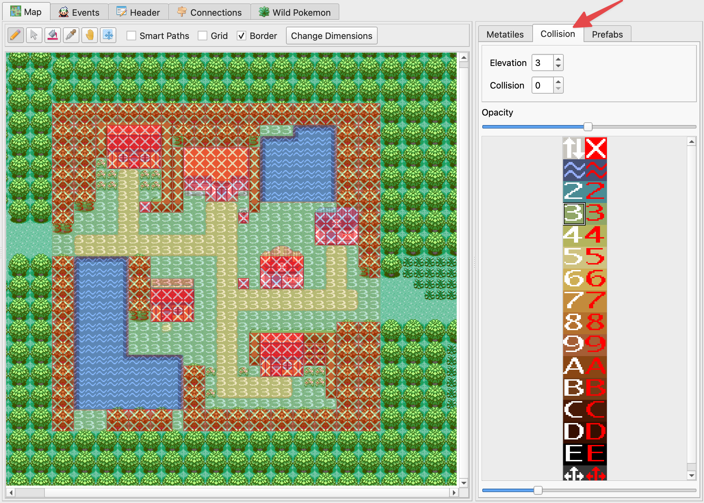
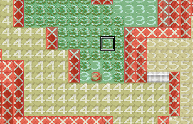

**********************
Editing Map Collisions
**********************

The second half of editing a map's metatiles is their collision properties.  This is what determines if the player can walk or surf on each metatile during gameplay.  Whenever editing a map's metatiles, you need to update the collision properties appropriately.  Typically, a user will first map the visual metatiles and fill in the collision properties after that is finished.  The editing flow for collisions is very similar to editing map tiles.  First, you select a collision type.  Then, you paint it onto the map.

Selecting Collision Types
------------------------------

The Collision Type Selector is a tab next to the Metatile Selector.  It features 32 total different collision types.  The left column is for collision types that allow the player to walk through the tiles.  These are denoted by white text.  The right column is for collision types that are impassable by the player.  These are denoted by red text.

The transparency slider above the collision types controls the transparency of the collision properties on the map view. The slider at the bottom of the panel zooms the selector image in and out.

    Map Collisions View

Unlike metatiles, only one collision type can be selected at a time.  A collision type can be selected either by clicking in the Collision Type Selector.  You can also right-click on a metatile from the map area, just like you would when editing metatiles.

Painting Collisions
-------------------

The painting process for collisions is nearly identical to painting metatiles. You can use the same paint tools and shortcuts, with the exception of Smart Paths.  Undo/redo history includes collision modifications, too.

.. _collision-types:

Collision Types
---------------

Now we'll go over the different types of collisions, along with some important concepts.  Each row in the Collision Type Selector represents a different *elevation*, which is why most rows have hexadecimal numbers in them (2, 3, 4, ..., D, E).  Rows 0, 1, and F have special purposes.

Elevation is how the game determines whether or not an object is on the same level as something else.  For example, it's commonly used to make sure the player can't walk off the top side of a mountain.  If the player's current elevation is 4, but the player is trying to walk onto a metatile with elevation 3, then the game won't let the player walk in that direction.  In the example below from Route 114, the player would be unable to walk north from the mountain onto the grass.  This is because 3 and 4 are different elevations.

    Different Elevations on a Cliff

Now that you undertand the basics of elevation, let's explore the special collision types, which have no elevation associated with them.

Transition Collision Type |transition-collision-type|
    The Transition collision type allows the player to move between different elevations.  The most common use case is for stairs.  The player will always be allowed to walk onto this collision type. Then, the player will be able to walk onto any elevation.

Impassable Collision Type |impassable-collision-type|
    The Impassable collision type blocks the player from moving.  What makes it special is that it doesn't count as any particular elevation.  This means that, for example, a signpost would be interactable from all elevations if it uses this collision type.  This is the most common impassable collision type used in the game, and it should generally be used for impassable tiles.

.. |impassable-collision-type|
   image:: images/editing-map-collisions/impassable-collision-type.png

Surf Collision Type |surf-collision-type-1| |surf-collision-type-2|
    The Surf collision type allow the player to surf.  The red version is just the impassable version.  **The player will only be able to start surfing from elevation 3.  The same is true when hopping off onto land.**

.. |surf-collision-type-2|
   image:: images/editing-map-collisions/surf-collision-type-2.png

Multi-Level Collision Type |multi-level-collision-type-1| |multi-level-collision-type-2|
    The Multi-Level collision type is used for bridges.  The red version is just the impassable version, and it doesn't have any special use.  Multi-level collision type remembers the player's previous elevation and maintains that elevation as long as the player continues to walk on multi-level collision.  The player will only be able to leave multi-level collision if he walks onto a new tile that has the same elevation as before the multi-level collision was entered.  Here is an example of a bridge from Route 119 that illustrates the ability to surf north/south under the bridge, while also being able to walk east/west.

.. figure:: images/editing-map-collisions/multi-level-bridge.png
    :alt: Multi-Level Collision Type on a Bridge

    Multi-Level Collision Type on a Bridge

.. |multi-level-collision-type-1|
   image:: images/editing-map-collisions/multi-level-collision-type-1.png

.. |multi-level-collision-type-2|
   image:: images/editing-map-collisions/multi-level-collision-type-2.png

.. note::
    For advanced usage: Any valid elevation/collision value combination can be selected using the ``Elevation`` and ``Collision`` value spinners, even if it's not represented graphically on the selector image. You may also resize/replace this selector image under ``Options -> Project Settings``.
