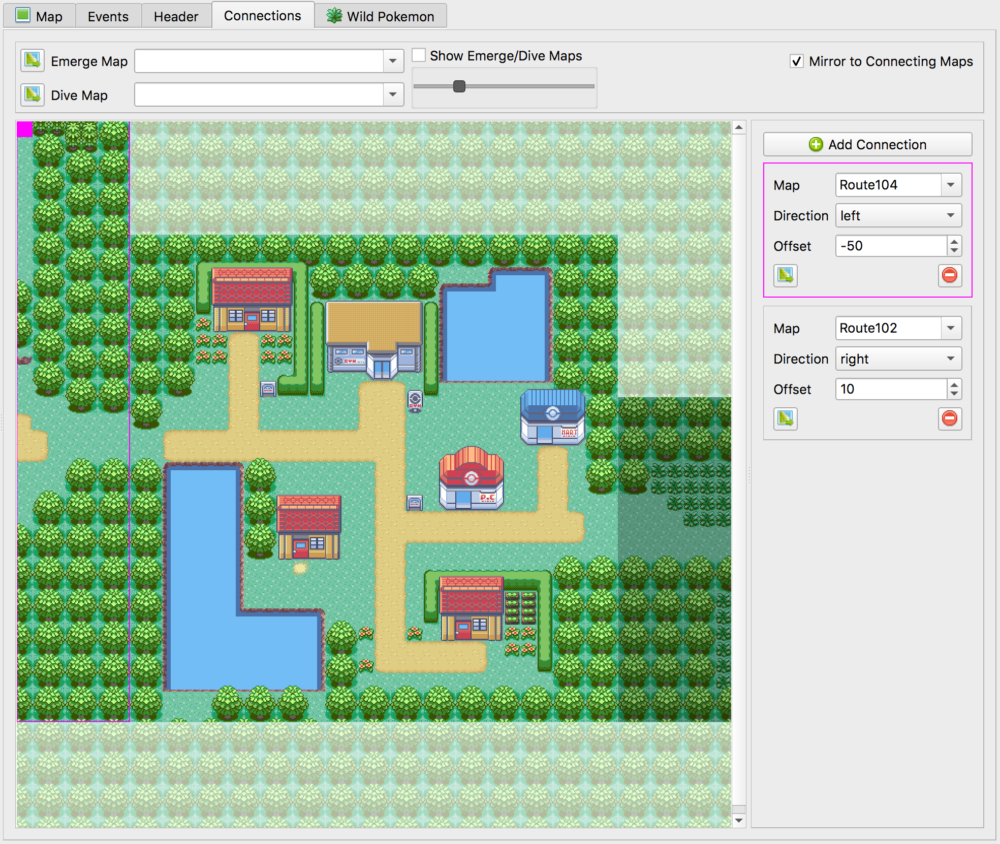
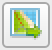

.. _editing-map-connections:

***********************
Editing Map Connections
***********************

Maps can be connected together so that the player can seamlessly walk between them. These connections can be edited in the Connections tab.

    Map Connections View

A connection has a direction, offset, and destination map. To add a new connection, press the |add-connection-button| button. To delete a connection you can either press the |remove-connection-button| button on its entry in the list, or select the connection and press the delete key.

The |open-connection-button| button will open the destination map. You may also open the destination map by double-clicking the connection itself (this can be done from the ``Map`` and ``Events`` tabs as well).

.. |remove-connection-button|
   image:: images/editing-map-connections/remove-connection-button.png
   :height: 24

To change the connection's vertical or horizontal offset, it's easiest to click and drag the connection to the desired offset.

Dive & Emerge Warps
-------------------

Dive & emerge warps are used for the HM move Dive. They don't have offsets or directions--only a destination map. To add a dive or emerge warp, simply add a value in the Dive Map and/or Emerge Map dropdown menus.

You can select the ``Show Emerge/Dive Maps`` checkbox to view your connected dive/emerge maps overlaid on the current map. The slider will change the opacity of this overlay. If you have both an emerge and a dive map connected you will see two sliders; the top slider is for the emerge map's opacity, and the bottom slider is for the dive map's opacity.

Mirror Connections
------------------

An extremely useful feature is the *Mirror to Connecting Maps* checkbox in the top-right corner.  Connections are one-way, which means that you must keep the two connections in sync between the two maps.  For example, Petalburg City has a west connection to Route 104, and Route 104 has an east connection to Petalburg City.  If *Mirror to Connecting Maps* is enabled, then Porymap will automatically update both sides of the connection.  Be sure to *File -> Save All* (``Ctrl+Shift+S``) when saving, since you will need to save both maps' connections.
