******************
Editing Map Events
******************

Events are what bring your maps to life.  They include NPCs, signposts, warps, scripts, and more.  Open the *Events* tab above the map area, and let's dissect what's going on.

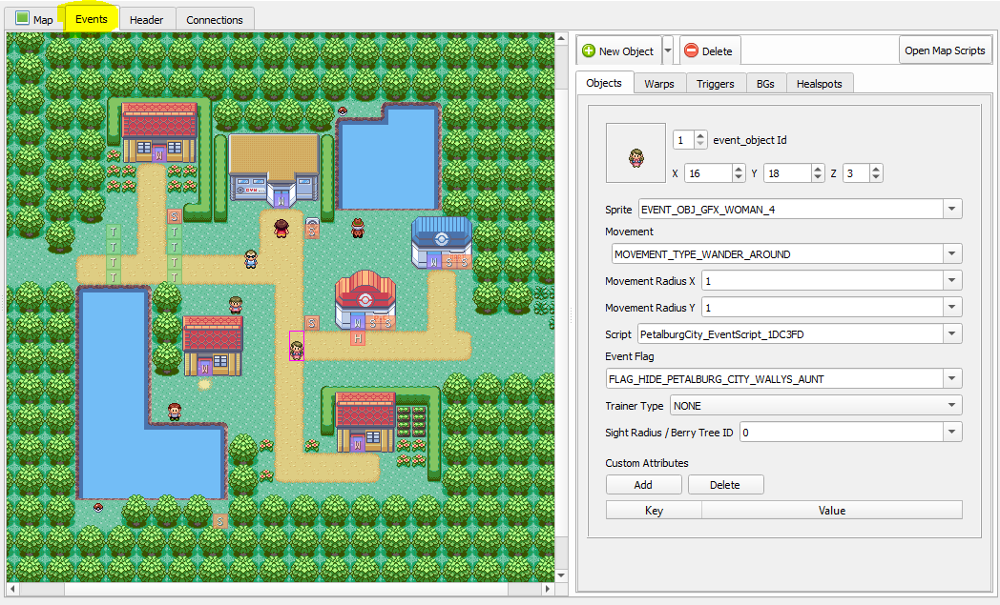

    Map Events View

All of the events are visible on the map.  The Event Details window on the right displays the properties of the currently-selected event.  If you look closely, you'll see that the woman NPC near the Pokémon Center has a pink border around it because it's selected.  To select a different event, simply click on an event in the map area.  Alternatively, you can use the spinner at the top of the event properties window.  Multiple events can be selected at the same time by holding ``Ctrl`` and clicking another event.

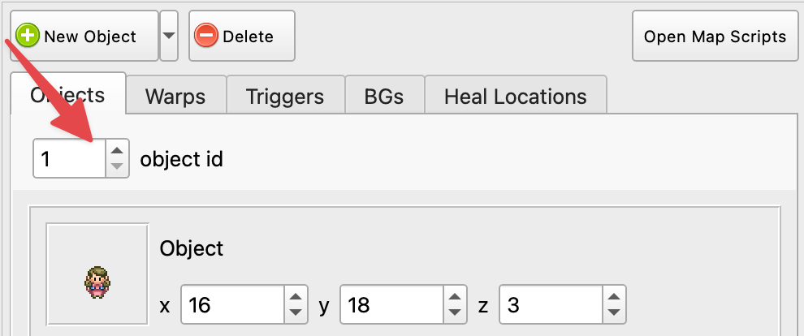

    Event Id Spinner

.. warning::
    There is currently no undo/redo functionality when editing events!  Use Git version control!

Adding & Deleting Events
------------------------

To add a new event, press the green plus button. |add-event-button|  You can choose between the different types of events by clicking the small arrow on the right. You can also duplicate any currently selected events with ``Ctrl+D``.

.. |add-event-button|
   image:: images/editing-map-events/add-event-button.png

To delete the selected event, press the delete button. |delete-event-button|

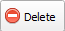

Event Positions
----------------

All events have X/Y coordinates.  To move an Event, click and drag it to a new position on the map.  Alternatively, you can use the X and Y spinners in the event properties.

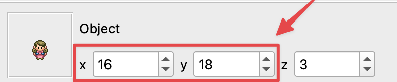

    Event Coordinates Spinners

Events also have an elevation, also known as Z coordinates (see image above).  Elevations are explained in detail in the :ref:`Collision Types <collision-types>` section.

Next, we'll cover each type of event in detail.

Object Events
-------------

Object events are typically used for NPCs (non-player-characters).  More technically, it's any event that has a sprite and the ability to move around.  Object events are displayed using their assigned sprite, except for special cases.  Any object event that uses a dynamic sprite will be displayed as a blue square with an `N` |dynamic-sprite|.  Some examples of dynamic sprites are the player's rival and berry trees.

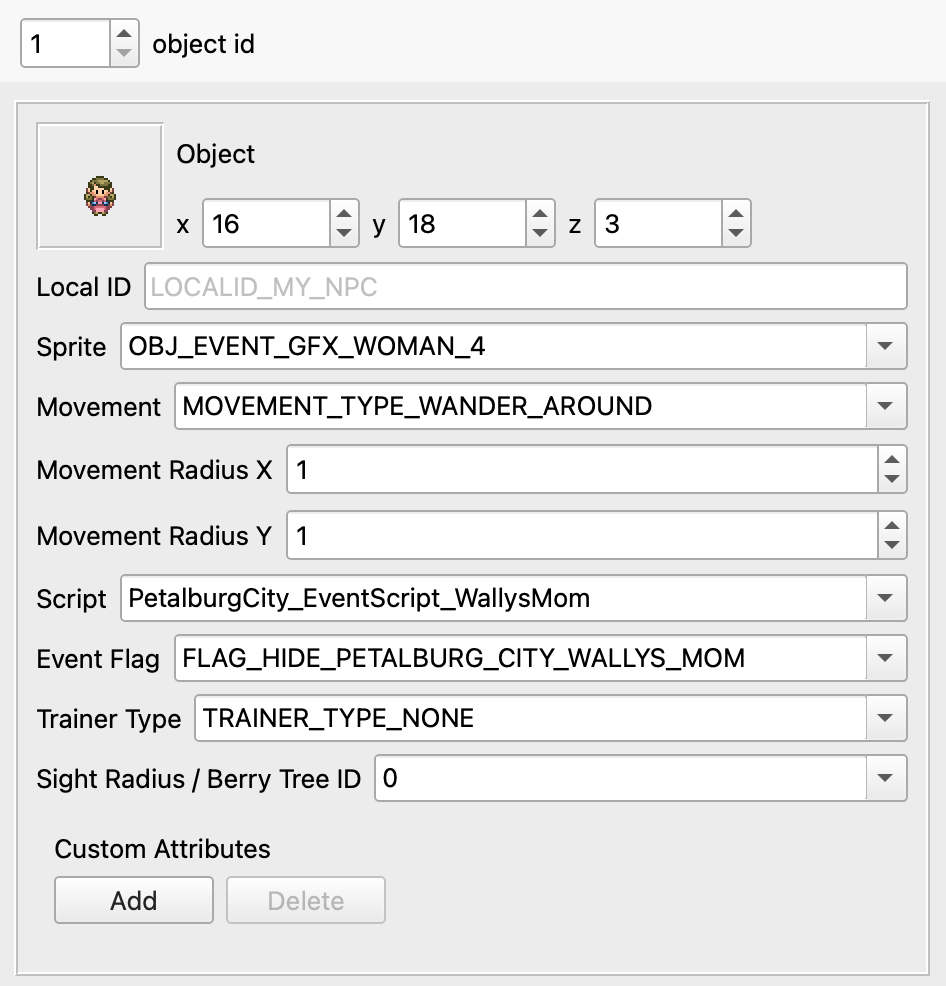

    Object Event Properties

Id
    This is the local id of the object in the map.  Some script values use this local id to specify object when using scripting commands such as `applymovement`.

Sprite
    The sprite that is used by the object.

Movement
    The movement type used by the object during normal gameplay.

Movement Radius X/Y
    Movement types that involves walking or moving around the map can be bounded by a radius.  The ensures that the object is always within the specified range from its original position.

Script
    The script that executes when the player interacts with the object.

Event Flag
    The flag value that controls if the object is visible.  If the flag is set (equal to 1), then the object will be invisible.  If the Event Flag is set to `0`, then the object will always be visible because `0` means "no flag".

Trainer Type
    The trainer type used by the object. If the object is a trainer, `TRAINER_TYPE_NORMAL` means that the trainer will spot the player in the object's line-of-sight.

Sight Radius or Berry Tree ID
    If the object is a trainer, this property control how many tiles the trainer can see to spot the player for battle.  If the object is a berry tree, this specifies the global id of the berry tree.  Each berry tree in the game has a unique berry tree id.

In Connection
    Exclusive to pokefirered. Used to replace objects that are visible in a map's connection with their corresponding object on the connecting map. When checked, these objects will make odd use of other fields; its trainer type value will be the connecting map number, its Sight Radius / Berry Tree Id will be the connecting map group, and its z coordinate will be the object's local id on the connecting map. 

.. _event-warps:

Warp Events
-----------

Warp events are how the player is able to warp to other maps, such as entering a building.  Double-clicking on a warp will automatically open the destination map and select the destination warp.  This makes it very easy to navigate around in Porymap.

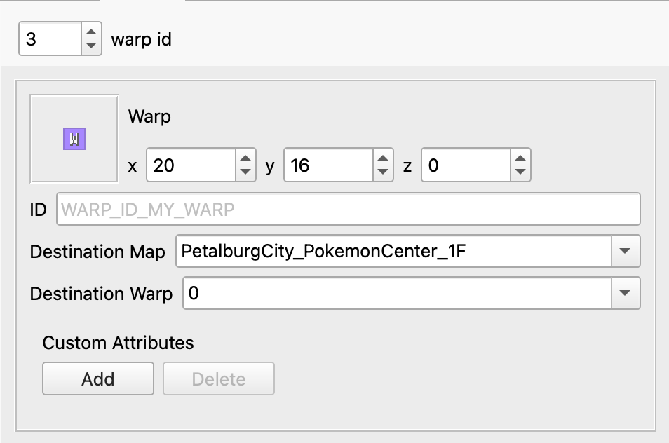

    Warp Event Properties

Id
    This is the local id of the warp in the map.  This is used when setting the Destination Warp property for another warp.

Destination Map
    The destination map name.

Destination Warp
    The Id of the warp in the destination map.

Trigger Events
--------------

Trigger events are scripts that execute when the player walks over them.  However, they only execute when a variable is equal some value.  Typically, they execute once, set the variable's value to something else, and then never execute again because the variable's value no longer matches.

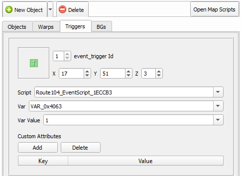

    Trigger Event Properties

Id
    The local id of the trigger in the map.  This value is not used for anything.

Script
    The script that executes when the player walks over the trigger AND when the `Var` equals the `Var Value`.

Var
    The variable used to determine if the trigger's Script should execute.

Var Value
    The value that the Var must equal for the trigger's Script to execute.

Weather Trigger Events
----------------------

Weather trigger events are a very specific type of trigger.  When the player walks over a weather trigger, the overworld's weather will transition to the specified weather type. This event type is unavailable for pokefirered projects; the functions to trigger weather changes were dummied out.

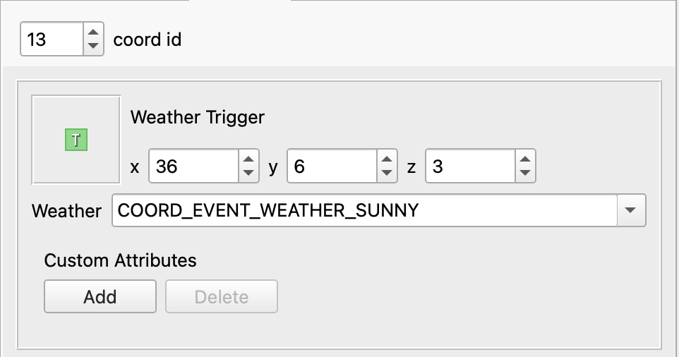

    Weather Trigger Event Properties

Id
    The local id of the trigger in the map.  This value is not used for anything.

Weather
    The type of weather to transition to.

Sign Event
-----------

Sign events, or signposts, are simple interactable scripts.  They are typically used for things like signs in front of buildings.  The player's facing direction can be required to be a certain direction in order to interact with the sign.  Signs are the first of three "BG" event types.

.. figure:: images/editing-map-events/event-sign.png
    :alt: Sign Event Properties

    Sign Event Properties

Id
    The local id of the BG event in the map.  This value is not used for anything.

Player Facing Direction
    The direction the player must be facing in order to execute the sign's script.

Script
    The script that executes when the player interacts with the sign.

Hidden Item Event
-----------------

Hidden items are invisible items that can be picked up by the player. They each use a flag to ensure the item can only be picked up once.

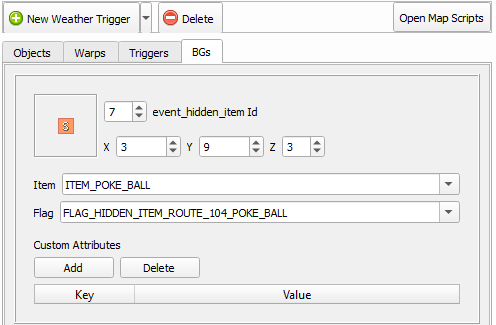

    Hidden Item Event Properties

Id
    The local id of the BG event in the map.  This value is not used for anything.

Item
    The item the player will receive when interacting with this hidden item.

Flag
    This flag is set when the player receives the hidden item.

Quantity
    Exclusive to pokefirered. The number of items received when the item is picked up.

Requires Itemfinder
    Exclusive to pokefirered. When checked, the hidden item can only be received by standing on it and using the Itemfinder.

Secret Base Event
-----------------

This is the event used to mark entrances to secret bases.  This event will only be functional on certain metatiles.  Unfortunately, they are hardcoded into the game's engine (see ``sSecretBaseEntranceMetatiles`` in ``src/secret_base.c``).
This event type is unavailable for pokefirered projects; secret bases do not exist there.

.. figure:: images/editing-map-events/event-secret-base.png
    :alt: Secret Base Event Properties

    Secret Base Event Properties

Id
    The local id of the BG event in the map.  This value is not used for anything.

Secret Base Id
    The id of the destination secret base.

Heal Location / Healspots
-------------------------

This event is used to control where a player will arrive when they white out or fly to the map. The white out functions a little differently between game versions. For pokeemerald and pokeruby players will arrive at the event's coordinates after a white out, while in pokefirered they will arrive on the map set in ``Respawn Map`` and at hardcoded coordinates (see ``SetWhiteoutRespawnWarpAndHealerNpc`` in ``src/heal_location.c``).

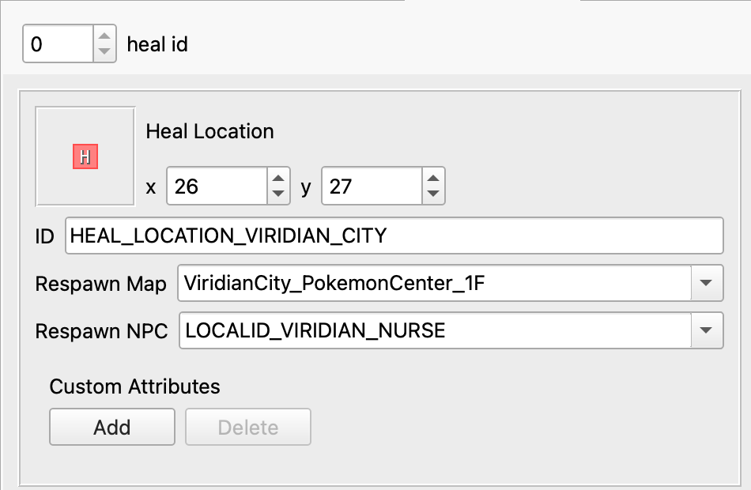

    Heal Location Properties

Respawn Map
    Exclusive to pokefirered. The map where the player will arrive when they white out (e.g. inside the PokéCenter that the heal location is in front of).

Respawn NPC
    Exclusive to pokefirered. The local id of the NPC the player will interact with when they white out.

Open Map Scripts
----------------

Clicking the ``Open Map Scripts`` button |open-map-scripts-button| will open the map's scripts file in your default text editor.  If nothing happens when this button is clicked, you may need to associate a text editor with the `.inc` file extension (or `.pory` if you're using Porycript).

Additionally, if you specify a ``Goto Line Command`` in *Options -> Edit Preferences* then a tool-button will appear next to the `Script` combo-box in the *Events* tab. Clicking this button will open the file that contains the script directly to the line number of that script. If the script cannot be found in the project then the current map's scripts file is opened.
|go-to-script-button|

.. |open-map-scripts-button|
   image:: images/editing-map-events/open-map-scripts-button.png

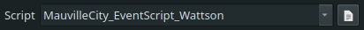

Tool Buttons
------------

The event editing tab also extends functionality to a few of the tool buttons described in :ref:`Editing Map Tiles <editing-map-tiles>`.
A brief description and animation is listed for each of the available tools below:

Pencil
    When clicking on an existing event, the pencil tool will behave normally (as the standard cursor). It can also be used to "draw" events in a certain location. The event created will be a default-valued event of the same type as the currently selected event. Right-clicking with the Pencil Tool will return to the Pointer tool.

.. figure:: images/editing-map-events/event-tool-pencil.gif
    :alt: Drawing Object Events with the Pencil Tool

    Drawing Object Events with the Pencil Tool

Pointer
    The Pointer Tool is the default tool for the event editing tab and allows you to select and move events on the map. The Pointer Tool also gives you access to the :ref:`Ruler Tool <ruler-tool>`.

Shift
    You can use the Shift Tool to move any number of events together. When a selected event is dragged, all other selected events will move with it. When a tile with no event is clicked, all events on the map can be dragged.

.. figure:: images/editing-map-events/event-tool-shift.gif
    :alt: Moving Events with the Shift Tool

    Moving Events with the Shift Tool

.. _ruler-tool:

Ruler Tool
----------

The Ruler Tool provides a convenient way to measure distance on the map. This is particularly useful for scripting object movement. With the Pointer Tool selected you can activate the ruler with a Right-click. With the ruler active you can move the mouse around to extend the ruler. The ruler can be deactivated with another Right-click, or locked in place with a Left-click (Left-click again to unlock the ruler).

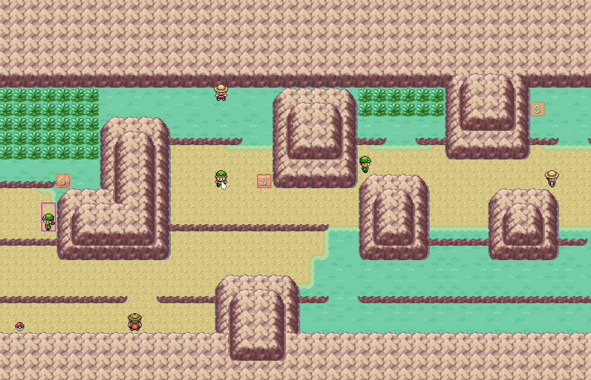

    Measuring metatile distance with the Ruler Tool
