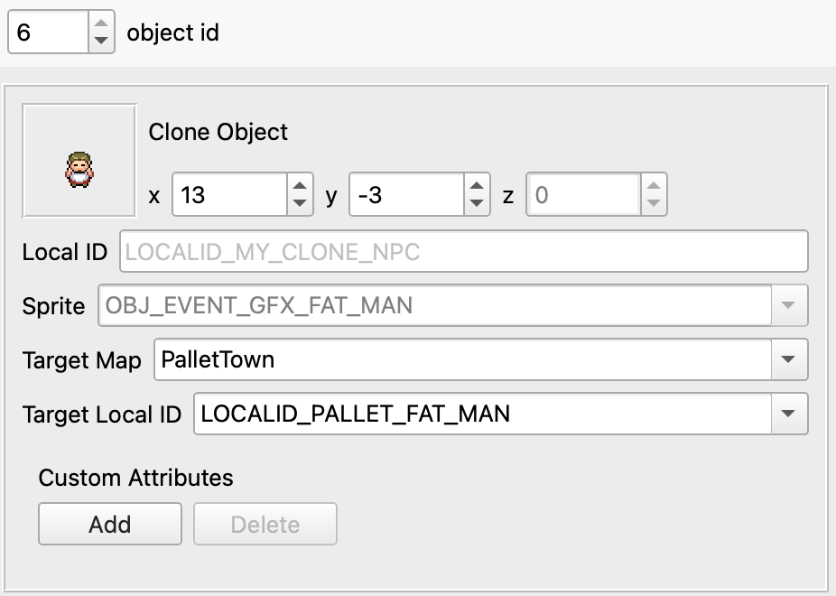
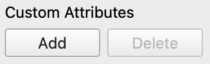

.. _editing-map-events:

******************
Editing Map Events
******************

Events are what bring your maps to life.  They include NPCs, signposts, warps, scripts, and more.  Open the *Events* tab above the map area, and let's dissect what's going on.

.. figure:: images/editing-map-events/map-events.png
    :alt: Map Events View
    :align: center

    Map Events View

All of the events are visible on the map.  The Event Details window on the right displays the properties of the currently-selected event.  If you look closely, you'll see that the woman NPC near the Pokémon Center has a pink border around it because it's selected.  To select a different event, simply click on an event in the map area. Multiple events can be selected at the same time by holding ``Ctrl`` (``Cmd`` on macOS) and clicking another event. Alternatively, you can use the spinner at the top of the event properties window to cycle through events. 

.. figure:: images/editing-map-events/event-id-spinner.png
    :alt: Event Id Spinner
    :width: 75%
    :align: center

    Event Id Spinner

.. warning::
    There is currently no undo/redo functionality when editing information in the Event Details window!  Use Git version control!

Adding & Deleting Events
------------------------

To add a new event, press the green plus button. You can choose between the different types of events by clicking the small arrow on the right side of the button. You can also duplicate any currently selected events with ``Ctrl+D``.

.. figure:: images/editing-map-events/add-event.png
    :alt: Add Event Button
    :width: 75%
    :align: center

    Add Event Button

To delete the selected event, press the |delete-event-button| button.

.. |delete-event-button|
   image:: images/editing-map-events/delete-event-button.png

Event Positions
----------------

All events have X/Y coordinates.  To move an Event, click and drag it to a new position on the map.  Alternatively, you can use the X and Y spinners in the event properties.

.. figure:: images/editing-map-events/event-coords-spinners.png
    :alt: Event Coordinates Spinners
    :width: 75%
    :align: center

    Event Coordinates Spinners

Events also have an elevation, also known as Z coordinates (see image above).  Elevations are explained in detail in the :ref:`Collision Types <collision-types>` section.

Next, we'll cover each type of event in detail.

.. |field-frlg-exclusive|
    replace:: Exclusive to pokefirered projects. Can be enabled under the ``Events`` tab of ``Options > Project Settings...``.

.. |event-frlg-exclusive|
    replace:: This event type is exclusive to pokefirered projects. If you have modified your pokeemerald/pokeruby project to support this event type, you can enable them under the ``Events`` tab of ``Options > Project Settings...``.

.. |event-rse-exclusive|
    replace:: This event type is exclusive to pokeemerald/pokeruby projects. If you have modified your pokefirered project to support this event type, you can enable them under the ``Events`` tab of ``Options > Project Settings...``.

.. |id-description|
    replace:: This is an optional field. Here you can give a *unique* name to your event so that you can refer to it elsewhere. If the event has no ID name, you can still refer to it using its number ID instead (the number next to the spinner at the top of the window).

.. |script-description|
    replace:: The script that executes when the player interacts with the event. The dropdown for this field contains all the scripts from the current map and any scripts already in-use by the map's events. You can enter the name of any script even if it doesn't appear in the dropdown.

Object Events
-------------

Object events are typically used for NPCs (non-player-characters).  More technically, it's any event that has a sprite and the ability to move around.  Object events are displayed using their assigned sprite, except for special cases.  Any object event that uses a dynamic sprite (like berry trees) or that Porymap doesn't recognize will be displayed as a blue square with an `N` |dynamic-sprite|.

.. |dynamic-sprite|
   image:: images/editing-map-events/dynamic-sprite.png

.. figure:: images/editing-map-events/event-object.png
    :alt: Object Event Properties
    :width: 75%
    :align: center

    Object Event Properties

Local ID
    |id-description|

    For example, if you give this object event a Local ID name of ``LOCALID_MY_NPC``, you could write in a script ``applymovement LOCALID_MY_NPC, MovementScript``, or ``applymovement 1, MovementScript``, and either one would apply to this event. The benefit of using ``LOCALID_MY_NPC`` over ``1`` is that if the number changes you won't have to update your scripts at all!

Sprite
    The sprite that is used by the object.

Movement
    The movement type used by the object during normal gameplay.

Movement Radius X/Y
    Movement types that involves walking or moving around the map can be bounded by a radius.  The ensures that the object is always within the specified range from its original position.

Script
    |script-description|

Event Flag
    The flag value that controls if the object is visible.  If the flag is set (equal to 1), then the object will be invisible.  If the flag is not set, or ``Event Flag`` is set to ``0`` (i.e., no flag), then the object will be visible.

Trainer Type
    The trainer type used by the object. If the object is a trainer, ``TRAINER_TYPE_NORMAL`` means that the trainer will spot the player in the object's line-of-sight.

Sight Radius or Berry Tree ID
    If the object is a trainer, this property control how many spaces away the trainer can see to spot the player for battle.  If the object is a berry tree, this specifies the global id of the berry tree.  Each berry tree in the game has a unique berry tree id.

Clone Object Events
-------------------

Clone Object events are a special type of object that inherits its properties from another Object event. They are used in-game to load objects that are visible in the connecting area of adjacent maps. The targeted object to clone is specified by id and map name. If the targeted object does not exist, or it's also a clone, the sprite for graphics id 0 will be displayed instead. Double-clicking on a Clone Object will open the targeted map with the targeted object selected.

.. note::
    |event-frlg-exclusive|

    Clone Object Event Properties

Local ID
    |id-description|

Sprite
    The sprite that is used by the object. Clone Objects inherit their sprite from the targeted object, so this cannot be edited. This field is not actually read by the game.

Target Local ID
    The local id of the object to be cloned.

Target Map
    The name of the map the object to be cloned is on.

.. _event-warps:

Warp Events
-----------

Warp events are how the player is able to warp to other maps, such as entering a building.  Double-clicking on a warp will automatically open the destination map and select the destination warp.  This makes it very easy to navigate around in Porymap. Warps need to be on specific metatiles to function as an exit; a warning will appear if the warp event is not on one of these metatiles.

.. figure:: images/editing-map-events/event-warp.png
    :alt: Warp Event Properties
    :width: 75%
    :align: center

    Warp Event Properties

ID
    |id-description|

    This is used when setting the Destination Warp property for another warp.

Destination Map
    The name of the map to travel to.

Destination Warp
    The ID of the warp to travel to.

Trigger Events
--------------

Trigger events are scripts that execute when the player walks over them.  However, they only execute when a variable is equal to some value.  Typically, they execute once, set the variable's value to something else, and then never execute again because the variable's value no longer matches.

.. figure:: images/editing-map-events/event-trigger.png
    :alt: Trigger Event Properties
    :width: 75%
    :align: center

    Trigger Event Properties

Script
    The script that executes when the player walks over the trigger AND when the value of ``Var`` equals ``Var Value``.

Var
    The variable used to determine if the trigger's Script should execute.

Var Value
    The value that the Var must equal for the trigger's Script to execute.

Weather Trigger Events
----------------------

Weather trigger events are a very specific type of trigger.  When the player walks over a weather trigger, the overworld's weather will transition to the specified weather type.

.. note::
    |event-rse-exclusive|

.. figure:: images/editing-map-events/event-weather-trigger.png
    :alt: Weather Trigger Event Properties
    :width: 75%
    :align: center

    Weather Trigger Event Properties

Weather
    The type of weather to transition to.

Sign Event
-----------

Sign events, or signposts, are simple interactable scripts.  They are typically used for things like signs in front of buildings.  The player's facing direction can be required to be a certain direction in order to interact with the sign.  Signs are the first of three "BG" event types.

.. figure:: images/editing-map-events/event-sign.png
    :alt: Sign Event Properties
    :width: 75%
    :align: center

    Sign Event Properties

Player Facing Direction
    The direction the player must be facing in order to execute the sign's script.

Script
    |script-description|

Hidden Item Event
-----------------

Hidden items are invisible items that can be picked up by the player. They each use a flag to ensure the item can only be picked up once.

.. figure:: images/editing-map-events/event-hidden-item.png
    :alt: Hidden Item Event Properties
    :width: 75%
    :align: center

    Hidden Item Event Properties

Item
    The item the player will receive when interacting with this hidden item.

Flag
    This flag is set when the player receives the hidden item.

Quantity
    The number of items received when the item is picked up.

    |field-frlg-exclusive|

Requires Itemfinder
    When checked, the hidden item can only be received by standing on it and using the Itemfinder.

    |field-frlg-exclusive|

Secret Base Event
-----------------

This is the event used to mark entrances to secret bases.  This event will only be functional on certain metatiles.  Unfortunately, they are hardcoded into the game's engine (see ``sSecretBaseEntranceMetatiles`` in ``src/secret_base.c``). Double-clicking on a secret base will open the secret base's map (assuming Porymap is able to infer which map that is by looking at the ``Secret Base`` field).

.. note::
    |event-rse-exclusive|

.. figure:: images/editing-map-events/event-secret-base.png
    :alt: Secret Base Event Properties
    :width: 75%
    :align: center

    Secret Base Event Properties

Secret Base
    The id of the destination secret base.

Heal Locations
--------------

This event is used to control where a player will arrive when they white out or fly to the map. The white out functions a little differently between game versions. For pokeemerald and pokeruby players will arrive at the event's coordinates after a white out, while in pokefirered they will arrive on the map set in ``Respawn Map`` and at hardcoded coordinates (see ``SetWhiteoutRespawnWarpAndHealerNpc`` in ``src/heal_location.c``).

.. figure:: images/editing-map-events/event-heal-location.png
    :alt: Heal Location Properties
    :width: 75%
    :align: center

    Heal Location Properties
ID
    The unique ID name of this Heal Location Event. This is the name you'll use to refer to this heal location in scripts (e.g. ``setrespawn HEAL_LOCATION_MY_MAP``) or elsewhere in your project. Unlike other ID name fields, this name is required and cannot be substituted with the ID number at the top of the window.

Respawn Map
    The map where the player will arrive when they white out (e.g. inside the PokéCenter that the heal location is in front of).

    |field-frlg-exclusive|

Respawn NPC
    The local id of the NPC the player will interact with when they white out.

    |field-frlg-exclusive|

.. _custom-attributes:

Custom Attributes
-----------------

Under each event you'll also find the ``Custom Attributes`` table. This lets you add new data to any event. By default it is empty, and only the ``Add`` button is enabled.

When you click ``Add`` you will be prompted to enter the name of your new data field, what type of data it is, and the value. Once added you can edit their values in the table, or select an entry and click ``Delete`` to remove it.

.. figure:: images/editing-map-events/custom-attributes-table.png
    :alt: Custom Attributes Table
    :width: 75%
    :align: center

At the moment our new data has no impact on the game, but we can write code in our project to do whatever we want with it! The new data can be found in the ``map.json`` file of whatever map it was added to. Normally these ``map.json`` files are handled by a tool in your project called ``mapjson``, so to use your new data you may need to modify this tool.

Open Map Scripts
----------------

Clicking the |open-map-scripts-button| button will open the map's scripts file in your default text editor.  If nothing happens when this button is clicked, you may need to associate a text editor with the ``.inc`` file extension (or ``.pory`` if you're using Porycript).

Additionally, if you specify a ``Goto Line Command`` in ``Preferences...`` then a tool-button will appear next to the ``Script`` combo-box in the ``Events`` tab. Clicking this button will open the file that contains the script directly to the line number of that script. If the script cannot be found in the project then the current map's scripts file is opened.
|go-to-script-button|

.. |open-map-scripts-button|
   image:: images/editing-map-events/open-map-scripts-button.png

.. |go-to-script-button|
    image:: images/editing-map-events/go-to-script-button.png

Tool Buttons
------------

The event editing tab also extends functionality to a few of the tool buttons described in :ref:`Editing Map Tiles <editing-map-tiles>`.

Pencil
    Clicking on an empty space will create a new event of the same type as your currently-selected event. This is the same as clicking the New Event button except that the new event will be positioned under your cursor. Right-clicking with the Pencil Tool will return to the Pointer tool.

.. figure:: images/editing-map-events/event-tool-pencil.gif
    :alt: Drawing Object Events with the Pencil Tool
    :align: center

    Drawing Object Events with the Pencil Tool

Pointer
    The Pointer Tool is the default tool for the event editing tab and allows you to select and move events on the map. The Pointer Tool also gives you access to the :ref:`Ruler Tool <ruler-tool>`.

Shift
    You can use the Shift Tool to move any number of events together. When a selected event is dragged, all other selected events will move with it. When a tile with no event is clicked, all events on the map can be dragged.

.. figure:: images/editing-map-events/event-tool-shift.gif
    :alt: Moving Events with the Shift Tool
    :align: center

    Moving Events with the Shift Tool

.. _ruler-tool:

Ruler Tool
----------

The Ruler Tool provides a convenient way to measure distance on the map. This is particularly useful for scripting object movement. With the Pointer Tool selected you can activate the ruler with a Right-click. With the ruler active you can move the mouse around to extend the ruler. The ruler can be deactivated with another Right-click, or locked in place with a Left-click (Left-click again to unlock the ruler).

.. figure:: images/editing-map-events/event-tool-ruler.gif
    :alt: Measuring metatile distance with the Ruler Tool
    :align: center

    Measuring metatile distance with the Ruler Tool

.. tip::
    If you'd like to see your events while editing the map, select ``View > Show Events in Map View``.
