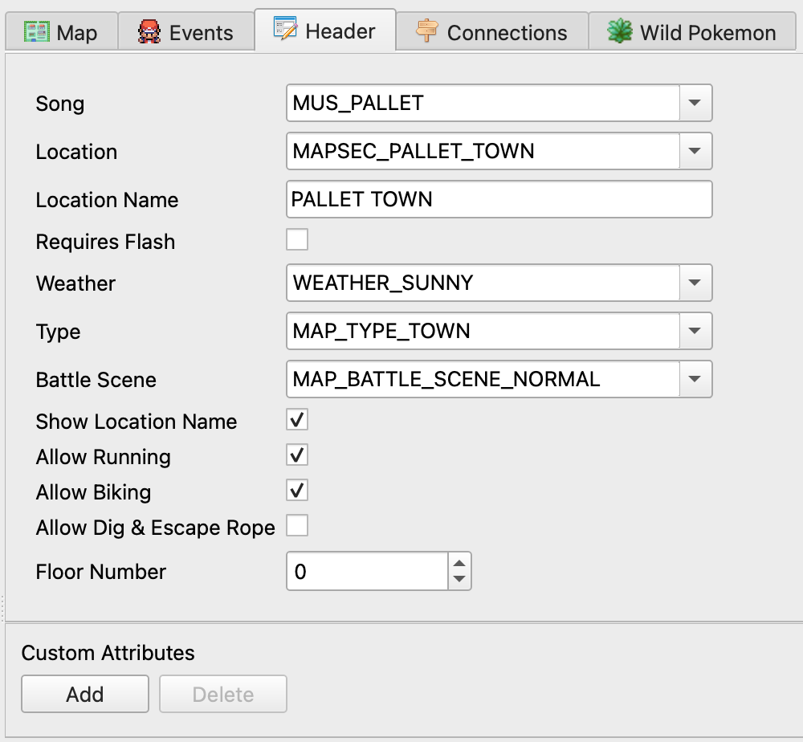

.. _editing-map-headers:

*******************
Editing Map Headers
*******************

The map header is a collection of miscellaneous properties that belong to a map.  They are mostly self-explanatory, but we'll go over each of them.

    Map Header View

Song
    The background music that is automatically played when entering the map.

Location
    The region map section to which the map belongs.

Location Name
    The in-game name that can appear for this map. This name is shared with all maps that use the same ``Location``.

Requires Flash
    Whether or not the map has limited vision which the HM move Flash can expand.

Weather
    The weather that is running when entering the map.

Type
    The type of map. This value is used by various things in the game engine.  For example, in Ruby Version, running shoes cannot be used when the map type is ``MAP_TYPE_INDOOR``.

Battle Scene
    Controls what graphics are used in battles.

Show Location Name
    Shows or hides the map name popup window when entering the map.

Allow Running
    Controls whether or not running shoes can be used.

Allow Biking
    Controls whether or not a bike can be used.

Allow Dig & Escape Rope
    Controls whether the Dig field move or the Escape Rope item can be used.

Floor Number
    Used to append a number to the map name popup. Negative values are prefixed with "B" for basement, and floor 127 is "Rooftop".

Custom Attributes
    You can enter new data if you need support for additional fields in your project.  They can also be useful for keeping notes. See :ref:`Custom Attributes <custom-attributes>`

.. note::
    ``Allow Running``, ``Allow Biking``, and ``Allow Dig & Escape Rope`` are disabled by default for pokeruby projects. ``Floor Number`` is disabled by default for pokeruby and pokeemerald projects. Their behavior is normally handled some other way, or doesn't exist. If you have modified your pokeruby/pokeemerald project to use one of these disabled fields, they can be enabled on the ``Maps`` tab of ``Options > Project Settings...``.
