.. _editing-map-tiles:

*****************
Editing Map Tiles
*****************

Editing map tiles takes place in Porymap's Main Window.  The map is laid out in a grid of what are called "metatiles".  The basic editing flow is to make a metatile selection, and then paint that metatile selection onto the map.

Visual Options
--------------

Before getting into the details of editing map tiles, you should be aware of some settings that make your life easier.

A grid can be displayed over the editable map area by using the ``Grid`` checkbox, which is located in the toolbar above the map area. The appearance of the grid can be changed with ``View > Grid Settings...``.

.. figure:: images/editing-map-tiles/map-grid.png
    :alt: Map Grid
    :width: 70%
    :align: center

    Map Grid

The border's visibility, including the surrounding map connections, can be toggled with the ``Border`` checkbox, which is located in the toolbar above the map area.

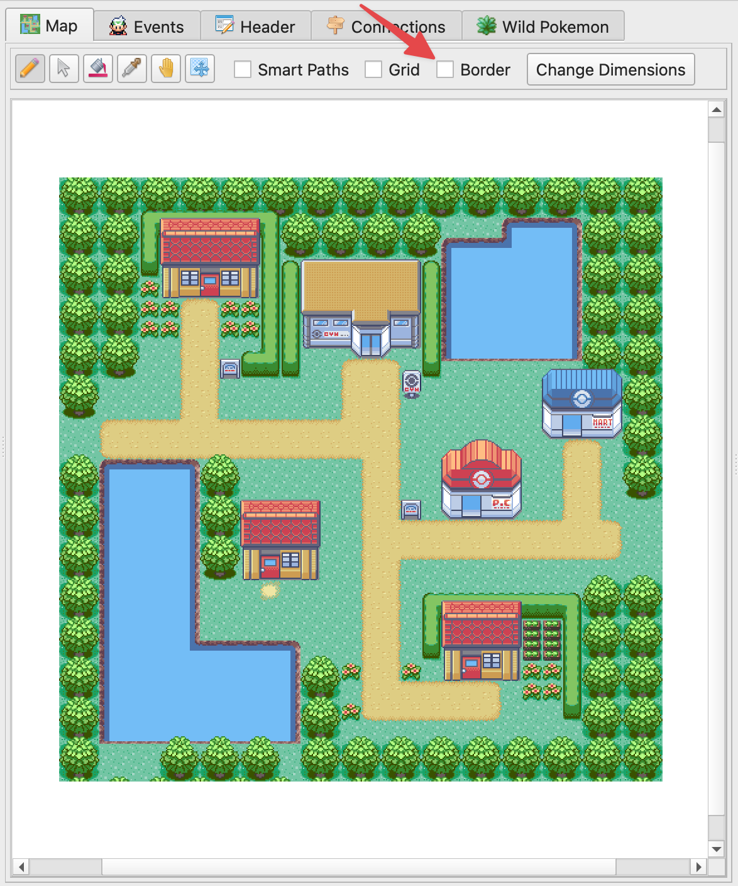

    Map Border Toggled Off

You can zoom in and out on the map with ``View > Zoom In`` (``Ctrl++`` or ``Ctrl+Mouse Wheel Scroll Up``) and ``View > Zoom Out`` (``Ctrl+-`` or ``Ctrl+Mouse Wheel Scroll Down``).

By default, the mouse cursor will show a white indicator outline of the currently-hovered tile(s) of what will be painted.  You can disable this outline with ``View > Cursor Tile Outline`` (``C``).  Additionally, the cursor changes its appearance depending on which tool you currently have selected in the toolbar.  You can disable this with ``View > Cursor Icons``.

An indicator outline for the player's in-game view radius can be toggled with ``View > Player View Rectangle`` (``V``).

The Metatile Selection Pane can be zoomed in or out using the slider on the bottom.

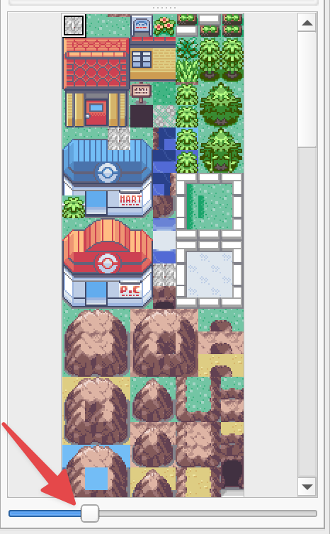

    Metatile Selection Zoom Slider

Selecting Metatiles
-------------------

Before you paint onto the map, you need to select which metatiles you will be painting.  The primary way to do this is to click on a metatile from the Metatile Selection Pane.  Whenever you change your selection, the selection preview will update so you can see exactly what you have selected at all times.

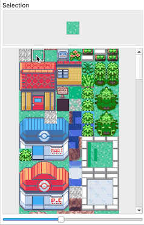

    Basic Metatile Selection

You can select more than one tile at a time by clicking and dragging the desired region.  For example, it's convenient to select the entire Pokémon Center at once. If your selection is too large to see, you can also resize the selection window.

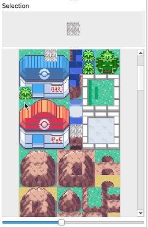

    Multiple Metatile Selection

Metatiles can also be selected from existing metatiles on the map area.  Use the Eyedropper Tool with ``Tools > Eyedropper`` (``E``), or simply click the |eyedropper-tool| button in the toolbar above the map area.  A more powerful way to do this is to right-click on the map when using the Pencil Tool or Bucket Fill Tool.  You can even right-click and drag to copy a region from the map.

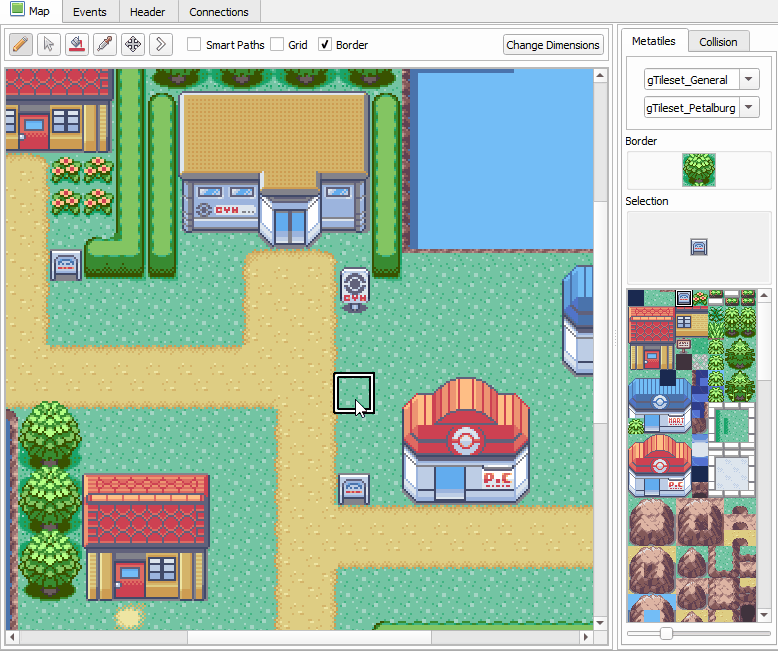

    Right-Click Metatile Selection

Now, let's learn how to use the various tools to paint your metatile selection onto the map.

Pencil Tool
-----------

The Pencil Tool |pencil-tool| (``Tools > Pencil``, or ``N``) is your bread and butter when editing maps.  Simply left-click to paint your current metatile selection onto the map.  You can click and drag to paint a bigger portion of the map.  When clicking and dragging, the metatiles will be painted as if they are snapping to a grid.  This simplifies things like painting large areas of trees.

While using the Pencil Tool (or really, viewing any map view in Porymap), the middle mouse button can be pressed as a hotkey to pan around the map. This is a convenient shortcut as an alternative to selecting the Move Tool.

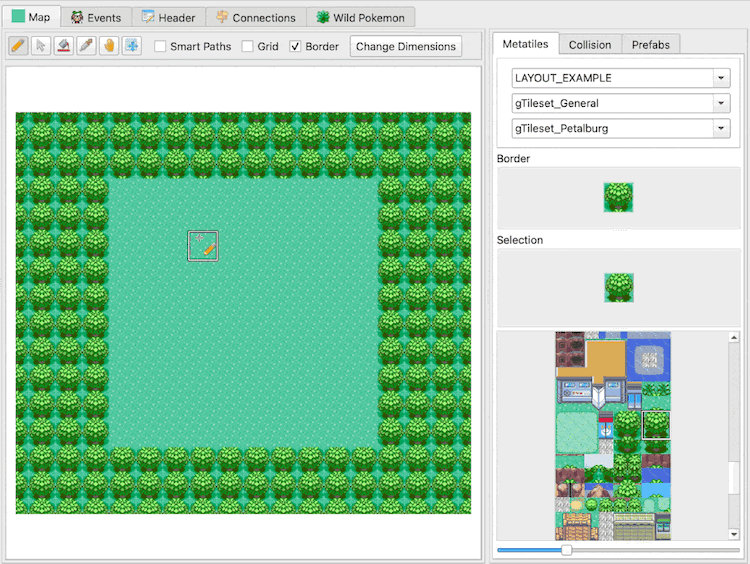

    Painting a Large Metatile Selection

.. |pencil-tool|
   image:: images/editing-map-tiles/pencil-tool.png
   :height: 24

Pointer Tool
------------

The Pointer Tool |pointer-tool| (``Tools > Pointer``, or ``P``) doesn't do anything.  It just allows you to click on the map without painting anything.

Bucket Fill Tool
----------------

The Bucket Fill Tool |bucket-fill-tool| (``Tools > Bucket Fill``, or ``B``) works just like you think it does.  It fills a contiguous region of identical metatiles.  If you have a large metatile selection, it will fill the region with that pattern.

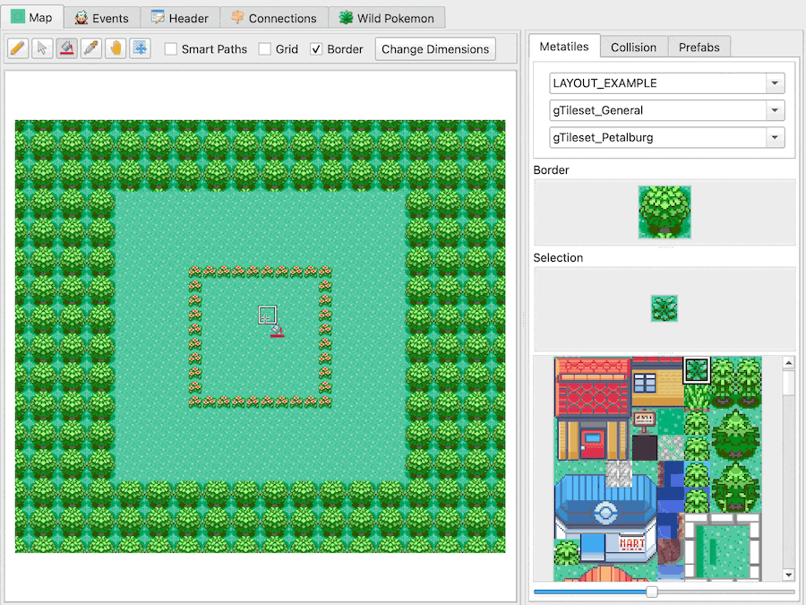

    Painting with Bucket Fill Tool

.. |bucket-fill-tool|
   image:: images/editing-map-tiles/bucket-fill-tool.png
   :height: 24

Holding down the ``Ctrl`` key (or ``Cmd``, on macOS) while using the Bucket Fill Tool will fill *all* matching metatiles on the map, rather that just the contiguous region.

Move Tool
---------

The Move Tool |move-tool| (``Tools > Move``, or ``M``) lets you pan around the map by clicking and dragging. You can also pan around the map with middle-click or by scrolling.

.. figure:: images/editing-map-tiles/map-pan.gif
    :alt: Panning with Move Tool
    :align: center

    Panning with Move Tool

Map Shift Tool
--------------

The Map Shift Tool |map-shift-tool| (``Tools > Map Shift``, or ``S``) lets you shift the metatile positions of the entire map at the same time.  This is useful after resizing a map.  (Though, simply right-click copying the entire map is another way of accomplishing the same thing.)  Metatiles are wrapped around to the other side of the map when using the Map Shift Tool.  Simply click and drag on the map to perform the map shift.

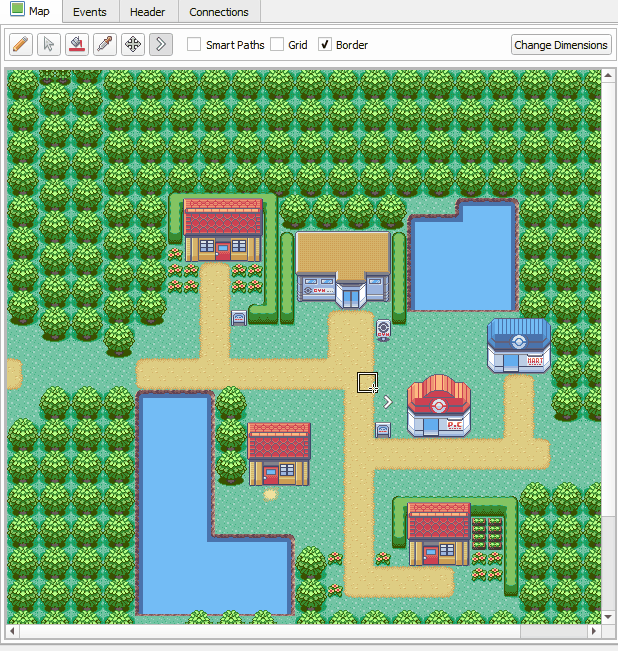

    Map Shift Tool

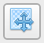

Smart Paths
-----------

Smart Paths provide an easy way to paint pathways, ponds, and mountains.  If there is any formation of metatiles that have a basic outline and a "middle" tile, then smart paths can help save you time when painting.  **Smart Paths can only be used when you have a 3x3 metatile selection.**  Smart Paths is only available when using the Pencil Tool or the Bucket Fill Tool.  To enable Smart Paths, you must either check the Smart Paths checkbox above the map area, or you can hold down the ``Shift`` key.  If you have the Smart Paths checkbox checked then you can temporarily disable smart paths by holding down the ``Shift`` key.  Below are a few examples that illustrate the power of Smart Paths.

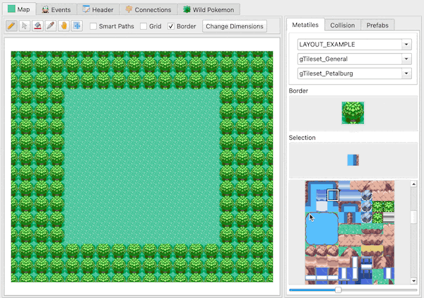

    Regular vs. Smart Paths

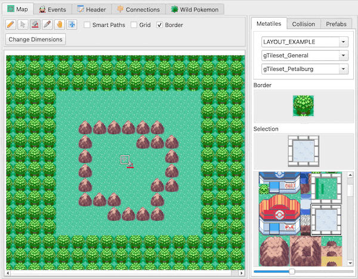

    Bucket Fill with Smart Paths

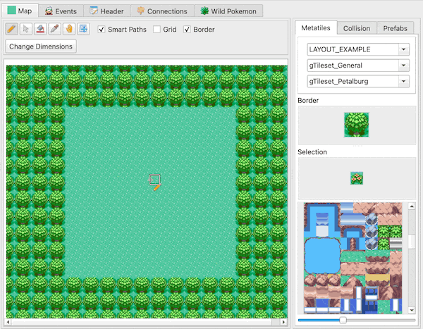

    Smart Paths from Right-Click Selection

Straight Paths
--------------

Straight Paths allows for painting tiles in straight lines by snapping the cursor to that line.  Either the X or Y axis will be locked depending on the direction you start painting in.  To enable straight paths simply hold down ``Ctrl`` (or ``Cmd``, on macOS) when painting tiles.  Straight paths works for both metatiles and collision tiles, and works in conjunction with *Smart Paths*.  It also works with the *Map Shift Tool*.  Straight path painting can be chained together with normal painting to allow you, for example, to paint a straight path, then release ``Ctrl`` to continue the path normally, then press ``Ctrl`` again to continue painting a straight path from that position.

Change Dimensions
-----------------

The dimensions of the map can be changed with the |change-dimensions| button. Clicking this button will bring up an interactive resizing window. Click and drag the borders around the map image to change the size of the map, or enter a specific size with the number inputs at the top. You can click and drag the map around to reposition it within the new size rectangle. Anything outside the rectangle when you finish will be deleted. If you'd like to undo your changes in this window you can hit |reset| to return to the original size and position.

.. figure:: images/editing-map-tiles/map-resizing.gif
    :alt: Resizing the map
    :align: center

    Resizing the map

Border Dimensions
^^^^^^^^^^^^^^^^^

The dimensions of the map's border can also be adjusted on this window for pokefirered projects via the ``Border Width`` and ``Border Height`` number inputs. If you have modified your pokeemerald or pokeruby project to support custom border sizes you can enable this option by checking ``Enable Custom Border Size`` on the ``Maps`` tab of ``Options > Project Settings...``.

.. |change-dimensions|
   image:: images/editing-map-tiles/change-dimensions.png
   :height: 24

.. |reset|
   image:: images/editing-map-tiles/reset.png
   :height: 24

Change Layout
-------------

The core visual data of the map is called the "layout". A map's size, which tilesets it uses, its border, metatiles, and collision/elevation are all part of the layout. The layout for the current map can be swapped using the Layout dropdown. This might be useful if you have multiple versions of the same map that you'd like to alternate between.

.. figure:: images/editing-map-tiles/layout-dropdown.png
    :alt: Layout Dropdown
    :width: 40%
    :align: center

    Layout Dropdown

Change Map Tilesets
-------------------

Every map uses exactly two Tilesets--primary and secondary.  These can be changed by choosing a different value from the two Tileset dropdowns.

.. figure:: images/editing-map-tiles/tileset-dropdowns.png
    :alt: Tileset Dropdowns
    :width: 40%
    :align: center

    Tileset Dropdowns

Change Map Border
-----------------

The map's border can be modified by painting on the Border image, which is located above the metatile selection pane.

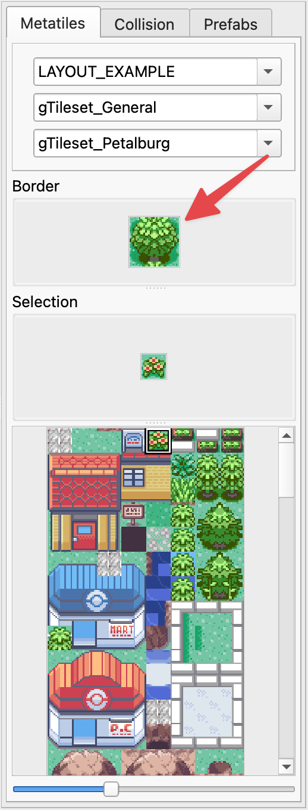

    Change Map Border

Undo & Redo
-----------

When painting metatiles, you can undo and redo actions you take.  This makes it very easy to fix mistakes or go back in time.  Undo can be performed with ``Ctrl+Z`` or ``Edit > Undo``.  Redo can be performed with ``Ctrl+Y``/``Ctrl+Shift+Z`` or ``Edit > Redo``.

.. _editing-map-tiles-prefabs:

Prefabs
-------

Prefabs, or "prefabricated selections", are a way to optimize your map-editing workflow by defining pre-built metatile selections. This can be useful when larger map objects can't be selected from the main metatile selector window. For example, the Poké Mart building is only partially selectable in the metatile selector view.

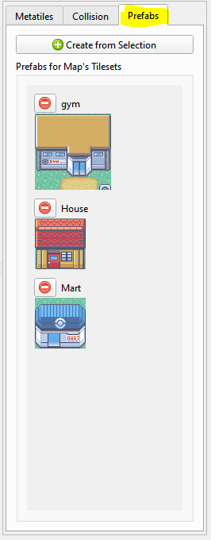

    Prefab Tab

Porymap provides a set of default prefabs for each supported base game version (pokeemerald, pokefirered, and pokeruby). When you first open the ``Prefabs`` tab for your project Porymap will prompt you to import those default prefabs.

To create a new prefab, simply select a group of metatiles from the main map view. (See the `Selecting Metatiles`_. section above for how to use right-click-drag to select from the map area.) Then, click the "Create from Selection" button. This will bring up the following window where individual metatiles can be toggled on/off in the prefab. You can also give your prefab a name.

.. figure:: images/editing-map-tiles/prefab-create.png
    :alt: Prefab Creation Window
    :align: center

    Prefab Creation Window

Prefabs are designated for whichever primary and secondary tilesets were used to create them. As such, any prefabs using tilesets that are incompatible with the currently-opened map will be hidden from the Prefab list.

To select a prefab to use for painting on the map, simply click on the prefab image in the list view.

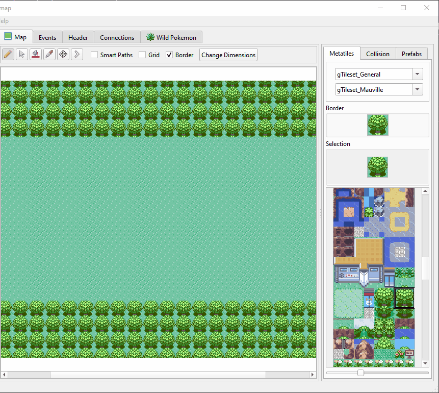

    Painting with a Prefab

Prefab data is saved to a JSON file. It defaults to ``<project_root>/prefabs.json``. This path can be changed at any time by editing ``Prefabs Path`` on the ``General`` tab of ``Options > Project Settings...``.
