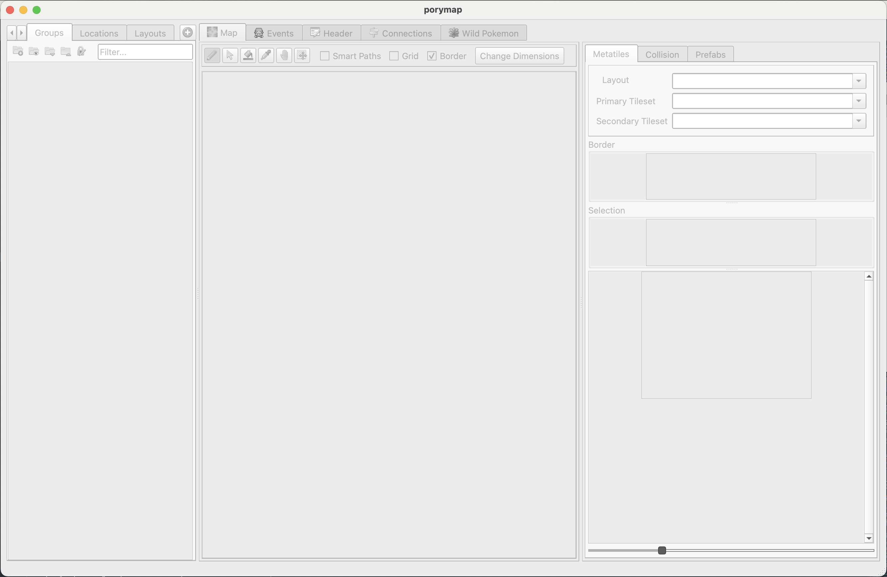
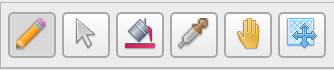
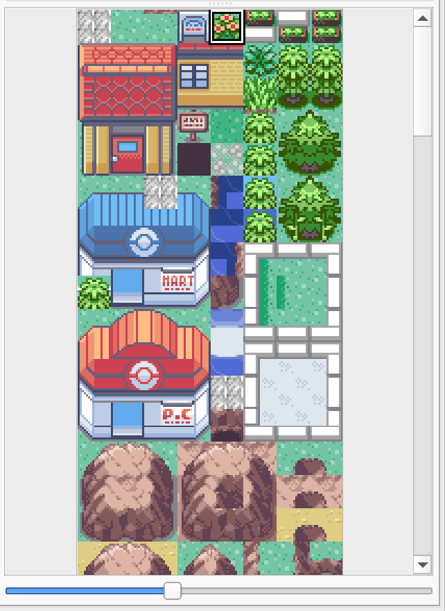

************
Introduction
************

About Porymap
-------------

**Porymap is a cross-platform map editor for the Gen 3 pret decompilation projects.  Its primary functions are to allow editing map tiles, collision, events, connections, and properties.  Porymap provides additional functionality, such as tileset editing and region map editing.  Downloadable releases are available for Windows and Mac, and Linux users can build it from source.**

Those familiar with traditional Gen 3 binary ROM hacking can think of it as the Advance Map equivalent for the decompilation projects.  Porymap supports the same features as Advance Map, so Advance Map users shouldn't have much difficulty learning how to use Porymap.  There are many usability improvements in Porymap.  The most notable is undo/redo when painting map tiles.

Porymap reads and writes files in the decompilation projects.  It **does not** read or write ROM files.  **Therefore, it is highly recommended to use Git for version control when working with Porymap.**

Getting Started
---------------

Before using Porymap, you must have your decompilation project setup.  Porymap supports the `pokeemerald <https://github.com/pret/pokeemerald>`_, `pokeruby <https://github.com/pret/pokeruby>`_, and `pokefirered <https://github.com/pret/pokefirered>`_ decompilation projects.  See their respective ``INSTALL.md`` files to get setup, and make sure you can successfully compile the ROM.

When launching Porymap for the first time, you will be greeted with the following empty window:

    Porymap Empty Window

The first thing we'll do is open a Gen 3 decompilation project with *File -> Open Project…* (``Ctrl+O``).  A folder selection dialog will pop up.  Choose the location of your existing decompilation project.  After doing so, Porymap will take a few seconds to load the project, and the main window should now be displaying the first map. (In ``pokeemerald``, it's Petalburg City.)

.. figure:: images/introduction/porymap-loaded-project.png
    :alt: Porymap Main Window

    Porymap Main Window

Now, let's make our first basic edit using Porymap. We'll use the Pencil Tool to draw some more flowers on the grass in Petalburg City.  First, make sure the Pencil Tool is selected.  You can click the Pencil Tool button, press the ``N`` shortcut, or select *Tools -> Pencil*.  The various painting Tool buttons are found on the left side of the toolbar above the map area.

    Tool Buttons

Next, select the flower metatile from the Metatile Selection panel by left-clicking on it.  The flower is metatile 0x4 in the General tileset.

    Metatile Selection Panel

Porymap shows the current metatile selection in the Selection panel.

.. figure:: images/introduction/metatile-current-selection.png
    :alt: Current Metatile Selection

    Current Metatile Selection

Place some flowers in Petalburg City by left-clicking to paint on the map area.

.. figure:: images/introduction/flowers-painted.png
    :alt: Flowery Petalburg City

    Flowery Petalburg City

That looks great!  Save your changes with *File -> Save* (``Ctrl+S``).  Finally, compile the ROM and see the results in-game.

.. note::
    When re-compiling your ROM, it is not recommended to use ``NODEP=1``, since that can result in data changes being ignored.

.. figure:: images/introduction/flower-petalburg-ingame.png
    :alt: Petalburg City In-Game Changes

    Petalburg City In-Game Changes

Now that you have the basic workflow down, it's time to learn how to navigate the various windows and screens of Porymap.
