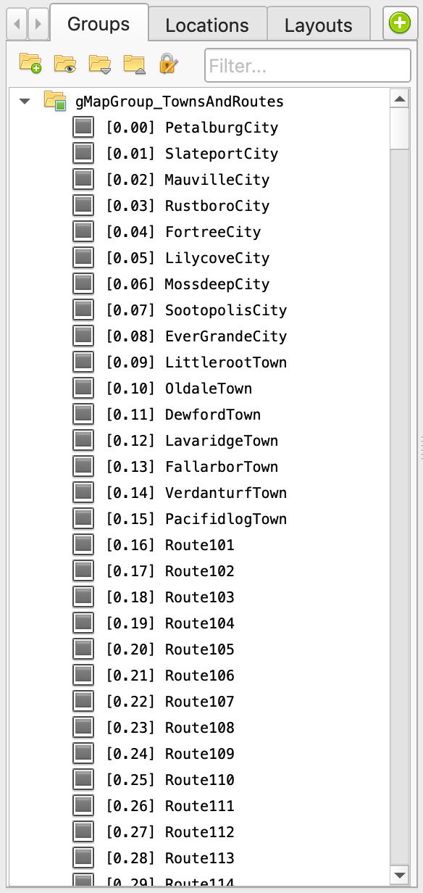
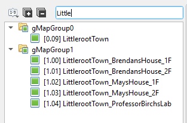
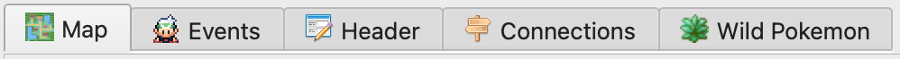
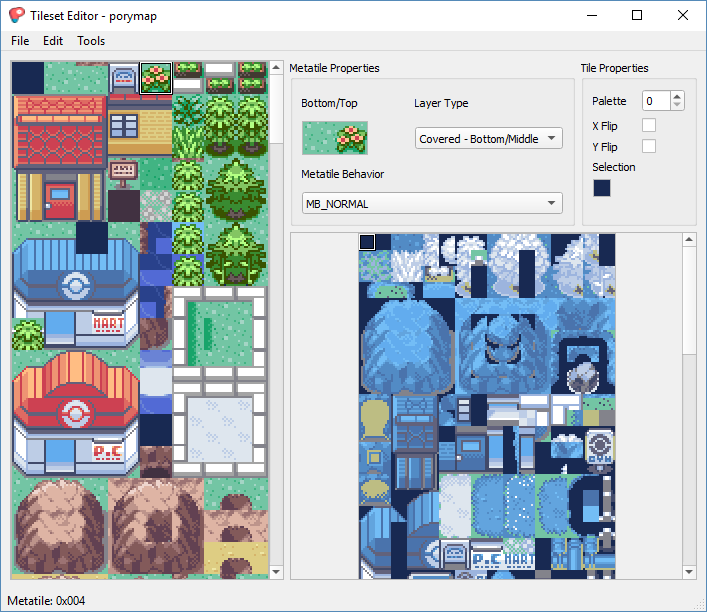
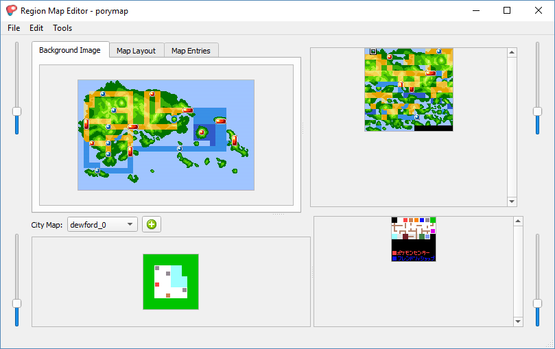

**********
Navigation
**********

Porymap can seem daunting at first because it has many buttons, tabs, panes, and windows.  Let's briefly go over the different parts of the application.

Map List
--------

The map list contains a hierarchical view of all of the maps in your project.  It is situated on the left side of Porymap's main window.  To switch to a different map, simply double-click or press ``Enter`` on the desired map's name.  Larger maps can take a few seconds to load the first time, so be patient.

    Map List Pane

By default, the maps are organized by their map groups.  The *Sort Map List* |sort-map-list-button| button gives you some other options to organize the maps:

Sort by Group
    Organizes by map groups.

Sort by Area
    Organizes by region map section.

Sort by Layout
    Organizes by map layouts. Most layouts are only used by a single map, but layouts like the Pokemon Center are used by many maps.

The *Expand All* |expand-all-button| and *Collapse All* |collapse-all-button| buttons will expand or collapse all of the map folders.

Type in the filter to show maps that contain the filter text.

    Filter Map List

.. |expand-all-button|
   image:: images/navigation/expand-all-button.png

.. |collapse-all-button|
   image:: images/navigation/collapse-all-button.png

Main Window
-----------

Most of the work you do in Porymap is in the center Main Window.  It features 4 tabbed views which each have different purposes, but they all operate within the context of the currently-opened map in the Map List.  Let's quickly summarize what each of these tabs is used for.

    Main Window Tabs

Map Tab
    Paint metatiles and their collision properties to change the appearance of the map and how the player can walk around the map.  When the Map Tab is selected, the pane on the right side of the map will have two tabs: Metatiles and Collision.  You can switch between these to paint either metatiles or collision properties onto the map.

Events Tab
    Edit the interactable events on the map.  This includes things like objects, warps, script triggers, and more.

Header Tab
    Choose various gameplay properties to set for the map. This includes things like background music and weather.

Connections Tab
    Change how the map connects with surrounding maps when the player walks from one to another.

Wild Pokémon Tab
    Edit the wild Pokémon available in the map.

Tileset Editor
--------------

The Tileset Editor can be opened with *File -> Tileset Editor*.  When the Tileset Editor is opened, it is opened in the context of the currently-opened map.  Every map has a primary and secondary tileset, so you will work with a combination of the two whenever you use the Tileset Editor.  The left-side pane shows the primary and secondary tilesets' metatiles.  The right-side panes allow you to modify the currently-selected metatile.

    Tileset Editor

Region Map Editor
-----------------

The Region Map Editor can be opened with *File -> Region Map Editor*. This window will allow you to modify the look and layout of maps on the game's region map.  You can also modify the city map images using the bottom two panes.

    Region Map Editor

We covered all of the basic views and windows of Porymap above.  Next, let's learn how to use Porymap's features to the fullest when editing map tiles.
