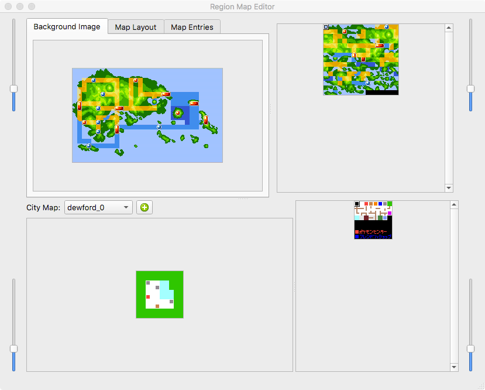
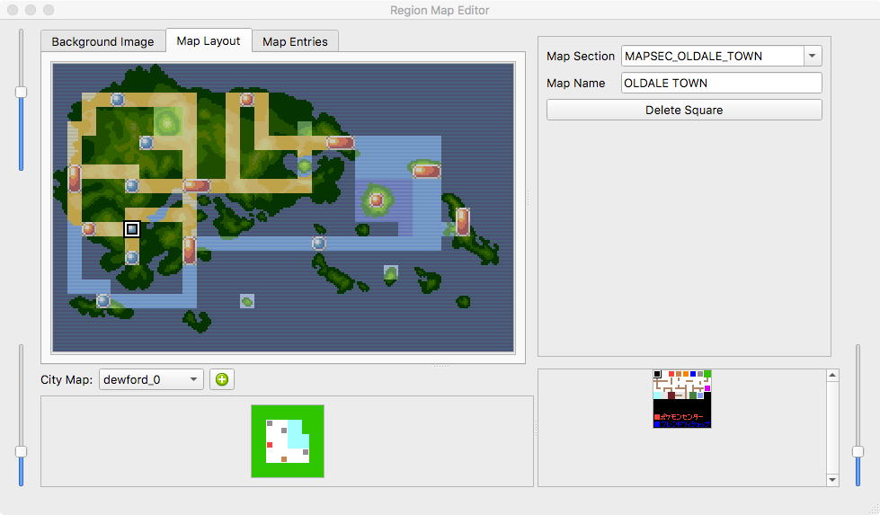
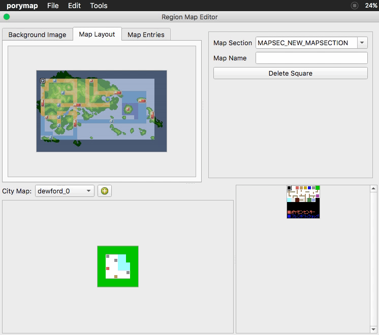
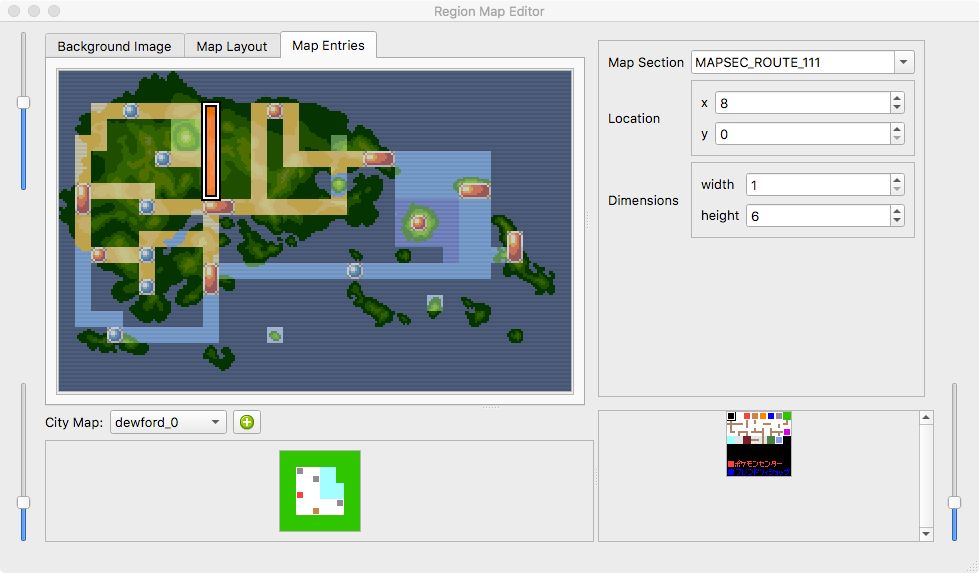
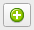

*********************
The Region Map Editor
*********************

This is where you edit the region map for your game.  To open the region map 
editor, navigate to *Tools -> Region Map Editor* from porymap's main window.

.. note::
    The region map editor is currently only available for pokeemerald and pokeruby.

When you first open the region map editor, your window will look like this:

    Region Map Editor Window

This window is split vertically--the region map editing is done at the top, 
while the zoomed-in city maps are edited at the bottom.  You can use the 
sliders to zoom in and out on each of the view panes.  You will notice 
that there are three different tabs above the image of the region map 
(:ref:`Background Image <background-image-tab>`,
:ref:`Map Layout <map-layout-tab>`,
:ref:`Map Entries <map-entries-tab>`).  Let's take a look at each tab's 
functionality in more detail...

.. _background-image-tab:

Background Image Tab
--------------------

When this tab is selected, you can draw on the region map.  Select tiles from
the tile selector on the right.  You can single-click or drag your mouse around 
to paint the selected tile onto the region map image.  If you make a mistake, or 
are unhappy with what you have done, you can undo (``Ctrl+Z`` or *Edit -> Undo*)
and redo (``Ctrl+Y`` or *Edit -> Redo*) your changes.  Right-clicking on the map
image will select the tile under your mouse from the tile selector.  

If you want to clear the background image, *Edit -> Clear Background Image* 
will set all tiles to the first tile in the tile selector.

.. figure:: images/region-map-editor/rme-painting-image.gif
    :scale: 75%
    :align: center
    :alt: RME Paint

    Drawing on the Region Map Image

It is likely that you will want to use your own tiles for your region map.  You 
can import a tile image by navigating to *Tools -> Import Region Map Image Tiles*.
There are strict requirements for your region map tile image.  It must (1) be 
indexed with a 256 color palette\*, (2) be composed of 8x8 pixel tiles, (3) have 256
or fewer tiles.

\* While the region map tile image requires a 256-color palette, the image only
uses the 32 colors beginning at index 112 in the palette.

.. _map-layout-tab:

Map Layout Tab
--------------

The layout tab is where map sections are placed on the region map.  When the 
player looks at the region map in-game, the layout determines the map under the
cursor.

    RME Layout Tab

To modify the region map layout, select a position by clicking on the map image
and higlighting a single square.  The "Map Section" combobox will be populated
with all of the map sections defined in ``include/constants/region_map_sections.h``.
Select the map section you want to associate with the selected position on the 
region map.  To change the popup name of the map section when you enter the map,
type it into the "Map Name" box.  The popup name is tied to the map section, so
each layout square with the same map section will share a name.

If you want to start from a blank layout, *Edit -> Clear Map Layout* will set
all layout squares to the value of ``MAPSEC_NONE``.

When adding new region map sections, the layout will be affected.  This is 
because the layout is stored as a binary file and uses the raw value of each
map section.  In order to fix your layout to account for this, you can swap two
values for the entire layout with *Edit -> Swap*.

In this example, ``MAPSEC_NEW_MAPSEC`` is inserted before ``MAPSEC_NONE``, and 
therefore the layout will link the original value of ``MAPSEC_NONE`` to the new 
map section ``MAPSEC_NEW_MAPSEC``.  Instances of ``MAPSEC_NEW_MAPSEC`` are swapped
with ``MAPSEC_NONE``.

    Swapping Map Sections

The "Delete Square" button simply resets a single layout square to ``MAPSEC_NONE``.

.. _map-entries-tab:

Map Entries Tab
---------------

A region map entry is the area on the region map that spans an entire map section.
This determines, for example, where the player's head appears on the region map
in-game.  Entries are stored at ``src/data/region_map/region_map_entries.h``.

    RME Entries Tab

To edit an entry, select a map section from the "Map Section" combobox.  You can
use the "Location" "x" and "y" spinboxes to change the coordinates of the entry.
You can also drag the entry around the map.  The "x" and "y" values correspond to
the position of the entry's top-left square on the region map.  The "Dimensions" 
"width" and "height" spinboxes will change the size of the map entry.

City Maps
---------

In the bottom half of the region map editor window, city maps can be edited.  
You paint on this the same way you paint on the region map background image.

.. figure:: images/region-map-editor/rme-painting-city.gif
    :scale: 60%
    :align: center
    :alt: City Paint

    Drawing on the City Map

To use custom tiles, there is a tile image importer under
*Tools -> Import City Map Image Tiles*. These images must (1) be indexed with a
16 color palette, (2) be made up of 8x8 pixel tiles, (3) have 256 or fewer tiles.

You can add a new city map by pressing the |new-city-map-button| button.

Currently, it is not possible to associate a city map to a region map location,
but that functionality will be added in a future update.

