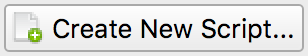
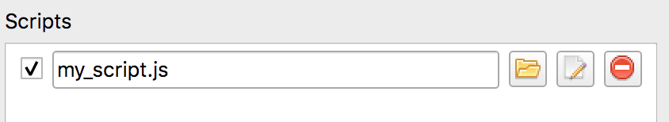

**********************
Scripting Capabilities
**********************

Porymap is extensible via scripting capabilities. This allows the user to write custom JavaScript (technically, ECMAScript) files to support enhanced workflows, without having to fork Porymap itself. While the possibilities are endless, some useful examples of scripting might be:

- Toggle Day/Night Palettes
- Custom Map Painting Brushes
- Detect Tile Errors
- Show Diagonistic Information
- Procedurally Generated Maps
- Randomize Grass Patterns

Custom Scripts Editor
---------------------

Your custom scripts can be managed with the Custom Scripts Editor accessible under ``Options -> Custom Scripts...``.

.. figure:: images/scripting-capabilities/custom-scripts-editor.png
    :alt: Custom Scripts Editor
    :width: 60%
    :align: center

    Custom Scripts Editor

At the top there are three basic buttons for managing your scripts:
 - |button-create| Opens a prompt to create a new script file, which will be populated with a basic template.
 - |button-load| Lets you add an existing script file to Porymap that you've already created or downloaded from elsewhere.
 - |button-refresh| Any edits made to your scripts while Porymap is already open will not be reflected until you select this button.

Below these buttons is a list of all the custom scripts you have loaded for your project. Each entry will have a text box showing the path of the script file. This path can be freely updated, or you can choose a new path with the |button-folder| button next to it. The |button-edit| button will open the script file in your default text editor, and the |button-remove| button will remove it from the list. The check box to the left of the filepath indicates whether your script should be running. If you'd like to temporarily disable a script you can uncheck this box.

.. |button-load| image:: images/scripting-capabilities/button-load.png
   :height: 24
.. |button-refresh| image:: images/scripting-capabilities/button-refresh.png
   :height: 24
.. |button-folder| image:: images/scripting-capabilities/folder.png
   :width: 24
   :height: 24
.. |button-edit| image:: images/scripting-capabilities/file_edit.png
   :width: 24
   :height: 24
.. |button-remove| image:: images/scripting-capabilities/delete.png
   :width: 24
   :height: 24

Writing a Custom Script
-----------------------

Let's write a custom script that will randomize grass patterns when the user is editing the map. This is useful, since it's cumbersome to manually add randomness to grass patches. With the custom script, it will happen automatically. Whenever the user paints a grass tile onto the map, the script will overwrite the tile with a random grass tile instead.

First, open the ``Options -> Custom Scripts...`` window and select the |button-create| button. This will open a file save prompt; let's name our new script file ``my_script.js`` and save it. We've successfully added a new script! We can now see it listed in the editor.

At the moment our script doesn't do anything. Let's select the |button-edit| button to open it and write the actual code that will power the grass-randomizer. Once the script file is open you will notice that there are several empty functions already inside. These are special "callback" functions that will be called automatically for certain events that occur while Porymap is running. We're interested in the ``onBlockChanged()`` callback, since we want our script to take action whenever a user paints a block on the map.

.. code-block:: js
   
   // Porymap callback when a block is painted.
   export function onBlockChanged(x, y, prevBlock, newBlock) {
       // Grass-randomizing logic goes here.
   }

We can leave the rest of the callback functions in here alone, or we can delete them because we're not using them. Every callback function does not need to be defined in your script. **Note**: For Porymap to be able to execute these callback functions they need to have the ``export`` keyword. The rest of the functions in your script do not need this keyword.

In addition to the callbacks, Porymap also supports a scripting API so that the script can interact with Porymap in interesting ways. For example, a script can change a block or add overlay text on the map. Since we want to paint random grass tiles, we'll be using the ``map.setMetatileId()`` function. Let's fill in the rest of the grass-randomizing code.

.. note::
   **For pokeemerald/pokeruby users**: We only have 1 regular grass metatile, but if you want to try this script you could replace ``const grassTiles = [0x8, 0x9, 0x10, 0x11];`` in the code below with ``const grassTiles = [0x1, 0x4, 0xD];`` to randomize using tall grass and flowers instead!

.. code-block:: js

	function randInt(min, max) {
	    min = Math.ceil(min);
	    max = Math.floor(max);
	    return Math.floor(Math.random() * (max - min)) + min;
	}

	// These are the grass metatiles in pokefirered.
	const grassTiles = [0x8, 0x9, 0x10, 0x11];

	// Porymap callback when a block is painted.
	export function onBlockChanged(x, y, prevBlock, newBlock) {
	    // Check if the user is painting a grass tile.
	    if (grassTiles.indexOf(newBlock.metatileId) != -1) {
	        // Choose a random grass tile and paint it on the map.
	        const i = randInt(0, grassTiles.length);
	        map.setMetatileId(x, y, grassTiles[i]);
	    }
	}

Let's apply our changes by selecting the |button-refresh| button. Because we've added a new script we'll be met with this confirmation prompt. Accept this prompt by selecting ``YES``.

.. figure:: images/scripting-capabilities/refresh-prompt.png
    :alt: Refresh Scripts Prompt
    :width: 60%
    :align: center

Now let's test our script! If we try to paint grass on the map, we should see our script inserting a nice randomized grass pattern.

.. figure:: images/scripting-capabilities/porymap-scripting-grass.gif
    :alt: Grass-Randomizing Script

    Grass-Randomizing Script

Registering Script Actions
--------------------------

The grass-randomizer script above happens implicitly when the user paints on the map. However, other times we probably want to call the custom script on demand. One of the API functions Porymap provides is the ability to trigger scripting functions from the ``Tools`` menu, or a keyboard shortcut. To do this, we will usually want to register the action when the project loads. Here is an example script where some custom actions are registered.

.. code-block:: js

	export function applyNightTint() {
	    // Apply night palette tinting...
	}

	// Porymap callback when project is opened.
	export function onProjectOpened(projectPath) {
	   utility.registerAction("applyNightTint", "View Night Tint", "T")
	}

Then, to trigger the ``applyNightTint()`` function, we could either click ``Tools -> View Night Tint`` or use the ``T`` keyboard shortcut. **Note**: Like callbacks, functions registered using ``utility.registerAction()`` also need the ``export`` keyword for Porymap to call them.

Now that we have an overview of how to utilize Porymap's scripting capabilities, the entire scripting API is documented below.

Scripting API
-------------

Callbacks
~~~~~~~~~

.. js:function:: onProjectOpened(projectPath)

   Called when Porymap successfully opens a project.

   :param projectPath: the directory path of the opened project
   :type projectPath: string

.. js:function:: onProjectClosed(projectPath)

   Called when Porymap closes a project. For example, this is called when opening a different project.

   :param projectPath: the directory path of the closed project
   :type projectPath: string

.. js:function:: onMapOpened(mapName)

   Called when a map is opened.

   :param mapName: the name of the opened map
   :type mapName: string

.. js:function:: onBlockChanged(x, y, prevBlock, newBlock)

   Called when a block is changed on the map. For example, this is called when a user paints a new tile or changes the collision property of a block.

   :param x: x coordinate of the block
   :type x: number
   :param y: y coordinate of the block
   :type y: number
   :param prevBlock: the block's state before it was modified. The object's shape is ``{metatileId, collision, elevation, rawValue}``
   :type prevBlock: object
   :param newBlock: the block's new state after it was modified. The object's shape is ``{metatileId, collision, elevation, rawValue}``
   :type newBlock: object

.. js:function:: onBorderMetatileChanged(x, y, prevMetatileId, newMetatileId)

   Called when a border metatile is changed.

   :param x: x coordinate of the block
   :type x: number
   :param y: y coordinate of the block
   :type y: number
   :param prevMetatileId: the metatile id of the border block before it was modified
   :type prevMetatileId: number
   :param newMetatileId: the metatile id of the border block after it was modified
   :type newMetatileId: number

.. js:function:: onBlockHoverChanged(x, y)

   Called when the mouse enters a new map block.

   :param x: x coordinate of the block
   :type x: number
   :param y: y coordinate of the block
   :type y: number

.. js:function:: onBlockHoverCleared()

   Called when the mouse exits the map.

.. js:function:: onMapResized(oldWidth, oldHeight, newWidth, newHeight)

   Called when the dimensions of the map are changed.

   :param oldWidth: the width of the map before the change
   :type oldWidth: number
   :param oldHeight: the height of the map before the change
   :type oldHeight: number
   :param newWidth: the width of the map after the change
   :type newWidth: number
   :param newHeight: the height of the map after the change
   :type newHeight: number

.. js:function:: onBorderResized(oldWidth, oldHeight, newWidth, newHeight)

   Called when the dimensions of the border are changed.

   :param oldWidth: the width of the border before the change
   :type oldWidth: number
   :param oldHeight: the height of the border before the change
   :type oldHeight: number
   :param newWidth: the width of the border after the change
   :type newWidth: number
   :param newHeight: the height of the border after the change
   :type newHeight: number

.. js:function:: onMapShifted(xDelta, yDelta)

   Called when the map is updated by use of the Map Shift tool.

   :param xDelta: the horizontal change from the shift
   :type xDelta: number
   :param yDelta: the vertical change from the shift
   :type yDelta: number

.. js:function:: onTilesetUpdated(tilesetName)

   Called when the currently loaded tileset is changed by switching to a new one or by saving changes to it in the Tileset Editor.

   :param tilesetName: the name of the updated tileset
   :type tilesetName: string

.. js:function:: onMainTabChanged(oldTab, newTab)

   Called when the selected tab in the main tab bar is changed. Tabs are indexed from left to right, starting at 0 (``0``: Map, ``1``: Events, ``2``: Header, ``3``: Connections, ``4``: Wild Pokemon).

   :param oldTab: the index of the previously selected tab
   :type oldTab: number
   :param newTab: the index of the newly selected tab
   :type newTab: number

.. js:function:: onMapViewTabChanged(oldTab, newTab)

   Called when the selected tab in the map view tab bar is changed. Tabs are indexed from left to right, starting at 0 (``0``: Metatiles, ``1``: Collision, ``2``: Prefabs).

   :param oldTab: the index of the previously selected tab
   :type oldTab: number
   :param newTab: the index of the newly selected tab
   :type newTab: number

.. js:function:: onBorderVisibilityToggled(visible)

   Called when the visibility of the border and connecting maps is toggled on or off.

   :param visible: whether the border is now visible
   :type visible: boolean

Functions
~~~~~~~~~

Map Editing Functions
^^^^^^^^^^^^^^^^^^^^^

The following functions are related to editing the map's blocks or retrieving information about them.

All map editing functions are callable via the global ``map`` object.

.. js:function:: map.getBlock(x, y)

   Gets a block in the currently-opened map.

   :param x: x coordinate of the block
   :type x: number
   :param y: y coordinate of the block
   :type y: number
   :returns: the block object
   :rtype: object (``{metatileId, collision, elevation, rawValue}``)

.. js:function:: map.setBlock(x, y, metatileId, collision, elevation, forceRedraw = true, commitChanges = true)

   Sets a block in the currently-opened map.

   :param x: x coordinate of the block
   :type x: number
   :param y: y coordinate of the block
   :type y: number
   :param metatileId: the metatile id of the block
   :type metatileId: number
   :param collision: the collision of the block (``0`` = passable, ``1-3`` = impassable)
   :type collision: number
   :param elevation: the elevation of the block
   :type elevation: number
   :param forceRedraw: Force the map view to refresh. Defaults to ``true``. Redrawing the map view is expensive, so set to ``false`` when making many consecutive map edits, and then redraw the map once using ``map.redraw()``.
   :type forceRedraw: boolean
   :param commitChanges: Commit the changes to the map's edit/undo history. Defaults to ``true``. When making many related map edits, it can be useful to set this to ``false``, and then commit all of them together with ``map.commit()``.
   :type commitChanges: boolean

.. js:function:: map.setBlock(x, y, rawValue, forceRedraw = true, commitChanges = true)

   Sets a block in the currently-opened map. This is an overloaded function that takes the raw value of a block instead of each of the block's properties individually.

   :param x: x coordinate of the block
   :type x: number
   :param y: y coordinate of the block
   :type y: number
   :param rawValue: the 16 bit value of the block. Bits ``0-9`` will be the metatile id, bits ``10-11`` will be the collision, and bits ``12-15`` will be the elevation.
   :type rawValue: number
   :param forceRedraw: Force the map view to refresh. Defaults to ``true``. Redrawing the map view is expensive, so set to ``false`` when making many consecutive map edits, and then redraw the map once using ``map.redraw()``.
   :type forceRedraw: boolean
   :param commitChanges: Commit the changes to the map's edit/undo history. Defaults to ``true``. When making many related map edits, it can be useful to set this to ``false``, and then commit all of them together with ``map.commit()``.
   :type commitChanges: boolean

.. js:function:: map.getMetatileId(x, y)

   Gets the metatile id of a block in the currently-opened map.

   :param x: x coordinate of the block
   :type x: number
   :param y: y coordinate of the block
   :type y: number
   :returns: the metatile id of the block
   :rtype: number

.. js:function:: map.setMetatileId(x, y, metatileId, forceRedraw = true, commitChanges = true)

   Sets the metatile id of a block in the currently-opened map.

   :param x: x coordinate of the block
   :type x: number
   :param y: y coordinate of the block
   :type y: number
   :param metatileId: the metatile id of the block
   :type metatileId: number
   :param forceRedraw: Force the map view to refresh. Defaults to ``true``. Redrawing the map view is expensive, so set to ``false`` when making many consecutive map edits, and then redraw the map once using ``map.redraw()``.
   :type forceRedraw: boolean
   :param commitChanges: Commit the changes to the map's edit/undo history. Defaults to ``true``. When making many related map edits, it can be useful to set this to ``false``, and then commit all of them together with ``map.commit()``.
   :type commitChanges: boolean

.. js:function:: map.getBorderMetatileId(x, y)

   Gets the metatile id of a block in the border of the currently-opened map.

   :param x: x coordinate of the block
   :type x: number
   :param y: y coordinate of the block
   :type y: number
   :returns: the metatile id of the block
   :rtype: number

.. js:function:: map.setBorderMetatileId(x, y, metatileId, forceRedraw = true, commitChanges = true)

   Sets the metatile id of a block in the border of the currently-opened map.

   :param x: x coordinate of the block
   :type x: number
   :param y: y coordinate of the block
   :type y: number
   :param metatileId: the metatile id of the block
   :type metatileId: number
   :param forceRedraw: Force the map view to refresh. Defaults to ``true``. Redrawing the map view is expensive, so set to ``false`` when making many consecutive map edits, and then redraw the map once using ``map.redraw()``.
   :type forceRedraw: boolean
   :param commitChanges: Commit the changes to the map's edit/undo history. Defaults to ``true``. When making many related map edits, it can be useful to set this to ``false``, and then commit all of them together with ``map.commit()``.
   :type commitChanges: boolean

.. js:function:: map.getCollision(x, y)

   Gets the collision of a block in the currently-opened map. (``0`` = passable, ``1-3`` = impassable)

   :param x: x coordinate of the block
   :type x: number
   :param y: y coordinate of the block
   :type y: number
   :returns: the collision of the block
   :rtype: number

.. js:function:: map.setCollision(x, y, collision, forceRedraw = true, commitChanges = true)

   Sets the collision of a block in the currently-opened map. (``0`` = passable, ``1-3`` = impassable)

   :param x: x coordinate of the block
   :type x: number
   :param y: y coordinate of the block
   :type y: number
   :param collision: the collision of the block
   :type collision: number
   :param forceRedraw: Force the map view to refresh. Defaults to ``true``. Redrawing the map view is expensive, so set to ``false`` when making many consecutive map edits, and then redraw the map once using ``map.redraw()``.
   :type forceRedraw: boolean
   :param commitChanges: Commit the changes to the map's edit/undo history. Defaults to ``true``. When making many related map edits, it can be useful to set this to ``false``, and then commit all of them together with ``map.commit()``.
   :type commitChanges: boolean

.. js:function:: map.getElevation(x, y)

   Gets the elevation of a block in the currently-opened map.

   :param x: x coordinate of the block
   :type x: number
   :param y: y coordinate of the block
   :type y: number
   :returns: the elevation of the block
   :rtype: number

.. js:function:: map.setElevation(x, y, elevation, forceRedraw = true, commitChanges = true)

   Sets the elevation of a block in the currently-opened map.

   :param x: x coordinate of the block
   :type x: number
   :param y: y coordinate of the block
   :type y: number
   :param elevation: the elevation of the block
   :type elevation: number
   :param forceRedraw: Force the map view to refresh. Defaults to ``true``. Redrawing the map view is expensive, so set to ``false`` when making many consecutive map edits, and then redraw the map once using ``map.redraw()``.
   :type forceRedraw: boolean
   :param commitChanges: Commit the changes to the map's edit/undo history. Defaults to ``true``. When making many related map edits, it can be useful to set this to ``false``, and then commit all of them together with ``map.commit()``.
   :type commitChanges: boolean

.. js:function:: map.setBlocksFromSelection(x, y, forceRedraw = true, commitChanges = true)

   Sets blocks on the map using the user's current metatile selection.

   :param x: initial x coordinate
   :type x: number
   :param y: initial y coordinate
   :type y: number
   :param forceRedraw: Force the map view to refresh. Defaults to ``true``. Redrawing the map view is expensive, so set to ``false`` when making many consecutive map edits, and then redraw the map once using ``map.redraw()``.
   :type forceRedraw: boolean
   :param commitChanges: Commit the changes to the map's edit/undo history. Defaults to ``true``. When making many related map edits, it can be useful to set this to ``false``, and then commit all of them together with ``map.commit()``.
   :type commitChanges: boolean

.. js:function:: map.bucketFill(x, y, metatileId, forceRedraw = true, commitChanges = true)

   Performs a bucket fill of a metatile id, starting at the given coordinates.

   :param x: initial x coordinate
   :type x: number
   :param y: initial y coordinate
   :type y: number
   :param metatileId: metatile id to fill
   :type metatileId: number
   :param forceRedraw: Force the map view to refresh. Defaults to ``true``. Redrawing the map view is expensive, so set to ``false`` when making many consecutive map edits, and then redraw the map once using ``map.redraw()``.
   :type forceRedraw: boolean
   :param commitChanges: Commit the changes to the map's edit/undo history. Defaults to ``true``. When making many related map edits, it can be useful to set this to ``false``, and then commit all of them together with ``map.commit()``.
   :type commitChanges: boolean

.. js:function:: map.bucketFillFromSelection(x, y, forceRedraw = true, commitChanges = true)

   Performs a bucket fill using the user's current metatile selection, starting at the given coordinates.

   :param x: initial x coordinate
   :type x: number
   :param y: initial y coordinate
   :type y: number
   :param forceRedraw: Force the map view to refresh. Defaults to ``true``. Redrawing the map view is expensive, so set to ``false`` when making many consecutive map edits, and then redraw the map once using ``map.redraw()``.
   :type forceRedraw: boolean
   :param commitChanges: Commit the changes to the map's edit/undo history. Defaults to ``true``. When making many related map edits, it can be useful to set this to ``false``, and then commit all of them together with ``map.commit()``.
   :type commitChanges: boolean

.. js:function:: map.magicFill(x, y, metatileId, forceRedraw = true, commitChanges = true)

   Performs a magic fill of a metatile id, starting at the given coordinates.

   :param x: initial x coordinate
   :type x: number
   :param y: initial y coordinate
   :type y: number
   :param metatileId: metatile id to magic fill
   :type metatileId: number
   :param forceRedraw: Force the map view to refresh. Defaults to ``true``. Redrawing the map view is expensive, so set to ``false`` when making many consecutive map edits, and then redraw the map once using ``map.redraw()``.
   :type forceRedraw: boolean
   :param commitChanges: Commit the changes to the map's edit/undo history. Defaults to ``true``. When making many related map edits, it can be useful to set this to ``false``, and then commit all of them together with ``map.commit()``.
   :type commitChanges: boolean

.. js:function:: map.magicFillFromSelection(x, y, forceRedraw = true, commitChanges = true)

   Performs a magic fill using the user's current metatile selection, starting at the given coordinates.

   :param x: initial x coordinate
   :type x: number
   :param y: initial y coordinate
   :type y: number
   :param forceRedraw: Force the map view to refresh. Defaults to ``true``. Redrawing the map view is expensive, so set to ``false`` when making many consecutive map edits, and then redraw the map once using ``map.redraw()``.
   :type forceRedraw: boolean
   :param commitChanges: Commit the changes to the map's edit/undo history. Defaults to ``true``. When making many related map edits, it can be useful to set this to ``false``, and then commit all of them together with ``map.commit()``.
   :type commitChanges: boolean

.. js:function:: map.shift(xDelta, yDelta, forceRedraw = true, commitChanges = true)

   Performs a shift on the map's blocks.

   :param xDelta: number of blocks to shift horizontally
   :type xDelta: number
   :param yDelta: number of blocks to shift vertically
   :type yDelta: number
   :param forceRedraw: Force the map view to refresh. Defaults to ``true``. Redrawing the map view is expensive, so set to ``false`` when making many consecutive map edits, and then redraw the map once using ``map.redraw()``.
   :type forceRedraw: boolean
   :param commitChanges: Commit the changes to the map's edit/undo history. Defaults to ``true``. When making many related map edits, it can be useful to set this to ``false``, and then commit all of them together with ``map.commit()``.
   :type commitChanges: boolean

.. js:function:: map.getDimensions()

   Gets the dimensions of the currently-opened map.

   :returns: the dimensions of the map
   :rtype: object (``{width, height}``)

.. js:function:: map.getWidth()

   Gets the width of the currently-opened map.

   :returns: the width of the map
   :rtype: number

.. js:function:: map.getHeight()

   Gets the height of the currently-opened map.

   :returns: the height of the map
   :rtype: number

.. js:function:: map.getBorderDimensions()

   Gets the dimensions of the border of the currently-opened map.

   :returns: the dimensions of the border
   :rtype: object (``{width, height}``)

.. js:function:: map.getBorderWidth()

   Gets the width of the border of the currently-opened map.

   :returns: the width of the border
   :rtype: number

.. js:function:: map.getBorderHeight()

   Gets the height of the border of the currently-opened map.

   :returns: the height of the border
   :rtype: number

.. js:function:: map.setDimensions(width, height)

   Sets the dimensions of the currently-opened map.

   :param width: width in blocks
   :type width: number
   :param height: height in blocks
   :type height: number

.. js:function:: map.setWidth(width)

   Sets the width of the currently-opened map.

   :param width: width in blocks
   :type width: number

.. js:function:: map.setHeight()

   Sets the height of the currently-opened map.

   :param height: height in blocks
   :type height: number

.. js:function:: map.setBorderDimensions(width, height)

   Sets the dimensions of the border of the currently-opened map. If the config setting ``use_custom_border_size`` is set to ``0`` then this does nothing.

   :param width: width in blocks
   :type width: number
   :param height: height in blocks
   :type height: number

.. js:function:: map.setBorderWidth(width)

   Sets the width of the border of the currently-opened map. If the config setting ``use_custom_border_size`` is set to ``0`` then this does nothing.

   :param width: width in blocks
   :type width: number

.. js:function:: map.setBorderHeight(height)

   Sets the height of the border of the currently-opened map. If the config setting ``use_custom_border_size`` is set to ``0`` then this does nothing.

   :param height: height in blocks
   :type height: number

.. js:function:: map.redraw()

   Redraws the entire map area. Useful when delaying map redraws using ``forceRedraw = false`` in certain map editing functions.

.. js:function:: map.commit()

   Commits any uncommitted changes to the map's edit/undo history. Useful when delaying commits using ``commitChanges = false`` in certain map editing functions.

Map Header Editing Functions
^^^^^^^^^^^^^^^^^^^^^^^^^^^^

The following functions are related to reading/writing the map's header properties.

All map header functions are callable via the global ``map`` object.

.. js:function:: map.getSong()

   Gets the name of the background song for the currently-opened map.

   :returns: the name of the song
   :rtype: string

.. js:function:: map.setSong(song)

   Sets the name of the background song for the currently-opened map. The song name must be one of the names in the "Song" dropdown menu on the Header tab.

   :param song: the name of the song
   :type song: string

.. js:function:: map.getLocation()

   Gets the name of the region map location for the currently-opened map.

   :returns: the name of the location
   :rtype: string

.. js:function:: map.setLocation(location)

   Sets the name of the region map location for the currently-opened map. The location name must be one of the names in the "Location" dropdown menu on the Header tab.

   :param location: the name of the location
   :type location: string

.. js:function:: map.getRequiresFlash()

   Gets whether flash would be required in-game for the currently-opened map.

   :returns: whether flash is required
   :rtype: boolean

.. js:function:: map.setRequiresFlash(require)

   Sets whether flash would be required in-game for the currently-opened map.

   :param require: whether flash should be required
   :type require: boolean

.. js:function:: map.getWeather()

   Gets the name of the weather for the currently-opened map.

   :returns: the name of the weather
   :rtype: string

.. js:function:: map.setWeather(weather)

   Sets the name of the weather for the currently-opened map. The weather name must be one of the names in the "Weather" dropdown menu on the Header tab.

   :param weather: the name of the weather
   :type weather: string

.. js:function:: map.getType()

   Gets the name of the map type for the currently-opened map.

   :returns: the name of the map type
   :rtype: string

.. js:function:: map.setType(type)

   Sets the name of the map type for the currently-opened map. The map type name must be one of the names in the "Type" dropdown menu on the Header tab.

   :param type: the name of the map type
   :type type: string

.. js:function:: map.getBattleScene()

   Gets the name of the battle scene for the currently-opened map.

   :returns: the name of the battle scene
   :rtype: string

.. js:function:: map.setBattleScene(battleScene)

   Sets the name of the battle scene for the currently-opened map. The battle scene name must be one of the names in the "Battle scene" dropdown menu on the Header tab.

   :param battleScene: the name of the battle scene
   :type battleScene: string

.. js:function:: map.getShowLocationName()

   Gets whether the location name will appear in-game for the currently-opened map.

   :returns: whether the location name will be shown
   :rtype: boolean

.. js:function:: map.setShowLocationName(show)

   Sets whether the location name should appear in-game for the currently-opened map.

   :param show: whether the location name should be shown
   :type show: boolean

.. js:function:: map.getAllowRunning()

   Gets whether running is allowed in-game for the currently-opened map.

   :returns: whether running is allowed
   :rtype: boolean

.. js:function:: map.setAllowRunning(allow)

   Sets whether running should be allowed in-game for the currently-opened map.

   :param allow: whether running should be allowed
   :type allow: boolean

.. js:function:: map.getAllowBiking()

   Gets whether biking is allowed in-game for the currently-opened map.

   :returns: whether biking is allowed
   :rtype: boolean

.. js:function:: map.setAllowBiking(allow)

   Sets whether biking should be allowed in-game for the currently-opened map.

   :param allow: whether biking should be allowed
   :type allow: boolean

.. js:function:: map.getAllowEscaping()

   Gets whether escaping (using Escape Rope or Dig) is allowed in-game for the currently-opened map.

   :returns: whether escaping is allowed
   :rtype: boolean

.. js:function:: map.setAllowEscaping(allow)

   Sets whether escaping (using Escape Rope or Dig) should be allowed in-game for the currently-opened map.

   :param allow: whether escaping should be allowed
   :type allow: boolean

.. js:function:: map.getFloorNumber()

   Gets the floor number for the currently-opened map.

   :returns: the floor number
   :rtype: number

.. js:function:: map.setFloorNumber(floorNumber)

   Sets the floor number for the currently-opened map. Floor numbers can be any number between -128 and 127 inclusive.

   :param floorNumber: the floor number
   :type floorNumber: number

Tileset Functions
^^^^^^^^^^^^^^^^^

The following functions are related to tilesets and how they are rendered. The functions with "preview" in their name operate on a "fake" version of the palette colors. This means that changing these "preview" colors won't affect the actual tileset colors in the project. A good use of the "preview" palettes would be Day/Night tints, for example.

All tileset functions are callable via the global ``map`` object.

.. js:function:: map.getPrimaryTileset()

   Gets the name of the primary tileset for the currently-opened map.

   :returns: primary tileset name
   :rtype: string

.. js:function:: map.setPrimaryTileset(tileset)

   Sets the primary tileset for the currently-opened map.

   :param tileset: the tileset name
   :type tileset: string

.. js:function:: map.getSecondaryTileset()

   Gets the name of the secondary tileset for the currently-opened map.

   :returns: secondary tileset name
   :rtype: string

.. js:function:: map.setSecondaryTileset(tileset)

   Sets the secondary tileset for the currently-opened map.

   :param tileset: the tileset name
   :type tileset: string

.. js:function:: map.getNumPrimaryTilesetTiles()

   Gets the number of tiles in the primary tileset for the currently-opened map.

   :returns: number of tiles
   :rtype: number

.. js:function:: map.getNumSecondaryTilesetTiles()

   Gets the number of tiles in the secondary tileset for the currently-opened map.

   :returns: number of tiles
   :rtype: number

.. js:function:: map.getNumPrimaryTilesetMetatiles()

   Gets the number of metatiles in the primary tileset for the currently-opened map.

   :returns: number of metatiles
   :rtype: number

.. js:function:: map.getNumSecondaryTilesetMetatiles()

   Gets the number of metatiles in the secondary tileset for the currently-opened map.

   :returns: number of metatiles
   :rtype: number

.. js:function:: map.getPrimaryTilesetPalettePreview(paletteIndex)

   Gets a palette from the primary tileset of the currently-opened map.

   :param paletteIndex: the palette index
   :type paletteIndex: number
   :returns: array of colors. Each color is a 3-element RGB array
   :rtype: array

.. js:function:: map.setPrimaryTilesetPalettePreview(paletteIndex, colors, forceRedraw = true)

   Sets a palette in the primary tileset of the currently-opened map. This will NOT affect the true underlying colors--it only displays these colors in the map-editing area of Porymap.

   :param paletteIndex: the palette index
   :type paletteIndex: number
   :param colors: array of colors. Each color is a 3-element RGB array
   :type colors: array
   :param forceRedraw: Redraw the elements with the updated palette. Defaults to ``true``. Redrawing the elements that use palettes is expensive, so it can be useful to batch together many calls to palette functions and only set ``redraw`` to ``true`` on the final call.
   :type forceRedraw: boolean

.. js:function:: map.getPrimaryTilesetPalettesPreview()

   Gets all of the palettes from the primary tileset of the currently-opened map.

   :returns: array of arrays of colors. Each color is a 3-element RGB array
   :rtype: array

.. js:function:: map.setPrimaryTilesetPalettesPreview(palettes, forceRedraw = true)

   Sets all of the palettes in the primary tileset of the currently-opened map. This will NOT affect the true underlying colors--it only displays these colors in the map-editing area of Porymap.

   :param palettes: array of arrays of colors. Each color is a 3-element RGB array
   :type palettes: array
   :param forceRedraw: Redraw the elements with the updated palettes. Defaults to ``true``. Redrawing the elements that use palettes is expensive, so it can be useful to batch together many calls to palette functions and only set ``redraw`` to ``true`` on the final call.
   :type forceRedraw: boolean

.. js:function:: map.getSecondaryTilesetPalettePreview(paletteIndex)

   Gets a palette from the secondary tileset of the currently-opened map.

   :param paletteIndex: the palette index
   :type paletteIndex: number
   :returns: array of colors. Each color is a 3-element RGB array
   :rtype: array

.. js:function:: map.setSecondaryTilesetPalettePreview(paletteIndex, colors, forceRedraw = true)

   Sets a palette in the secondary tileset of the currently-opened map. This will NOT affect the true underlying colors--it only displays these colors in the map-editing area of Porymap.

   :param paletteIndex: the palette index
   :type paletteIndex: number
   :param colors: array of colors. Each color is a 3-element RGB array
   :type colors: array
   :param forceRedraw: Redraw the elements with the updated palette. Defaults to ``true``. Redrawing the elements that use palettes is expensive, so it can be useful to batch together many calls to palette functions and only set ``redraw`` to ``true`` on the final call.
   :type forceRedraw: boolean

.. js:function:: map.getSecondaryTilesetPalettesPreview()

   Gets all of the palettes from the secondary tileset of the currently-opened map.

   :returns: array of arrays of colors. Each color is a 3-element RGB array
   :rtype: array

.. js:function:: map.setSecondaryTilesetPalettesPreview(palettes, forceRedraw = true)

   Sets all of the palettes in the secondary tileset of the currently-opened map. This will NOT affect the true underlying colors--it only displays these colors in the map-editing area of Porymap.

   :param palettes: array of arrays of colors. Each color is a 3-element RGB array
   :type palettes: array
   :param forceRedraw: Redraw the elements with the updated palettes. Defaults to ``true``. Redrawing the elements that use palettes is expensive, so it can be useful to batch together many calls to palette functions and only set ``redraw`` to ``true`` on the final call.
   :type forceRedraw: boolean

.. js:function:: map.getPrimaryTilesetPalette(paletteIndex)

   Gets a palette from the primary tileset of the currently-opened map.

   :param paletteIndex: the palette index
   :type paletteIndex: number
   :returns: array of colors. Each color is a 3-element RGB array
   :rtype: array

.. js:function:: map.setPrimaryTilesetPalette(paletteIndex, colors, forceRedraw = true)

   Sets a palette in the primary tileset of the currently-opened map. This will permanently affect the palette and save the palette to disk.

   :param paletteIndex: the palette index
   :type paletteIndex: number
   :param colors: array of colors. Each color is a 3-element RGB array
   :type colors: array
   :param forceRedraw: Redraw the elements with the updated palette. Defaults to ``true``. Redrawing the elements that use palettes is expensive, so it can be useful to batch together many calls to palette functions and only set ``redraw`` to ``true`` on the final call.
   :type forceRedraw: boolean

.. js:function:: map.getPrimaryTilesetPalettes()

   Gets all of the palettes from the primary tileset of the currently-opened map.

   :returns: array of arrays of colors. Each color is a 3-element RGB array
   :rtype: array

.. js:function:: map.setPrimaryTilesetPalettes(palettes, forceRedraw = true)

   Sets all of the palettes in the primary tileset of the currently-opened map. This will permanently affect the palettes and save the palettes to disk.

   :param palettes: array of arrays of colors. Each color is a 3-element RGB array
   :type palettes: array
   :param forceRedraw: Redraw the elements with the updated palettes. Defaults to ``true``. Redrawing the elements that use palettes is expensive, so it can be useful to batch together many calls to palette functions and only set ``redraw`` to ``true`` on the final call.
   :type forceRedraw: boolean

.. js:function:: map.getSecondaryTilesetPalette(paletteIndex)

   Gets a palette from the secondary tileset of the currently-opened map.

   :param paletteIndex: the palette index
   :type paletteIndex: number
   :returns: array of colors. Each color is a 3-element RGB array
   :rtype: array

.. js:function:: map.setSecondaryTilesetPalette(paletteIndex, colors, forceRedraw = true)

   Sets a palette in the secondary tileset of the currently-opened map. This will permanently affect the palette and save the palette to disk.

   :param paletteIndex: the palette index
   :type paletteIndex: number
   :param colors: array of colors. Each color is a 3-element RGB array
   :type colors: array
   :param forceRedraw: Redraw the elements with the updated palette. Defaults to ``true``. Redrawing the elements that use palettes is expensive, so it can be useful to batch together many calls to palette functions and only set ``redraw`` to ``true`` on the final call.
   :type forceRedraw: boolean

.. js:function:: map.getSecondaryTilesetPalettes()

   Gets all of the palettes from the secondary tileset of the currently-opened map.

   :returns: array of arrays of colors. Each color is a 3-element RGB array
   :rtype: array

.. js:function:: map.setSecondaryTilesetPalettes(palettes, forceRedraw = true)

   Sets all of the palettes in the secondary tileset of the currently-opened map. This will permanently affect the palettes and save the palettes to disk.

   :param palettes: array of arrays of colors. Each color is a 3-element RGB array
   :type palettes: array
   :param forceRedraw: Redraw the elements with the updated palettes. Defaults to ``true``. Redrawing the elements that use palettes is expensive, so it can be useful to batch together many calls to palette functions and only set ``redraw`` to ``true`` on the final call.
   :type forceRedraw: boolean

.. js:function:: map.getMetatileLabel(metatileId)

   Gets the label for the specified metatile.

   :param metatileId: id of target metatile
   :type metatileId: number
   :returns: the label
   :rtype: string

.. js:function:: map.setMetatileLabel(metatileId, label)

   Sets the label for the specified metatile. A label can only consist of letters, numbers, and underscores.
   
   **Warning:** This function writes directly to the project. There is no undo for this.

   :param metatileId: id of target metatile
   :type metatileId: number
   :param label: the label
   :type label: string

.. js:function:: map.getMetatileLayerType(metatileId)

   Gets the layer type for the specified metatile. ``0``: Middle/Top, ``1``: Bottom/Middle, ``2``: Bottom/Top.

   :param metatileId: id of target metatile
   :type metatileId: number
   :returns: the layer type
   :rtype: number

.. js:function:: map.setMetatileLayerType(metatileId, layerType)

   Sets the layer type for the specified metatile. ``0``: Middle/Top, ``1``: Bottom/Middle, ``2``: Bottom/Top.
  
   **Warning:** This function writes directly to the tileset. There is no undo for this.

   :param metatileId: id of target metatile
   :type metatileId: number
   :param layerType: the layer type
   :type layerType: number

.. js:function:: map.getMetatileEncounterType(metatileId)

   Gets the encounter type for the specified metatile. ``0``: None, ``1``: Land, ``2``: Water

   :param metatileId: id of target metatile
   :type metatileId: number
   :returns: the encounter type
   :rtype: number

.. js:function:: map.setMetatileEncounterType(metatileId, encounterType)

   Sets the encounter type for the specified metatile. ``0``: None, ``1``: Land, ``2``: Water
   
   **Warning:** This function writes directly to the tileset. There is no undo for this.

   :param metatileId: id of target metatile
   :type metatileId: number
   :param encounterType: the encounter type
   :type encounterType: number

.. js:function:: map.getMetatileTerrainType(metatileId)

   Gets the terrain type for the specified metatile. ``0``: None, ``1``: Grass, ``2``: Water, ``3``: Waterfall

   :param metatileId: id of target metatile
   :type metatileId: number
   :returns: the terrain type
   :rtype: number

.. js:function:: map.setMetatileTerrainType(metatileId, terrainType)

   Sets the terrain type for the specified metatile. ``0``: None, ``1``: Grass, ``2``: Water, ``3``: Waterfall
   
   **Warning:** This function writes directly to the tileset. There is no undo for this.

   :param metatileId: id of target metatile
   :type metatileId: number
   :param terrainType: the terrain type
   :type terrainType: number

.. js:function:: map.getMetatileBehavior(metatileId)

   Gets the behavior for the specified metatile.

   :param metatileId: id of target metatile
   :type metatileId: number
   :returns: the behavior
   :rtype: number

.. js:function:: map.setMetatileBehavior(metatileId, behavior)

   Sets the behavior for the specified metatile.
   
   **Warning:** This function writes directly to the tileset. There is no undo for this.

   :param metatileId: id of target metatile
   :type metatileId: number
   :param behavior: the behavior
   :type behavior: number

.. js:function:: map.getMetatileBehaviorName(metatileId)

   Gets the behavior name for the specified metatile. Returns an empty string if the metatile's behavior value has no name.

   :param metatileId: id of target metatile
   :type metatileId: number
   :returns: the behavior name
   :rtype: string

.. js:function:: map.setMetatileBehaviorName(metatileId, behavior)

   Sets the behavior name for the specified metatile. Does nothing if there is no metatile behavior define with the specified name.

   **Warning:** This function writes directly to the tileset. There is no undo for this.

   :param metatileId: id of target metatile
   :type metatileId: number
   :param behavior: the behavior name
   :type behavior: string

.. js:function:: map.getMetatileAttributes(metatileId)

   Gets the raw attributes value for the specified metatile.

   :param metatileId: id of target metatile
   :type metatileId: number
   :returns: the raw attributes value
   :rtype: number

.. js:function:: map.setMetatileAttributes(metatileId, attributes)

   Sets the raw attributes value for the specified metatile.
   
   **Warning:** This function writes directly to the tileset. There is no undo for this. Porymap will not limit the value of existing attributes to their usual range.

   :param metatileId: id of target metatile
   :type metatileId: number
   :param attributes: the raw attributes value
   :type attributes: number

.. js:function:: map.getMetatileTile(metatileId, tileIndex)

   Gets the tile at the specified index of the metatile.

   :param metatileId: id of target metatile
   :type metatileId: number
   :param tileIndex: index of the tile to get
   :type tileIndex: number
   :returns: the tile
   :rtype: object (``{tileId, xflip, yflip, palette}``)

.. js:function:: map.getMetatileTiles(metatileId, tileStart = 0, tileEnd = -1)

   Gets the tiles in the specified range of the metatile.

   :param metatileId: id of target metatile
   :type metatileId: number
   :param tileStart: index of the first tile to get. Defaults to ``0`` (the first tile)
   :type tileStart: number
   :param tileEnd: index of the last tile to get. Defaults to ``-1`` (the last tile)
   :type tileEnd: number
   :returns: array of tiles in the specified range. Each tile is an object of the form ``{tileId, xflip, yflip, palette}``
   :rtype: array

.. js:function:: map.setMetatileTile(metatileId, tileIndex, tileId, xflip, yflip, palette, forceRedraw = true)

   Sets the tile at the specified index of the metatile.
   
   **Warning:** This function writes directly to the tileset. There is no undo for this.

   :param metatileId: id of target metatile
   :type metatileId: number
   :param tileIndex: index of the tile to set
   :type tileIndex: number
   :param tileId: new tile's value
   :type tileId: number
   :param xflip: whether the new tile is flipped horizontally
   :type xflip: boolean
   :param yflip: whether the new tile is flipped vertically
   :type yflip: boolean
   :param palette: new tile's palette number
   :type palette: number
   :param forceRedraw: Force the map view to refresh. Defaults to ``true``. Redrawing the map view is expensive, so set to ``false`` when making many consecutive map edits, and then redraw the map once using ``map.redraw()``.
   :type forceRedraw: boolean

.. js:function:: map.setMetatileTile(metatileId, tileIndex, tile, forceRedraw = true)

   Sets the tile at the specified index of the metatile. This is an overloaded function that takes a single tile as a JavaScript object instead of each of the tile's properties individually.
   
   **Warning:** This function writes directly to the tileset. There is no undo for this.

   :param metatileId: id of target metatile
   :type metatileId: number
   :param tileIndex: index of the tile to set
   :type tileIndex: number
   :param tile: the new tile. ``tile`` is an object with the properties ``{tileId, xflip, yflip, palette}``
   :type tile: object
   :param forceRedraw: Force the map view to refresh. Defaults to ``true``. Redrawing the map view is expensive, so set to ``false`` when making many consecutive map edits, and then redraw the map once using ``map.redraw()``.
   :type forceRedraw: boolean

.. js:function:: map.setMetatileTiles(metatileId, tileId, xflip, yflip, palette, tileStart = 0, tileEnd = -1, forceRedraw = true)

   Sets the tiles in the specified range of the metatile. All tiles in the specified range will be set using the same given values.
   
   **Warning:** This function writes directly to the tileset. There is no undo for this.

   :param metatileId: id of target metatile
   :type metatileId: number
   :param tileId: new tiles' value
   :type tileId: number
   :param xflip: whether the new tiles are flipped horizontally
   :type xflip: boolean
   :param yflip: whether the new tiles are flipped vertically
   :type yflip: boolean
   :param palette: new tiles' palette number
   :type palette: number
   :param tileStart: index of the first tile to set. Defaults to ``0`` (the first tile)
   :type tileStart: number
   :param tileEnd: index of the last tile to set. Defaults to ``-1`` (the last tile)
   :type tileEnd: number
   :param forceRedraw: Force the map view to refresh. Defaults to ``true``. Redrawing the map view is expensive, so set to ``false`` when making many consecutive map edits, and then redraw the map once using ``map.redraw()``.
   :type forceRedraw: boolean

.. js:function:: map.setMetatileTiles(metatileId, tiles, tileStart = 0, tileEnd = -1, forceRedraw = true)

   Sets the tiles in the specified range of the metatile. This is an overloaded function that takes an array of tiles as JavaScript objects instead of each of the tile properties individually.
   
   **Warning:** This function writes directly to the tileset. There is no undo for this.

   :param metatileId: id of target metatile
   :type metatileId: number
   :param tiles: array of tiles to set. Each tile is an object of the form ``{tileId, xflip, yflip, palette}``. If the array does not have sufficient objects to set all the tiles in the specified range then the remaining tiles will be set with all default values.
   :type tiles: array
   :param tileStart: index of the first tile to set. Defaults to ``0`` (the first tile)
   :type tileStart: number
   :param tileEnd: index of the last tile to set. Defaults to ``-1`` (the last tile)
   :type tileEnd: number
   :param forceRedraw: Force the map view to refresh. Defaults to ``true``. Redrawing the map view is expensive, so set to ``false`` when making many consecutive map edits, and then redraw the map once using ``map.redraw()``.
   :type forceRedraw: boolean

.. js:function:: map.getTilePixels(tileId)

   Gets the pixel data for the specified tile. The pixel data is an array of indexes indicating which palette color each pixel uses. Tiles are 8x8, so the pixel array will be 64 elements long.

   :returns: the pixel data
   :rtype: array

Overlay Functions
^^^^^^^^^^^^^^^^^

The following functions are related to an overlay that is drawn on top of the map area. Text, images, and shapes can be drawn using these functions. Items can be drawn and manipulated on separate layers by specifiying a layer id. Items on higher layer ids will be drawn above those on lower layers. The visibility, opacity, position, rotation, and scale of each layer can be changed; by default all layers are visible, have an opacity of ``100``, are at position ``0,0``, an angle of ``0``, and a horizontal and vertical scale of ``1.0``.

All overlay functions are callable via the global ``overlay`` object.

.. js:function:: overlay.clear(layer)

   Clears and erases all previously-added overlay items on the specified layer.

   :param layer: the layer id
   :type layer: number

.. js:function:: overlay.clear()

   This is an overloaded function. Clears and erases all previously-added overlay items on every layer.

.. js:function:: overlay.hide(layer)

   Hides all overlay items on the specified layer.

   :param layer: the layer id
   :type layer: number

.. js:function:: overlay.hide()

   This is an overloaded function. Hides all overlay items on all active layers. Layers that have not been used yet will not be hidden.

.. js:function:: overlay.show(layer)

   Shows all overlay items on the specified layer.

   :param layer: the layer id
   :type layer: number

.. js:function:: overlay.show()

   This is an overloaded function. Shows all overlay items on all active layers.

.. js:function:: overlay.getVisibility(layer = 0)

   Gets whether the specified overlay layer is currently showing or not.

   :param layer: the layer id. Defaults to ``0``
   :type layer: number
   :returns: whether the layer is showing
   :rtype: boolean

.. js:function:: overlay.setVisibility(visible, layer)

   Sets the visibility of the specified overlay layer.

   :param visible: whether the layer should be showing
   :type visible: boolean
   :param layer: the layer id
   :type layer: number

.. js:function:: overlay.setVisibility(visible)

   This is an overloaded function. Sets the visibility of all active overlay layers.

   :param visible: whether the layers should be showing
   :type visible: boolean

.. js:function:: overlay.getOpacity(layer = 0)

   Gets the opacity of the specified overlay layer. Opacity ranges from ``0`` (invisible) to ``100`` (completely opaque).

   :param layer: the layer id. Defaults to ``0``
   :type layer: number
   :returns: the opacity
   :rtype: number

.. js:function:: overlay.setOpacity(opacity, layer)

   Sets the opacity of the specified overlay layer. Opacity ranges from ``0`` (invisible) to ``100`` (completely opaque).

   :param opacity: the opacity
   :type opacity: number
   :param layer: the layer id
   :type layer: number

.. js:function:: overlay.setOpacity(opacity)

   This is an overloaded function. Sets the opacity of all active overlay layers. Layers that have not been used yet will not have their opacity changed. Opacity ranges from ``0`` (invisible) to ``100`` (completely opaque).

   :param opacity: the opacity
   :type opacity: number

.. js:function:: overlay.getHorizontalScale(layer = 0)

   Gets the horizontal scale of the specified overlay layer. ``1.0`` is normal size.

   :param layer: the layer id. Defaults to ``0``
   :type layer: number
   :returns: the scale
   :rtype: number

.. js:function:: overlay.getVerticalScale(layer = 0)

   Gets the vertical scale of the specified overlay layer. ``1.0`` is normal size.

   :param layer: the layer id. Defaults to ``0``
   :type layer: number
   :returns: the scale
   :rtype: number

.. js:function:: overlay.setHorizontalScale(scale, layer)

   Sets the horizontal scale of the specified overlay layer. ``1.0`` is normal size.

   :param scale: the scale to set
   :type scale: number
   :param layer: the layer id
   :type layer: number

.. js:function:: overlay.setHorizontalScale(scale)

   This is an overloaded function. Sets the horizontal scale of all active overlay layers. Layers that have not been used yet will not have their scale changed. ``1.0`` is normal size.

   :param scale: the scale to set
   :type scale: number

.. js:function:: overlay.setVerticalScale(scale, layer)

   Sets the vertical scale of the specified overlay layer. ``1.0`` is normal size.

   :param scale: the scale to set
   :type scale: number
   :param layer: the layer id
   :type layer: number

.. js:function:: overlay.setVerticalScale(scale)

   This is an overloaded function. Sets the vertical scale of all active overlay layers. Layers that have not been used yet will not have their scale changed. ``1.0`` is normal size.

   :param scale: the scale to set
   :type scale: number

.. js:function:: overlay.setScale(hScale, vScale, layer)

   Sets the horizontal and vertical scale of the specified overlay layer. ``1.0`` is normal size.

   :param hScale: the horizontal scale to set
   :type hScale: number
   :param vScale: the vertical scale to set
   :type vScale: number
   :param layer: the layer id
   :type layer: number

.. js:function:: overlay.setScale(hScale, vScale)

   This is an overloaded function. Sets the horizontal and vertical scale of all active overlay layers. Layers that have not been used yet will not have their scale changed. ``1.0`` is normal size.

   :param hScale: the horizontal scale to set
   :type hScale: number
   :param vScale: the vertical scale to set
   :type vScale: number

.. js:function:: overlay.getRotation(layer = 0)

   Gets the angle the specified overlay layer is rotated to.

   :param layer: the layer id. Defaults to ``0``
   :type layer: number
   :returns: the angle the layer is rotated to
   :rtype: number

.. js:function:: overlay.setRotation(angle, layer)

   Sets the angle the specified overlay layer is rotated to.

   :param angle: the angle to set
   :type angle: number
   :param layer: the layer id
   :type layer: number

.. js:function:: overlay.setRotation(angle)

   This is an overloaded function. Sets the angle that all active overlay layers are rotated to. Layers that have not been used yet will not have their angle changed.

   :param angle: the angle to set
   :type angle: number

.. js:function:: overlay.rotate(degrees, layer)

   Rotates the specified overlay layer. A positive number of degrees is clockwise rotation, a negative number of degrees is counterclockwise rotation.

   :param degrees: the number of degrees to rotate
   :type degrees: number
   :param layer: the layer id
   :type layer: number

.. js:function:: overlay.rotate(degrees)

   This is an overloaded function. Rotates the all active overlay layers. Layers that have not been used yet will not be rotated. A positive number of degrees is clockwise rotation, a negative number of degrees is counterclockwise rotation.

   :param degrees: the number of degrees to rotate
   :type degrees: number

.. js:function:: overlay.getX(layer = 0)

   Gets the x position of the specified overlay layer.

   :param layer: the layer id. Defaults to ``0``
   :type layer: number
   :returns: the pixel x coordinate
   :rtype: number

.. js:function:: overlay.getY(layer = 0)

   Gets the y position of the specified overlay layer.

   :param layer: the layer id. Defaults to ``0``
   :type layer: number
   :returns: the pixel y coordinate
   :rtype: number

.. js:function:: overlay.setX(x, layer)

   Sets the x position of the specified overlay layer.

   :param x: the pixel x coordinate
   :type x: number
   :param layer: the layer id
   :type layer: number

.. js:function:: overlay.setX(x)

   This is an overloaded function. Sets the x position of all active overlay layers. Layers that have not been used yet will not have their position changed.

   :param x: the pixel x coordinate
   :type x: number

.. js:function:: overlay.setY(y, layer)

   Sets the y position of the specified overlay layer.

   :param y: the pixel y coordinate
   :type y: number
   :param layer: the layer id
   :type layer: number

.. js:function:: overlay.setY(y)

   This is an overloaded function. Sets the y position of all active overlay layers. Layers that have not been used yet will not have their position changed.

   :param y: the pixel y coordinate
   :type y: number

.. js:function:: overlay.setClippingRect(x, y, width, height, layer)

   Sets the rectangular clipping region for the specifieid overlay layer. A clipping region will cause the overlay's rendering to be contained inside it. In other words, any content from the overlay layer will not be visible outside of the specified rectangle.

   :param x: the rectangle's pixel x coordinate, 0 is the left edge of the current map. A negative value is where the left map border's region is
   :type x: number
   :param y: the rectangle's pixel y coordinate, 0 is the top edge of the current map. A negative value is where the top map border's region is
   :type y: number
   :param width: the rectangle's pixel width
   :type width: number
   :param height: the rectangle's pixel height
   :type height: number
   :param layer: the layer id
   :type layer: number

.. js:function:: overlay.setClippingRect(x, y, width, height)

   This is an overloaded function. Sets the rectangular clipping region for all overlay layers. A clipping region will cause the overlay's rendering to be contained inside it. In other words, any content from the overlay layer will not be visible outside of the specified rectangle.

   :param x: the rectangle's pixel x coordinate, 0 is the left edge of the current map. A negative value is where the left map border's region is
   :type x: number
   :param y: the rectangle's pixel y coordinate, 0 is the top edge of the current map. A negative value is where the top map border's region is
   :type y: number
   :param width: the rectangle's pixel width
   :type width: number
   :param height: the rectangle's pixel height
   :type height: number

.. js:function:: overlay.clearClippingRect(layer)

   Clears any clipping for the specified overlay layer. See ``setClippingRect`` for more info about clipping.

   :param layer: the layer id
   :type layer: number

.. js:function:: overlay.clearClippingRect()

   Clears any clipping for all overlay layers. See ``setClippingRect`` for more info about clipping.

.. js:function:: overlay.getPosition(layer = 0)

   Gets the position of the specified overlay layer.

   :param layer: the layer id. Defaults to ``0``
   :type layer: number
   :returns: the layer's pixel coordinates
   :rtype: object (``{x, y}``)

.. js:function:: overlay.setPosition(x, y, layer)

   Sets the position of the specified overlay layer.

   :param x: the pixel x coordinate
   :type x: number
   :param y: the pixel y coordinate
   :type y: number
   :param layer: the layer id
   :type layer: number

.. js:function:: overlay.setPosition(x, y)

   This is an overloaded function. Sets the position of all active overlay layers. Layers that have not been used yet will not have their position changed.

   :param x: the pixel x coordinate
   :type x: number
   :param y: the pixel y coordinate
   :type y: number

.. js:function:: overlay.move(deltaX, deltaY, layer)

   Moves the specified overlay layer.

   :param deltaX: the number of pixels to move horizontally
   :type deltaX: number
   :param deltaY: the number of pixels to move vertically
   :type deltaY: number
   :param layer: the layer id
   :type layer: number

.. js:function:: overlay.move(deltaX, deltaY)

   This is an overloaded function. Moves all active overlay layers. Layers that have not been used yet will not have their position changed.

   :param deltaX: the number of pixels to move horizontally
   :type deltaX: number
   :param deltaY: the number of pixels to move vertically
   :type deltaY: number

.. js:function:: overlay.addText(text, x, y, color = "#000000", size = 12, layer = 0)

   Adds a text item to the specified overlay layer. Text can be additionally formatted with a `limited set of HTML tags <https://doc.qt.io/qt-5/richtext-html-subset.html#supported-tags>`_. Note that only text can be displayed, so text decoration like underlines or table borders will not appear.

   :param text: the text to display
   :type text: string
   :param x: the x pixel coordinate of the text (relative to the layer's position)
   :type x: number
   :param y: the y pixel coordinate of the text (relative to the layer's position)
   :type y: number
   :param color: the color of the text. Can be specified as ``"#RRGGBB"`` or ``"#AARRGGBB"``. Defaults to black.
   :type color: string
   :param size: the font size of the text. Defaults to 12.
   :type size: number
   :param layer: the layer id. Defaults to ``0``
   :type layer: number

.. js:function:: overlay.addRect(x, y, width, height, borderColor = "#000000", fillColor = "", rounding = 0, layer = 0)

   Adds a rectangle outline item to the specified overlay layer.

   :param x: the x pixel coordinate of the rectangle's top-left corner (relative to the layer's position)
   :type x: number
   :param y: the y pixel coordinate of the rectangle's top-left corner (relative to the layer's position)
   :type y: number
   :param width: the pixel width of the rectangle
   :type width: number
   :param height: the pixel height of the rectangle
   :type height: number
   :param borderColor: the color of the rectangle's border. Can be specified as ``"#RRGGBB"`` or ``"#AARRGGBB"``. Defaults to black.
   :type borderColor: string
   :param fillColor: the color of the area enclosed by the rectangle. Can be specified as ``"#RRGGBB"`` or ``"#AARRGGBB"``. Defaults to transparent.
   :type fillColor: string
   :param rounding: the percent degree the corners will be rounded. ``0`` is rectangular, ``100`` is elliptical. Defaults to ``0``
   :type rounding: number
   :param layer: the layer id. Defaults to ``0``
   :type layer: number

.. js:function:: overlay.addPath(coords, borderColor = "#000000", fillColor = "", layer = 0)

   Draws a straight path on the specified layer by connecting the coordinate pairs in ``coords``. The area enclosed by the path can be colored in, and will follow the `"odd-even" fill rule <https://doc.qt.io/qt-5/qt.html#FillRule-enum>`_.

   :param coords: array of pixel coordinates to connect to create the path. Each element of the array should be an array containing an x and y pixel coordinate
   :type coords: array
   :param borderColor: the color of the path. Can be specified as ``"#RRGGBB"`` or ``"#AARRGGBB"``. Defaults to black.
   :type borderColor: string
   :param fillColor: the color of the area enclosed by the path. Can be specified as ``"#RRGGBB"`` or ``"#AARRGGBB"``. Defaults to transparent.
   :type fillColor: string
   :param layer: the layer id. Defaults to ``0``
   :type layer: number

.. js:function:: overlay.addPath(xCoords, yCoords, borderColor = "#000000", fillColor = "", layer = 0)

   This is an overloaded function. Draws a straight path on the specified layer by connecting the coordinates at (``xCoords``, ``yCoords``). The area enclosed by the path can be colored in, and will follow the `"odd-even" fill rule <https://doc.qt.io/qt-5/qt.html#FillRule-enum>`_.

   :param xCoords: array of x pixel coordinates to connect to create the path
   :type xCoords: array
   :param yCoords: array of y pixel coordinates to connect to create the path
   :type yCoords: array
   :param borderColor: the color of the path. Can be specified as ``"#RRGGBB"`` or ``"#AARRGGBB"``. Defaults to black.
   :type borderColor: string
   :param fillColor: the color of the area enclosed by the path. Can be specified as ``"#RRGGBB"`` or ``"#AARRGGBB"``. Defaults to transparent.
   :type fillColor: string
   :param layer: the layer id. Defaults to ``0``
   :type layer: number

.. js:function:: overlay.addImage(x, y, filepath, layer = 0, useCache = true)

   Adds an image item to the specified overlay layer.

   :param x: the x pixel coordinate of the image's top-left corner (relative to the layer's position)
   :type x: number
   :param y: the y pixel coordinate of the image's top-left corner (relative to the layer's position)
   :type y: number
   :param filepath: the image's filepath
   :type filepath: string
   :param layer: the layer id. Defaults to ``0``
   :type layer: number
   :param useCache: whether the image should be saved/loaded using the cache. Defaults to ``true``. Reading images from a file is slow. Setting ``useCache`` to ``true`` will save the image to memory so that the next time the filepath is encountered the image can be loaded from memory rather than the file.
   :type useCache: boolean

.. js:function:: overlay.createImage(x, y, filepath, width = -1, height = -1, xOffset = 0, yOffset = 0, hScale = 1, vScale = 1, paletteId = -1, setTransparency = false, layer = 0, useCache = true)

   Creates an image item on the specified overlay layer. This differs from ``overlay.addImage`` by allowing the new image to be a transformation of the image file.

   :param x: the x pixel coordinate of the image's top-left corner (relative to the layer's position)
   :type x: number
   :param y: the y pixel coordinate of the image's top-left corner (relative to the layer's position)
   :type y: number
   :param filepath: the image's filepath
   :type filepath: string
   :param width: the width in pixels of the area to read in the image. If ``-1``, use the full width of the original image. Defaults to ``-1``
   :type width: number
   :param height: the height in pixels of the area to read in the image. If ``-1``, use the full height of the original image. Defaults to ``-1``
   :type height: number
   :param xOffset: the x pixel coordinate on the original image where data should be read from. Defaults to ``0``
   :type xOffset: number
   :param yOffset: the y pixel coordinate on the original image where data should be read from. Defaults to ``0``
   :type yOffset: number
   :param hScale: the horizontal scale for the image. Negative values will be a horizontal flip of the original image. Defaults to ``1``
   :type hScale: number
   :param vScale: the vertical scale for the image. Negative values will be a vertical flip of the original image. Defaults to ``1``
   :type vScale: number
   :param paletteId: the id of which currently loaded tileset palette to use for the image. If ``-1``, use the original image's palette. Defaults to ``-1``
   :type paletteId: number
   :param setTransparency: whether the color at index 0 should be overwritten with transparent pixels. Defaults to ``false``
   :type setTransparency: boolean
   :param layer: the layer id. Defaults to ``0``
   :type layer: number
   :param useCache: whether the image should be saved/loaded using the cache. Defaults to ``true``. Reading images from a file is slow. Setting ``useCache`` to ``true`` will save the image to memory so that the next time the filepath is encountered the image can be loaded from memory rather than the file.
   :type useCache: boolean

.. js:function:: overlay.addTileImage(x, y, tileId, xflip, yflip, palette, setTransparency = false, layer = 0)

   Creates an image of a tile on the specified overlay layer.

   :param x: the x pixel coordinate of the image's top-left corner (relative to the layer's position)
   :type x: number
   :param y: the y pixel coordinate of the image's top-left corner (relative to the layer's position)
   :type y: number
   :param tileId: tile value for the image
   :type tileId: number
   :param xflip: whether the tile image is flipped horizontally
   :type xflip: boolean
   :param yflip: whether the tile image is flipped vertically
   :type yflip: boolean
   :param palette: palette number for the tile image
   :type palette: number
   :param setTransparency: whether the color at index 0 should be overwritten with transparent pixels. Defaults to ``false``
   :type setTransparency: boolean
   :param layer: the layer id. Defaults to ``0``
   :type layer: number

.. js:function:: overlay.addTileImage(x, y, tile, setTransparency = false, layer = 0)

   Creates an image of a tile on the specified overlay layer. This is an overloaded function that takes a single tile as a JavaScript object instead of each of the tile's properties individually.

   :param x: the x pixel coordinate of the image's top-left corner (relative to the layer's position)
   :type x: number
   :param y: the y pixel coordinate of the image's top-left corner (relative to the layer's position)
   :type y: number
   :param tile: the tile to create an image of. ``tile`` is an object with the properties ``{tileId, xflip, yflip, palette}``
   :type tile: object
   :param setTransparency: whether the color at index 0 should be overwritten with transparent pixels. Defaults to ``false``
   :type setTransparency: boolean
   :param layer: the layer id. Defaults to ``0``
   :type layer: number

.. js:function:: overlay.addMetatileImage(x, y, metatileId, setTransparency = false, layer = 0)

   Creates an image of a metatile on the specified overlay layer.

   :param x: the x pixel coordinate of the image's top-left corner (relative to the layer's position)
   :type x: number
   :param y: the y pixel coordinate of the image's top-left corner (relative to the layer's position)
   :type y: number
   :param metatileId: id of the metatile to create an image of
   :type metatileId: number
   :param setTransparency: whether the color at index 0 should be overwritten with transparent pixels. Defaults to ``false``
   :type setTransparency: boolean
   :param layer: the layer id. Defaults to ``0``
   :type layer: number

Settings Functions
^^^^^^^^^^^^^^^^^^

The following functions are related to settings.

All settings functions are callable via the global ``utility`` object.

.. js:function:: utility.getGridVisibility()

   Gets the visibility of the map grid overlay.

   :returns: grid visibility
   :rtype: boolean

.. js:function:: utility.setGridVisibility(visible)

   Sets the visibility of the map grid overlay.

   :param visible: grid visibility
   :type visible: boolean

.. js:function:: utility.getBorderVisibility()

   Gets the visibility of the map's border.

   :returns: border visibility
   :rtype: boolean

.. js:function:: utility.setBorderVisibility(visible)

   Sets the visibility of the map's border.

   :param visible: border visibility
   :type visible: boolean

.. js:function:: utility.getSmartPathsEnabled()

   Gets the toggle state of smart paths.

   :returns: smart paths enabled
   :rtype: boolean

.. js:function:: utility.setSmartPathsEnabled(enabled)

   Sets the toggle state of smart paths.

   :param enabled: smart paths enabled
   :type enabled: boolean

.. js:function:: utility.getCustomScripts()

   Gets the list of paths to custom scripts.

   :returns: string array of custom scripts paths
   :rtype: array

.. js:function:: utility.getMainTab()

   Gets the index of the currently selected main tab. Tabs are indexed from left to right, starting at 0 (``0``: Map, ``1``: Events, ``2``: Header, ``3``: Connections, ``4``: Wild Pokemon).

   :returns: current main tab index
   :rtype: number

.. js:function:: utility.setMainTab(tab)

   Sets the currently selected main tab. Tabs are indexed from left to right, starting at 0 (``0``: Map, ``1``: Events, ``2``: Header, ``3``: Connections, ``4``: Wild Pokemon).

   :param tab: index of the tab to select
   :type tab: number

.. js:function:: utility.getMapViewTab()

   Gets the index of the currently selected map view tab. Tabs are indexed from left to right, starting at 0 (``0``: Metatiles, ``1``: Collision, ``2``: Prefabs).

   :returns: current map view tab index
   :rtype: number

.. js:function:: utility.setMapViewTab(tab)

   Sets the currently selected map view tab. Tabs are indexed from left to right, starting at 0 (``0``: Metatiles, ``1``: Collision, ``2``: Prefabs).

   :param tab: index of the tab to select
   :type tab: number

.. js:function:: utility.getMetatileLayerOrder()

   Gets the order that metatile layers are rendered.

   :returns: array of layers. The bottom layer is represented as 0.
   :rtype: array

.. js:function:: utility.setMetatileLayerOrder(order)

   Sets the order that metatile layers are rendered.

   :param order: array of layers. The bottom layer is represented as 0.
   :type order: array

.. js:function:: utility.getMetatileLayerOpacity()

   Gets the opacities that metatile layers are rendered with.

   :returns: array of opacities for each layer. The bottom layer is the first element.
   :rtype: array

.. js:function:: utility.setMetatileLayerOpacity(opacities)

   Sets the opacities that metatile layers are rendered with.

   :param opacities: array of opacities for each layer. The bottom layer is the first element.
   :type opacities: array

Utility Functions
^^^^^^^^^^^^^^^^^

These are some miscellaneous functions that can be very useful when building custom scripts.

All utility functions are callable via the global ``utility`` object.

.. js:function:: utility.registerAction(functionName, actionName, shortcut = "")

   Registers a JavaScript function to an action that can be manually triggered in Porymap's ``Tools`` menu. Optionally, a keyboard shortcut (e.g. ``"Ctrl+P"``) can also be specified, assuming it doesn't collide with any existing shortcuts used by Porymap. The function specified by ``functionName`` must have the ``export`` keyword.

   :param functionName: name of the JavaScript function
   :type functionName: string
   :param actionName: name of the action that will be displayed in the ``Tools`` menu
   :type actionName: string
   :param shortcut: optional keyboard shortcut
   :type shortcut: string

.. js:function:: utility.registerToggleAction(functionName, actionName, shortcut = "", checked = false)

   Registers a JavaScript function to an action that can be manually triggered in Porymap's ``Tools`` menu. Optionally, a keyboard shortcut (e.g. ``"Ctrl+P"``) can also be specified, assuming it doesn't collide with any existing shortcuts used by Porymap. A check mark will be toggled next to the action name each time its activated. Whether the check mark is initially present can be set with ``checked``. The function specified by ``functionName`` must have the ``export`` keyword.

   :param functionName: name of the JavaScript function
   :type functionName: string
   :param actionName: name of the action that will be displayed in the ``Tools`` menu
   :type actionName: string
   :param shortcut: optional keyboard shortcut
   :type shortcut: string
   :param checked: whether the action initially has a check mark. Defaults to ``false``.
   :type checked: boolean

.. js:function:: utility.setTimeout(func, delayMs)

   This behaves essentially the same as JavaScript's ``setTimeout()`` that is used in web browsers or NodeJS. The ``func`` argument is a JavaScript function (NOT the name of a function) which will be executed after a delay. This is useful for creating animations or refreshing the overlay at constant intervals.

   :param func: a JavaScript function that will be executed later
   :type func: function
   :param delayMs: the number of milliseconds to wait before executing ``func``
   :type delayMs: number

.. js:function:: utility.log(message)

   Logs a message to the Porymap log file with the prefix ``[INFO]``. This is useful for debugging custom scripts.

   :param message: the message to log
   :type message: string

.. js:function:: utility.warn(message)

   Logs a message to the Porymap log file with the prefix ``[WARN]``.

   :param message: the message to log
   :type message: string

.. js:function:: utility.error(message)

   Logs a message to the Porymap log file with the prefix ``[ERROR]``.

   :param message: the message to log
   :type message: string

.. js:function:: utility.showMessage(text, informativeText, detailedText)

   Displays a message box with an "Information" icon and an ``OK`` button. Execution stops while the window is open.

   :param text: the main message text
   :type text: string
   :param informativeText: smaller text below the main message. Defaults to ``""``
   :type informativeText: string
   :param detailedText: text hidden behind a "Show Details" box. Defaults to ``""``
   :type detailedText: string

.. js:function:: utility.showWarning(text, informativeText, detailedText)

   Displays a message box with a "Warning" icon and an ``OK`` button. Execution stops while the window is open.

   :param text: the main message text
   :type text: string
   :param informativeText: smaller text below the main message. Defaults to ``""``
   :type informativeText: string
   :param detailedText: text hidden behind a "Show Details" box. Defaults to ``""``
   :type detailedText: string

.. js:function:: utility.showError(text, informativeText, detailedText)

   Displays a message box with a "Critical" icon and an ``OK`` button. Execution stops while the window is open.

   :param text: the main message text
   :type text: string
   :param informativeText: smaller text below the main message. Defaults to ``""``
   :type informativeText: string
   :param detailedText: text hidden behind a "Show Details" box. Defaults to ``""``
   :type detailedText: string

.. js:function:: utility.showQuestion(text, informativeText, detailedText)

   Displays a message box with a "Question" icon and a ``Yes`` and a ``No`` button. Execution stops while the window is open.

   :param text: the main message text
   :type text: string
   :param informativeText: smaller text below the main message. Defaults to ``""``
   :type informativeText: string
   :param detailedText: text hidden behind a "Show Details" box. Defaults to ``""``
   :type detailedText: string
   :returns: ``true`` if ``Yes`` was selected, ``false`` if ``No`` was selected or if the window was closed without selection
   :rtype: boolean

.. js:function:: utility.getInputText(title, label, default)

   Displays a text input dialog with an ``OK`` and a ``Cancel`` button. Execution stops while the window is open.

   :param title: the text in the window title bar
   :type title: string
   :param label: the text adjacent to the input entry area
   :type label: string
   :param default: the text in the input entry area when the window is opened. Defaults to ``""``
   :type default: string
   :returns: ``input`` will be the input text and ``ok`` will be ``true`` if ``OK`` was selected. ``input`` will be ``""`` and ``ok`` will be ``false`` if ``Cancel`` was selected or if the window was closed without selection.
   :rtype: object (``{input, ok}``)

.. js:function:: utility.getInputNumber(title, label, default, min, max, decimals, step)

   Displays a number input dialog with an ``OK`` and a ``Cancel`` button. Execution stops while the window is open.

   :param title: the text in the window title bar
   :type title: string
   :param label: the text adjacent to the input entry area
   :type label: string
   :param default: the number in the input entry area when the window is opened. Defaults to ``0``
   :type default: number
   :param min: the minimum allowable input value. Defaults to ``-2147483648``
   :type min: number
   :param max: the maximum allowable input value. Defaults to ``2147483647``
   :type max: number
   :param decimals: the number of decimals used for the input number. Defaults to ``0``
   :type decimals: number
   :param step: the increment by which the input number will change when the spinner is used. Defaults to ``1``
   :type step: number
   :returns: ``input`` will be the input number and ``ok`` will be ``true`` if ``OK`` was selected. ``input`` will be ``default`` and ``ok`` will be ``false`` if ``Cancel`` was selected or if the window was closed without selection.
   :rtype: object (``{input, ok}``)

.. js:function:: utility.getInputItem(title, label, items, default, editable)

   Displays a text input dialog with an items dropdown and an ``OK`` and a ``Cancel`` button. Execution stops while the window is open.

   :param title: the text in the window title bar
   :type title: string
   :param label: the text adjacent to the input entry area
   :type label: string
   :param items: an array of text items that will populate the dropdown
   :type items: array
   :param default: the index of the item to select by default. Defaults to ``0``
   :type default: number
   :param editable: whether the user is allowed to enter their own text instead. Defaults to ``false``
   :type editable: boolean
   :returns: ``input`` will be the input text and ``ok`` will be ``true`` if ``OK`` was selected. ``input`` will be the text of the item at ``default`` and ``ok`` will be ``false`` if ``Cancel`` was selected or if the window was closed without selection.
   :rtype: object (``{input, ok}``)

.. js:function:: utility.getMapNames()

   Gets the list of map names.

   :returns: the list of map names
   :rtype: array

.. js:function:: utility.getTilesetNames()

   Gets the list of tileset names.

   :returns: the list of tileset names
   :rtype: array

.. js:function:: utility.getPrimaryTilesetNames()

   Gets the list of primary tileset names.

   :returns: the list of primary tileset names
   :rtype: array

.. js:function:: utility.getSecondaryTilesetNames()

   Gets the list of secondary tileset names.

   :returns: the list of secondary tileset names
   :rtype: array

.. js:function:: utility.getMetatileBehaviorNames()

   Gets the list of metatile behavior names.

   :returns: the list of metatile behavior names
   :rtype: array

.. js:function:: utility.getSongNames()

   Gets the list of song names.

   :returns: the list of song names
   :rtype: array

.. js:function:: utility.getLocationNames()

   Gets the list of map location names.

   :returns: the list of map location names
   :rtype: array

.. js:function:: utility.getWeatherNames()

   Gets the list of weather names.

   :returns: the list of weather names
   :rtype: array

.. js:function:: utility.getMapTypeNames()

   Gets the list of map type names.

   :returns: the list of map type names
   :rtype: array

.. js:function:: utility.getBattleSceneNames()

   Gets the list of battle scene names.

   :returns: the list of battle scene names
   :rtype: array

.. js:function:: utility.isPrimaryTileset(tilesetName)

   Gets whether the specified tileset is a primary tileset.

   :param tilesetName: the tileset name
   :type tilesetName: string
   :returns: is a primary tileset
   :rtype: boolean

.. js:function:: utility.isSecondaryTileset(tilesetName)

   Gets whether the specified tileset is a secondary tileset.

   :param tilesetName: the tileset name
   :type tilesetName: string
   :returns: is a secondary tileset
   :rtype: boolean

Constants
~~~~~~~~~

Some constant values are provided for convenience. These are read-only properties guaranteed not to change unless a new project is opened or the current one is reloaded.

All constants are accessible via the global ``constants`` object.

.. js:attribute:: constants.max_primary_tiles

   The maximum number of tiles in a primary tileset.

.. js:attribute:: constants.max_secondary_tiles

   The maximum number of tiles in a secondary tileset.

.. js:attribute:: constants.max_primary_metatiles

   The maximum number of metatiles in a primary tileset.

.. js:attribute:: constants.max_secondary_metatiles

   The maximum number of metatiles in a secondary tileset.

.. js:attribute:: constants.num_primary_palettes

   The number of palettes in a primary tileset.

.. js:attribute:: constants.num_secondary_palettes

   The number of palettes in a secondary tileset.

.. js:attribute:: constants.layers_per_metatile

   The number of tile layers used in each metatile. This will either be ``2`` or ``3``, depending on the config setting ``enable_triple_layer_metatiles``.

.. js:attribute:: constants.tiles_per_metatile

   The number of tiles in each metatile. This will either be ``8`` or ``12``, depending on the config setting ``enable_triple_layer_metatiles``.

.. js:attribute:: constants.metatile_behaviors

   An object mapping metatile behavior names to their values. For example, ``constants.metatile_behaviors["MB_TALL_GRASS"]`` would normally be ``2``.

.. js:attribute:: constants.base_game_version

   The string value of the config setting ``base_game_version``. This will either be ``pokeruby``, ``pokefirered``, or ``pokeemerald``.

.. js:attribute:: constants.version.major

   Porymap's major version number. For example, for Porymap version ``5.1.0`` this will be ``5``.

.. js:attribute:: constants.version.minor

   Porymap's minor version number. For example, for Porymap version ``5.1.0`` this will be ``1``.

.. js:attribute:: constants.version.patch

   Porymap's patch version number. For example, for Porymap version ``5.1.0`` this will be ``0``.
