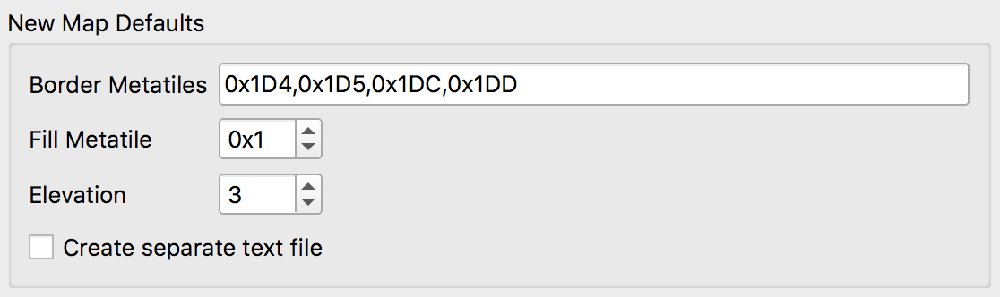
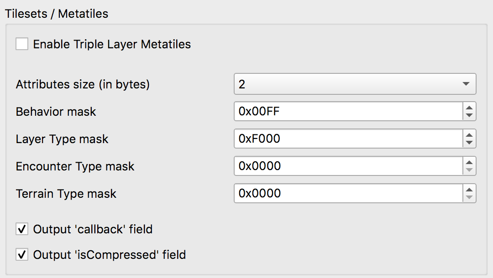
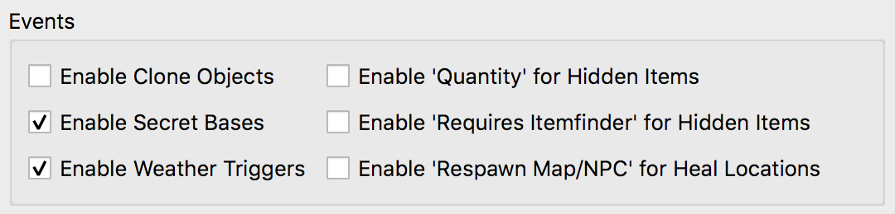
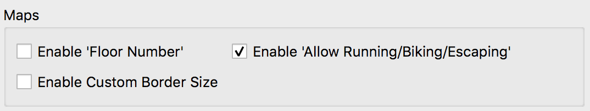

.. _settings-and-options:

****************
Porymap Settings
****************

Porymap uses config files to read and store user and project settings.

===============
Global settings
===============

A global settings file is stored in a platform-dependent location for app configuration files 
(``%Appdata%\pret\porymap\porymap.cfg`` on Windows, ``~/Library/Application\ Support/pret/porymap/porymap.cfg`` on macOS).

A selection of the settings in this file can be edited under ``Preferences...``, and the rest are updated automatically while using Porymap.

================
Project settings
================

A config file for project-specific settings is also created when opening a project in porymap for the first time. It is stored in your project root as ``porymap.project.cfg``. You may want to force commit this file so that other users will automatically have access to your project settings.

A second config file is created for user-specific settings. It is stored in your project root as ``porymap.user.cfg``. You should add this file to your gitignore.

The settings in ``porymap.project.cfg`` and ``porymap.user.cfg`` can be edited under ``Options -> Project Settings...``. Any changes made in this window will not take effect unless confirmed by selecting ``OK`` and then reloading the project.

Each of the settings in the ``Project Settings...`` window are described below.

.. warning::
    Changing any of the settings in the Project Settings Editor's red ``Warning`` box will require additional changes to your project to function correctly. Investigate the repository versions that have a setting natively supported to see what changes to your project are necessary.

Preferences
-----------

.. figure:: images/settings-and-options/preferences.png
   :align: left
   :width: 60%
   :alt: Preferences

Use Poryscript
   If this is checked, a ``scripts.pory`` (and ``text.pory``, if applicable) file will be created alongside new maps, instead of a ``scripts.inc`` file. Additionally, ``.pory`` files will be considered when searching for scripts labels and when opening scripts files (in addition to the regular ``.inc`` files).

   Defaults to ``unchecked``.

   Field name: ``use_poryscript``

Show Wild Encounter Tables
   If this is checked, the ``Wild Pokemon`` tab will be enabled and wild encounter data will be read from the project's encounters JSON file.

   If no encounters JSON file is found this will be automatically unchecked.

   Field name: ``use_encounter_json``

Default Tilesets
----------------

.. figure:: images/settings-and-options/default-tilesets.png
   :align: left
   :width: 60%
   :alt: Default Tilesets

Default Primary/Secondary Tilesest
   These will be the initially-selected tilesets when creating a new map, and will be used if a layout's tileset fails to load. If a default tileset is not found then the first tileset in the respective list will be used instead.

   The default primary tileset is ``gTileset_General``.

   The default secondary tileset is ``gTileset_PalletTown`` for ``pokefirered``, and ``gTileset_Petalburg`` for other versions.

   Field names: ``default_primary_tileset`` and ``default_secondary_tileset``

New Map Defaults
----------------

Border Metatiles
   This is list of metatile ID values that will be used to fill the border on new maps. The spin boxes correspond to the top-left, top-right, bottom-left, and bottom-right border metatiles respectively.

   If ``Enable Custom Border Size`` is checked, this will instead be a comma-separated list of metatile ID values that will be used to fill the border on new maps. Values in the list will be read sequentially to fill the new border left-to-right top-to-bottom. If the number of metatiles in the border for a new map is not the same as the number of values in the list then the border will be filled with metatile ID ``0x000`` instead.

   Defaults to ``0x014``, ``0x015``, ``0x01C``, ``0x01D`` for ``pokefirered``, and ``0x1D4``, ``0x1D5``, ``0x1DC``, ``0x1DD`` for other versions.

   Field name: ``new_map_border_metatiles``

Fill Metatile
   This is the metatile ID value that will be used to fill new maps.

   Defaults to ``0x1``.

   Field name: ``new_map_metatile``

Elevation
   This is the elevation that will be used to fill new maps. New maps will be filled with passable collision.

   Defaults to ``3``.

   Field name: ``new_map_elevation``

Create separate text file
   If this is checked, a ``text.inc`` (or ``text.pory``) file will be created alongside new maps.

   Defaults to ``unchecked`` for ``pokeemerald`` and ``checked`` for other versions.

   Field name: ``create_map_text_file``

Prefabs
-------

.. figure:: images/settings-and-options/prefabs.png
   :align: left
   :width: 60%
   :alt: Prefabs

Prefabs Path
   This is the file path to a ``.json`` file that contains definitions of prefabs. This will be used to populate the ``Prefabs`` panel on the ``Map`` tab. If no path is specified prefabs will be saved to a new ``prefabs.json`` file in the root project folder. A new file can be selected with the folder button.

   The ``Import Defaults`` button will populate the specified file with version-specific prefabs constructed using the vanilla tilesets. This will overwrite any existing prefabs.

   Field name: ``prefabs_filepath``.

   Additionally, there is a ``prefabs_import_prompted`` field that should not be edited.

Base game version
-----------------

.. figure:: images/settings-and-options/base-game-version.png
   :align: left
   :width: 60%
   :alt: Base Game Version

This is the name of base pret repository for this project. The options are ``pokeruby``, ``pokefirered``, and ``pokeemerald``, and can be selected (or automatically from the project folder name) when the project is first opened. Changing the base game version setting will prompt you to restore the default project settings for any of the three versions. You can also do this for the currently-selected base game version by selecting ``Restore Defaults`` at the bottom. For up-to-date projects changing this setting has no other effect.

Field name: ``base_game_version``

Tilesets / Metatiles
--------------------

Enable Triple Layer Metatiles
   Metatile data normally consists of 2 layers with 4 tiles each. If this is checked, they should instead consist of 3 layers with 4 tiles each. Additionally, the ``Layer Type`` option in the ``Tileset Editor`` will be removed. Note that layer type data will still be read and written according to your ``Layer Type mask`` setting.

   For details on supporting this setting in your project, see https://github.com/pret/pokeemerald/wiki/Triple-layer-metatiles.

   Defaults to ``unchecked``

   Field name: ``enable_triple_layer_metatiles``

Attributes size
   The number of bytes used per metatile for metatile attributes. The data in each of your project's ``metatile_attributes.bin`` files will be expected to be ``s * n``, where ``s`` is this size and ``n`` is the number of metatiles in the tileset. Additionally, new ``metatile_attributes.bin`` will be included in the project with a corresponding ``INCBIN_U8``, ``INCBIN_U16``, or ``INCBIN_U32`` directive.

   Changing this setting will automatically enforce the new limit on the metatile attribute mask settings below.

   Defaults to ``4`` for ``pokefirered`` and ``2`` for other versions.

   Field name: ``metatile_attributes_size``

Attribute masks
   Each of the following four settings are bit masks that will be used to read and write a specific metatile attribute from the metatile attributes data. If you are instead importing metatile attribute data from AdvanceMap, a default mask value will be used to read the data, and the mask value specified here will be used to write the new file.

   If any of the mask values are set to ``0x0``, the corresponding option in the Tileset Editor will be removed. The maximum for all the attribute masks is determined by the Attributes size setting.

.. warning::
   If any of the metatile attribute masks have overlapping bits they may behave in unexpected ways. A warning will be logged in the Porymap log file if this happens

Metatile Behavior mask
   See Attribute masks. This is the mask value for the ``Metatile Behavior`` metatile attribute.

   Defaults to ``0x1FF`` for ``pokefirered``, and ``0xFF`` for other versions.

   Field name: ``metatile_behavior_mask``

Layer Type mask
   See Attribute masks. This is the mask value for the ``Layer Type`` metatile attribute. If the value is set to ``0x0`` the ``Layer Type`` option will be disabled in the Tileset Editor, and all metatiles will be treated in the editor as if they had the ``Normal`` layer type.

   Defaults to ``0x60000000`` for ``pokefirered`` and ``0xF000`` for other versions.

   Field name: ``metatile_layer_type_mask``

Encounter Type mask
   See Attribute masks. This is the mask value for the ``Encounter Type`` metatile attribute.

   Defaults to ``0x7000000`` for ``pokefirered`` and ``0x0`` for other versions.

   Field name: ``metatile_encounter_type_mask``

Terrain Type mask
   See Attribute masks. This is the mask value for the ``Terrain Type`` metatile attribute.

   Defaults to ``0x3E00`` for ``pokefirered`` and ``0x0`` for other versions.

   Field name: ``metatile_terrain_type_mask``

Output 'callback' and 'isCompressed' fields
   If these are checked, then ``callback`` and ``isCompressed`` fields will be output in the C data for new tilesets. Their default values will be ``NULL`` and ``TRUE``, respectively. 

   Defaults to ``checked`` for both.

   Field names: ``tilesets_have_callback`` and ``tilesets_have_is_compressed``

Project Files
-------------
   This is a list of the files and folders Porymap expects from your project. Each can be overridden by typing a new path or selecting a file/folder with the folder button. If the file/folder doesn't exist when the project is loaded then the default path will be used instead.

   For more information on each of these files/folders, see https://huderlem.github.io/porymap/manual/project-files.html

   Field name: ``path/<identifier>``

Events
------

Enable Clone Objects
   If this is checked Clone Object Events will be available on the ``Events`` tab. For more information see https://huderlem.github.io/porymap/manual/editing-map-events.html#clone-object-events

   Defaults to ``checked`` for ``pokefirered`` and ``unchecked`` for other versions.

   Field name: ``enable_event_clone_object``

Enable Secret Bases
   If this is checked Secret Base Events will be available on the ``Events`` tab. For more information see https://huderlem.github.io/porymap/manual/editing-map-events.html#secret-base-event

   Defaults to ``unchecked`` for ``pokefirered`` and ``checked`` for other versions.

   Field name: ``enable_event_secret_base``

Enable Weather Triggers
   If this is checked Weather Trigger Events will be available on the ``Events`` tab. For more information see https://huderlem.github.io/porymap/manual/editing-map-events.html#weather-trigger-events

   Defaults to ``unchecked`` for ``pokefirered`` and ``checked`` for other versions.

   Field name: ``enable_event_weather_trigger``

Enable 'Quantity' for Hidden Items
   If this is checked the ``Quantity`` property will be available for Hidden Item Events. For more information see https://huderlem.github.io/porymap/manual/editing-map-events.html#hidden-item-event

   Defaults to ``checked`` for ``pokefirered`` and ``unchecked`` for other versions.

   Field name: ``enable_hidden_item_quantity``

Enable 'Requires Itemfinder' for Hidden Items
   If this is checked the ``Requires Itemfinder`` property will be available for Hidden Item Events. For more information see https://huderlem.github.io/porymap/manual/editing-map-events.html#hidden-item-event

   Defaults to ``checked`` for ``pokefirered`` and ``unchecked`` for other versions.

   Field name: ``enable_hidden_item_requires_itemfinder``

Enable 'Repsawn Map/NPC' for Heal Locations
   If this is checked the ``Respawn Map`` and ``Respawn NPC`` properties will be available for Heal Location events. For more information see https://huderlem.github.io/porymap/manual/editing-map-events.html#heal-location-healspots

   Defaults to ``checked`` for ``pokefirered`` and ``unchecked`` for other versions.

   Field name: ``enable_heal_location_respawn_data``

Maps
----

Enable 'Floor Number'
   If this is checked, a ``Floor Number`` option will become available on the ``Header`` tab and on the new map prompt. For more information see https://huderlem.github.io/porymap/manual/editing-map-header.html

   Defaults to ``checked`` for ``pokefirered`` and ``unchecked`` for other versions.

   Field name: ``enable_floor_number``

Enable 'Allow Running/Biking/Escaping'
   If this is checked, ``Allow Running``, ``Allow Biking``, and ``Allow Dig & Escape Rope`` options will become available on the ``Header`` tab and on the new map prompt. For more information see https://huderlem.github.io/porymap/manual/editing-map-header.html

   Defaults to ``unchecked`` for ``pokeruby`` and ``checked`` for other versions.

   Field name: ``enable_map_allow_flags``

Enable Custom Border Size
   If this is checked, ``Border Width`` and ``Border Height`` options will become available under the ``Change Dimensions`` button and on the new map prompt. If it is unchecked all maps will use the default 2x2 dimensions.

   Defaults to ``checked`` for ``pokefirered`` and ``unchecked`` for other versions.

   Field name: ``use_custom_border_size``

Additional Fields
-----------------
   There are two additional fields in ``porymap.user.cfg`` that aren't described above.

   ``recent_map`` is the name of the most recently opened map and is updated automatically. This is the map that will be opened when the project is opened. If no map is found with this name (or if the field is empty) then the first map in the map list will be used instead.

   ``custom_scripts`` is a comma-separated list of filepaths to scripts for Porymap's API. These can be edited under ``Options -> Custom Scripts...``. For more information see https://huderlem.github.io/porymap/manual/scripting-capabilities.html
