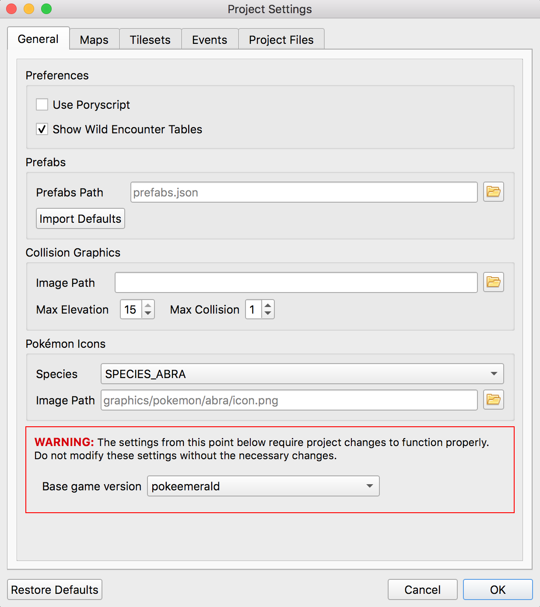
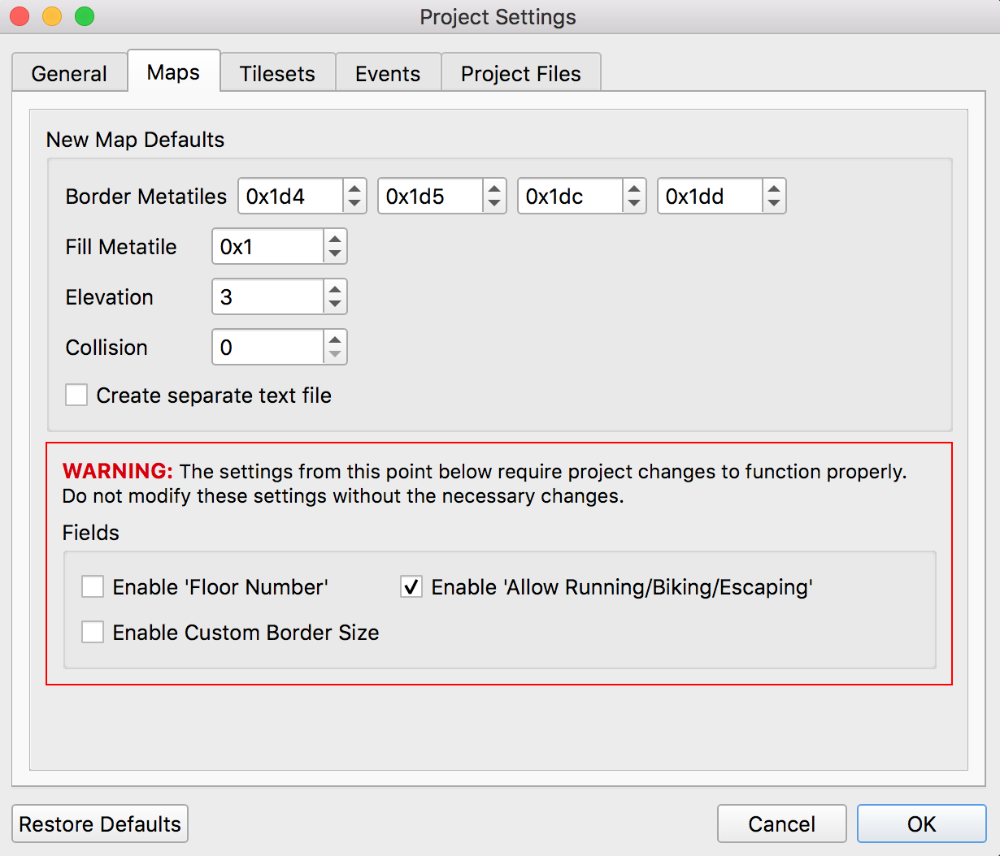
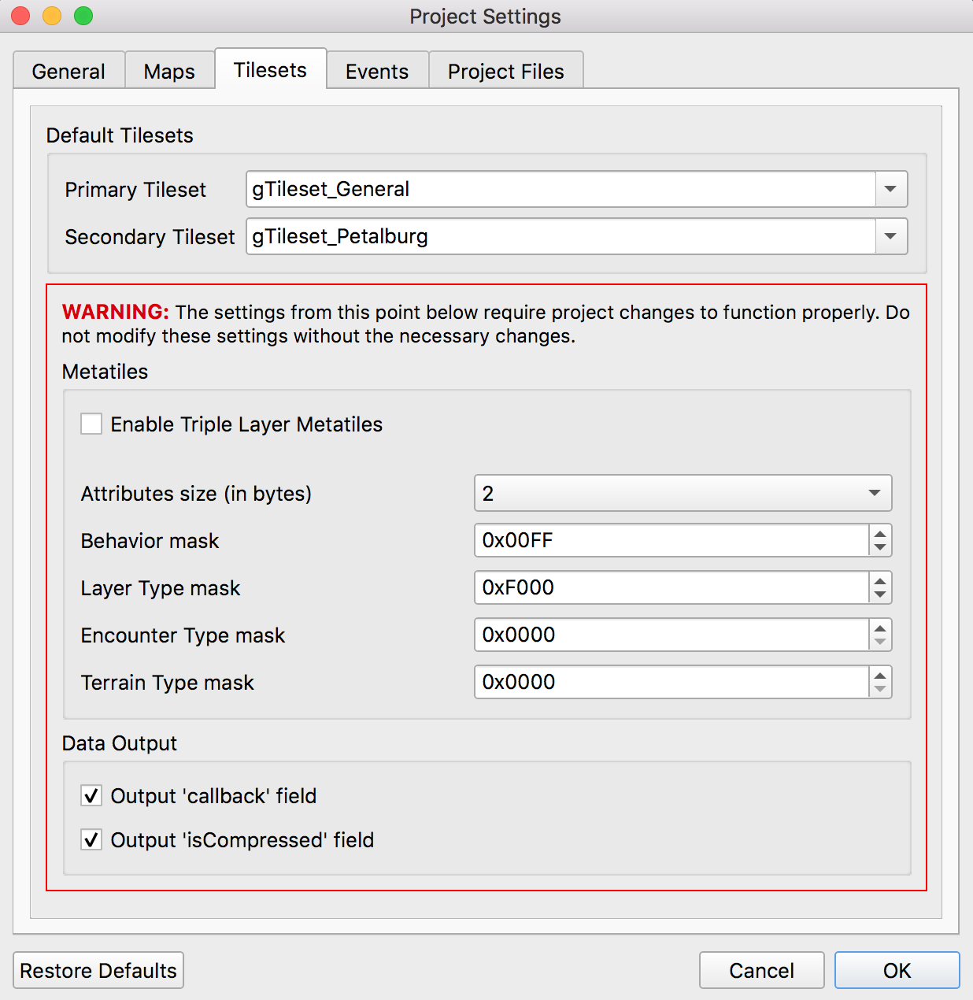
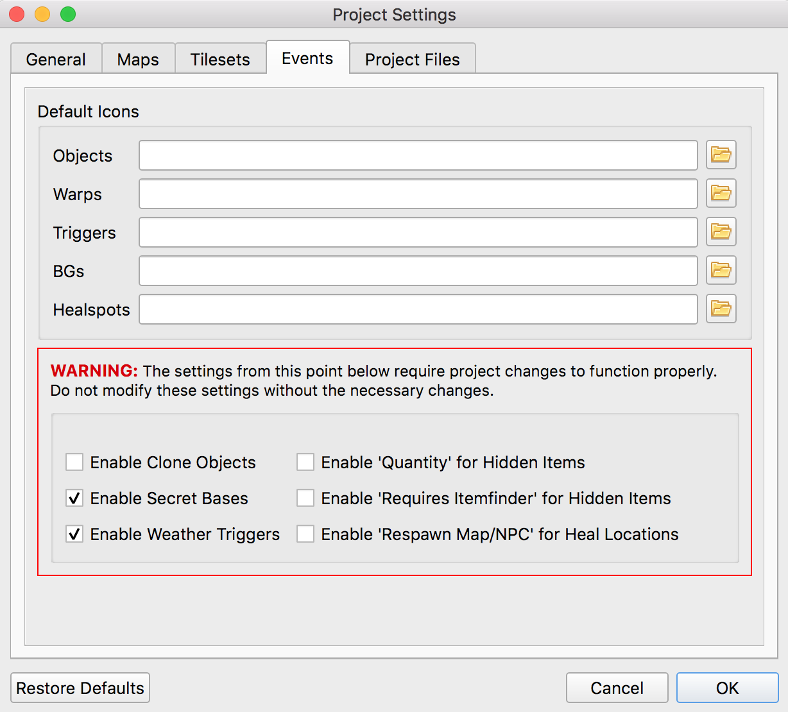

.. _settings-and-options:

****************
Porymap Settings
****************

Porymap uses config files to read and store user and project settings.

===============
Global settings
===============

A global settings file is stored in a platform-dependent location for app configuration files 
(``%Appdata%\pret\porymap\porymap.cfg`` on Windows, ``~/Library/Application\ Support/pret/porymap/porymap.cfg`` on macOS).

A selection of the settings in this file can be edited under ``Preferences...``, and the rest are updated automatically while using Porymap.

================
Project settings
================

   * :ref:`General <general>`
   * :ref:`Maps <maps>`
   * :ref:`Tilesets <tilesets>`
   * :ref:`Events <events>`
   * :ref:`Files & Identifiers <files-identifiers>`

A config file for project-specific settings is also created when opening a project in porymap for the first time. It is stored in your project root as ``porymap.project.cfg``. You may want to force commit this file so that other users will automatically have access to your project settings.

A second config file is created for user-specific settings. It is stored in your project root as ``porymap.user.cfg``. You should add this file to your gitignore.

The settings in ``porymap.project.cfg`` and ``porymap.user.cfg`` can be edited under ``Options -> Project Settings...``. Any changes made in this window will not take effect unless confirmed by selecting ``OK`` and then reloading the project.

.. |button-folder| image:: images/scripting-capabilities/folder.png
   :width: 24
   :height: 24

.. |button-import-defaults| image:: images/settings-and-options/import-defaults.png
   :height: 24

.. |button-restore-defaults| image:: images/settings-and-options/restore-defaults.png
   :height: 24

.. _general:

General
-------

Use Poryscript
    If this is checked, a ``scripts.pory`` (and ``text.pory``, if applicable) file will be created alongside new maps, instead of a ``scripts.inc`` file. Additionally, ``.pory`` files will be considered when searching for scripts labels and when opening scripts files (in addition to the regular ``.inc`` files).

    Defaults to ``unchecked``.

Show Wild Encounter Tables
    If this is checked, the ``Wild Pokemon`` tab will be enabled and wild encounter data will be read from the project's encounters JSON file.

    Defaults to ``checked``. If no encounters JSON file is found this will be automatically unchecked.

Prefabs
    ``Prefabs Path`` is the file path to a ``.json`` file that contains definitions of prefabs. This will be used to populate the ``Prefabs`` panel on the ``Map`` tab. If no path is specified prefabs will be saved to a new ``prefabs.json`` file in the root project folder. A new file can be selected with the |button-folder| button or by editing the file path.

    The |button-import-defaults| button will populate the specified file with version-specific prefabs constructed using the vanilla tilesets. This will overwrite any existing prefabs.

Collision Graphics
    ``Image Path`` is a path to any image file you'd like to use to represent collision and elevation values on the ``Collision`` tab. A new file can be selected with the |button-folder| button or by editing the file path. The image will be evenly divided into segments, with each row representing an elevation value (starting with ``0`` at the top) and each column representing a collision value (starting with ``0`` on the left).

    Your image does not need to have a row/column for every valid elevation/collision value (for instance, the default collision values range from ``0-3``, but because ``2-3`` are semantically the same as ``1`` they are not displayed). You can specify the highest elevation and collision value represented on your image with ``Max Elevation`` and ``Max Collision``.

    Note: Images with transparency may not function correctly when displayed on the map.

    The filepath defaults empty, which will use `Porymap's original image <https://github.com/huderlem/porymap/blob/master/resources/images/collisions.png>`_. ``Max Elevation`` and ``Max Collision`` default to ``15`` and ``1`` respectively.

Pokémon Icons
    Porymap can display Pokémon species icons that it reads from your project on the ``Wild Pokemon`` tab. If Porymap fails to load your icon image, or if you'd like to display your own icon in Porymap for any reason, you can select a new image with the |button-folder| button or by editing the file path. You can select a species with the dropdown to edit the path for a different icon.

    If your custom icon or the default icon fails to load a |pokemon-icon-placeholder| icon will be displayed.

    Defaults to empty (the path in your project where Porymap expects to find each icon).

Base Game Version
    This is the name of the base pret repository for this project. Changing this setting will prompt you to restore the default project settings for any of the three versions. You can also do this for the currently-selected base game version by selecting |button-restore-defaults| at the bottom of the window. Aside from determining the default settings in this window, the base game version also determines the default settings when initializing the region map and when importing default prefabs.

    Defaults to ``pokeruby``, ``pokefirered``, or ``pokeemerald`` depending on the project folder name. If the folder name doesn't match you will be prompted to select a version on first launch.

.. _maps:

Maps
----

Map Data Defaults
   Border Metatiles
      This is list of metatile ID values that will be used to fill the border on new maps. The spin boxes correspond to the top-left, top-right, bottom-left, and bottom-right border metatiles respectively.

      If ``Enable Custom Border Size`` is checked, this will instead be a comma-separated list of metatile ID values that will be used to fill the border on new maps. Values in the list will be read sequentially to fill the new border left-to-right top-to-bottom. If the number of metatiles in the border for a new map is not the same as the number of values in the list then the border will be filled with metatile ID ``0x000`` instead.

      Defaults to ``0x014``, ``0x015``, ``0x01C``, ``0x01D`` for ``pokefirered``, and ``0x1D4``, ``0x1D5``, ``0x1DC``, ``0x1DD`` for other versions.

   Metatile ID
      This is the metatile ID value that will be used to fill new maps.

      Defaults to ``0x1``.

   Collision
      This is the collision value that will be used to fill new maps. It will also be used to set the default selection on the Collision tab when the project is first opened.

      Defaults to ``0``.

   Elevation
      This is the elevation value that will be used to fill new maps. It will also be used to set the default selection on the Collision tab when the project is first opened.

      Defaults to ``3``.

   Create separate text file
      If this is checked, a ``text.inc`` (or ``text.pory``) file will be created alongside new maps.

      Defaults to ``unchecked`` for ``pokeemerald`` and ``checked`` for other versions.

Map Data Layout
   Each of these three settings are bit masks that will be used to read and write an attribute of the data that makes up each map space (metatile ID, collision, and elevation). A warning will be displayed if any of the masks overlap. Their values may be read from ``#define`` s in your project, in which case editing will be disabled and you can change their values by modifying them in your project.

   Default to being read from ``MAPGRID_METATILE_ID_MASK``, ``MAPGRID_COLLISION_MASK``, and ``MAPGRID_ELEVATION_MASK``. If they can't be read, they default to ``0x3FF``, ``0xC00``, and ``0xF000`` respectively.

Enable 'Floor Number'
   If this is checked, a ``Floor Number`` option will become available on the ``Header`` tab and on the new map prompt. For more information see `Editing Map Headers <https://huderlem.github.io/porymap/manual/editing-map-header.html>`_.

   Defaults to ``checked`` for ``pokefirered`` and ``unchecked`` for other versions.

Enable 'Allow Running/Biking/Escaping'
   If this is checked, ``Allow Running``, ``Allow Biking``, and ``Allow Dig & Escape Rope`` options will become available on the ``Header`` tab and on the new map prompt. For more information see `Editing Map Headers <https://huderlem.github.io/porymap/manual/editing-map-header.html>`_.

   Defaults to ``unchecked`` for ``pokeruby`` and ``checked`` for other versions.

Enable Custom Border Size
   If this is checked, ``Border Width`` and ``Border Height`` options will become available under the ``Change Dimensions`` button and on the new map prompt. If it is unchecked all maps will use the default 2x2 dimensions.

   Defaults to ``checked`` for ``pokefirered`` and ``unchecked`` for other versions.

.. _tilesets:

Tilesets
--------

Default Primary/Secondary Tilesest
    These will be the initially-selected tilesets when creating a new map, and will be used if a layout's tileset fails to load. If a default tileset is not found then the first tileset in the respective list will be used instead.

    The default primary tileset is ``gTileset_General``.

    The default secondary tileset is ``gTileset_PalletTown`` for ``pokefirered``, and ``gTileset_Petalburg`` for other versions.

Enable Triple Layer Metatiles
   Metatile data normally consists of 2 layers with 4 tiles each. If this is checked, they should instead consist of 3 layers with 4 tiles each. Additionally, the ``Layer Type`` option in the ``Tileset Editor`` will be removed. Note that layer type data will still be read and written according to your ``Layer Type mask`` setting.

   For details on supporting this setting in your project, see https://github.com/pret/pokeemerald/wiki/Triple-layer-metatiles.

   Defaults to ``unchecked``

Attributes size
   The number of bytes used per metatile for metatile attributes. The data in each of your project's ``metatile_attributes.bin`` files will be expected to be ``s * n``, where ``s`` is this size and ``n`` is the number of metatiles in the tileset. Additionally, new ``metatile_attributes.bin`` will be included in the project with a corresponding ``INCBIN_U8``, ``INCBIN_U16``, or ``INCBIN_U32`` directive.

   Changing this setting will automatically enforce the new limit on the metatile attribute mask settings.

   Defaults to ``4`` for ``pokefirered`` and ``2`` for other versions.

Attribute masks
   Each of these four settings are bit masks that will be used to read and write a specific metatile attribute from the metatile attributes data. If you are instead importing metatile attribute data from AdvanceMap, a default mask value will be used to read the data, and the mask value specified here will be used to write the new file.

   If any of the mask values are set to ``0x0``, the corresponding option in the Tileset Editor will be removed. The maximum for all the attribute masks is determined by the Attributes size setting. A warning will be displayed if any of the masks overlap.

   - Metatile Behavior mask
      This is the mask value for the ``Metatile Behavior`` metatile attribute.

      Defaults to being read from ``sMetatileAttrMasks`` or ``METATILE_ATTR_BEHAVIOR_MASK``. If these can't be read, defaults to ``0x1FF`` for ``pokefirered``, and ``0xFF`` for other versions.

   - Layer Type mask
      This is the mask value for the ``Layer Type`` metatile attribute. If the value is set to ``0x0`` the ``Layer Type`` option will be disabled in the Tileset Editor, and all metatiles will be treated in the editor as if they had the ``Normal`` layer type.

      Defaults to being read from ``sMetatileAttrMasks`` or ``METATILE_ATTR_LAYER_MASK``. If these can't be read, defaults to ``0x60000000`` for ``pokefirered``, and ``0xF000`` for other versions.

   - Encounter Type mask
      This is the mask value for the ``Encounter Type`` metatile attribute.

      Defaults to being read from ``sMetatileAttrMasks``. If this can't be read, defaults to ``0x7000000`` for ``pokefirered``, and ``0x0`` for other versions.

   - Terrain Type mask
      This is the mask value for the ``Terrain Type`` metatile attribute.

      Defaults to being read from ``sMetatileAttrMasks``. If this can't be read, defaults to ``0x3E00`` for ``pokefirered``, and ``0x0`` for other versions.

Output 'callback' and 'isCompressed' fields
   If these are checked, then ``callback`` and ``isCompressed`` fields will be output in the C data for new tilesets. Their default values will be ``NULL`` and ``TRUE``, respectively. 

   Defaults to ``checked`` for both.

.. _events:

Events
------

Default Icons
   Each event group is represented by a unique icon on the ``Events`` tab of the main editor. Here you can provide filepaths to your own image files to replace these icons, either by selecting the |button-folder| button or by editing the file path directly.

   Events in the ``Objects`` group will only use this icon if there are no graphics associated with their ``Sprite`` field.

   The filepaths default to empty, which will use `Porymap's original icons <https://github.com/huderlem/porymap/blob/master/resources/images/Entities_16x16.png>`_.

Warp Behaviors
   By default, Warp Events only function as exits if they're positioned on a metatile whose Metatile Behavior is treated specially in your project's code. If any Warp Events are positioned on a metatile that doesn't have one of these behaviors they will display a warning. Here you can disable that warning, or edit the list of behavior names that will silence the warning.

   Defaults to ``unchecked``, i.e. the warning is enabled. The list of behaviors is initially populated with all the vanilla warp behavior names across pokeemerald, pokefirered, and pokeruby.

Enable Clone Objects
   If this is checked Clone Object Events will be available on the ``Events`` tab. For more information see `Clone Object Events <https://huderlem.github.io/porymap/manual/editing-map-events.html#clone-object-events>`_.

   Defaults to ``checked`` for ``pokefirered`` and ``unchecked`` for other versions.

Enable Secret Bases
   If this is checked Secret Base Events will be available on the ``Events`` tab. For more information see `Secret Base Events <https://huderlem.github.io/porymap/manual/editing-map-events.html#secret-base-event>`_.

   Defaults to ``unchecked`` for ``pokefirered`` and ``checked`` for other versions.

Enable Weather Triggers
   If this is checked Weather Trigger Events will be available on the ``Events`` tab. For more information see `Weather Trigger Events <https://huderlem.github.io/porymap/manual/editing-map-events.html#weather-trigger-events>`_.

   Defaults to ``unchecked`` for ``pokefirered`` and ``checked`` for other versions.

Enable 'Quantity' for Hidden Items
   If this is checked the ``Quantity`` property will be available for Hidden Item Events. For more information see `Hidden Item Events <https://huderlem.github.io/porymap/manual/editing-map-events.html#hidden-item-event>`_.

   Defaults to ``checked`` for ``pokefirered`` and ``unchecked`` for other versions.

Enable 'Requires Itemfinder' for Hidden Items
   If this is checked the ``Requires Itemfinder`` property will be available for Hidden Item Events. For more information see `Hidden Item Events <https://huderlem.github.io/porymap/manual/editing-map-events.html#hidden-item-event>`_.

   Defaults to ``checked`` for ``pokefirered`` and ``unchecked`` for other versions.

Enable 'Repsawn Map/NPC' for Heal Locations
   If this is checked the ``Respawn Map`` and ``Respawn NPC`` properties will be available for Heal Location events. For more information see `Heal Locations <https://huderlem.github.io/porymap/manual/editing-map-events.html#heal-location-healspots>`_.

   Defaults to ``checked`` for ``pokefirered`` and ``unchecked`` for other versions.

.. _files-identifiers:

Files & Identifiers
-------------------

.. figure:: images/settings-and-options/tab-files.png
   :alt: Files tab

.. figure:: images/settings-and-options/tab-identifiers.png
   :alt: Identifiers tab

These two tabs provide a way to override the filepaths and symbol/macro names Porymap expects to find in your project.

For ``Files``, each can be overridden by typing a new path or selecting a file/folder with the |button-folder| button. Paths are expected to be relative to the root project folder. If no path is specified, or if the file/folder specified does not exist, then the default path will be used instead.

For ``Identifiers``, each can be overridden by typing a new name in the line edit. Overrides with ``regex`` in the name support the `regular expression syntax <https://perldoc.perl.org/perlre>`_ used by Qt.

For more information on what each of these overrides does, see `Project Files <https://huderlem.github.io/porymap/manual/project-files.html>`_.

