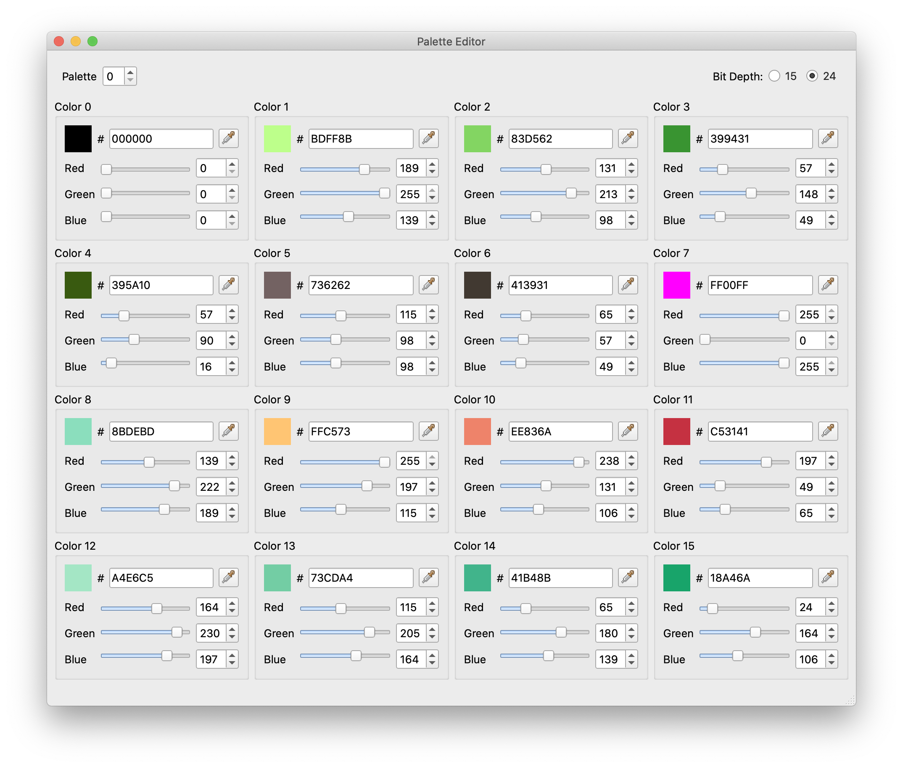

.. _tse-ref:

*********************
The Tileset Editor
*********************

Here, you can edit individual tilesets.
When the Tileset Editor is opened, it is opened in the context of the 
currently-opened map.  Every map has a primary and secondary tileset, so you 
will work with a combination of the two whenever you use the Tileset Editor.  
The left-side pane shows the primary and secondary tilesets' metatiles.  
The right-side panes allow you to modify the currently-selected metatile.

.. figure:: images/tileset-editor/tse-open-window.png
    :align: center
    :width: 75%
    :alt: TSE Window

    Tileset Editor Window


Metatile Properties
===================

.. figure:: images/tileset-editor/tse-metatile-properties.png
    :align: center
    :width: 30%
    :alt: MP Frame

    Metatile Properties Panel

Layer Type
----------

Defines the background layers the metatiles will use for drawing.
The options are:

**Normal** --- Metatile uses middle and top bg layers

**Covered** --- Metatile uses bottom and middle bg layers

**Split** --- Metatile uses bottom and top bg layers


Metatile Behavior
-----------------

Defines the metatile behavior associated with this metatile.  This can be used 
for a variety of different reasons. For example, warps, ice, and tall grass effects
are all determined by a metatile's behavior.

This dropdown is populated with constants found in ``include/constants/metatile_behaviors.h``.


Encounter Type
--------------

    *pokefirered exclusive*

Used to determine which category of wild encounter to attempt.


Terrain Type
------------

    *pokefirered exclusive*

Used to determine certain attributes of metatiles.  Can be useful in certain scenarios.
For example, to determine if the player is facing water or standing in grass.


Metatile Label
--------------

    *optional*

A name can be given to metatiles so that they may be referenced in source code.
These are defined in ``include/constants/metatile_labels.h``.

For example, the metatile pictured above can be referenced using the define 
``METATILE_General_Plain_Grass``.
This define name can be copied using the Copy button next to the metatile label text box.

Sometimes it may be useful to have a ``METATILE`` define that applies to many tilesets.
This can be done by manually creating a ``METATILE`` define with a value outside its tileset.
For example, the primary tileset ``SecretBase`` is associated with many secondary tilesets,
all of which use the same labels. ``#define METATILE_SecretBase_PC 0x220`` defines a label
for the secondary metatile id ``0x220`` which will be used by any secondary tileset that's
paired with ``SecretBase``. Labels like this will appear gray in the text box, and can't
be edited from within Porymap; they must be edited manually in ``metatile_labels.h``.


Tools Menu
==========

The tileset editor provides users with several useful tools for making edits
easier and more convenient.


Import Tiles Image...
---------------------

Tool to automatically import a new tile image for a tileset.
The tile image is an indexed png of 8x8 pixel tiles, which are used to form
metatiles in the tileset editor.


Import Metatiles from Advance Map 1.92...
-----------------------------------------

Helpful for users converting projects from binary hacks. 
Metatile data exported from Advance Map 1.92 in a ``.bvd``` file can be imported
into porymap's tileset editor.
This saves a lot of time since metatiles will not have to be defined from scratch.


Change Number of Metatiles
--------------------------

The number of metatiles in both the current primary and current secondary tileset
can be adjusted within the limits.

.. note::
    You may need to change the Makefile rules for the number of tiles allowed
    for the tileset in the file ``graphics_file_rules.mk``. You can simply
    remove the ``-num_tiles=`` argument altogether.


Other Tools
-----------

.. figure:: images/tileset-editor/tse-display-tool.png
    :align: center
    :width: 60%
    :alt: TSE Unused

    Displaying Unused Tiles

There are also tools to count the number of metatile and tile usages across the
entire project, which can be useful, for example, in determining whether a
metatile can be deleted.  The output of these operations is pictured above.


Palette Editor
==============

The palette editor is where the ``.pal`` files are modified for each tileset.



    Palette Editor

The current palette is indicated by the spinner at the top left. To switch 
between palettes, just change the spinner value.
At the top right is a setting for the bit depth at which colors are displayed.
The colors in a palette file are displayed as 24 bit numbers, but the GBA 
hardware only allows 15 bit colors, so displaying in 15 bits can be more realistic.

Each individual color can be adjusted with either the sliders or the spinners, 
in addition to the hex value box.  Each color also has an eyedropper toolbutton
which allows users to pick any color from the screen and add it to the palette.

Entire palettes can also be imported from a variety of formats,
including JASC, Adobe Color Table, Tile Layer Pro, and Advance PE.
Each imported palette must contain 16 colors.
